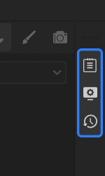

# 베이킹 모드

**베이킹 모드**&#x200B;를 사용하면 고품질 베이크를 만드는 데 필요한 모든 도구와 매개 변수에 액세스할 수 있습니다.

**베이킹 모드**&#x200B;에 액세스하려면 뷰포트의 오른쪽 상단에 있는 (구운) 크루아상 버튼을 클릭합니다. 또는 [키보드 단축키&#x200B;](../interface/settings/shortcuts.md)**F8**&#x200B;을 사용하거나 **모드 > 메시 맵 굽기**&#x200B;를 선택합니다

베이킹 모드는 UI 레이아웃을 변경하고 다양한 패널을 베이킹 메시 맵에 특별히 사용할 수 있게 합니다.

## 인터페이스

베이킹 모드 인터페이스는 기본적으로 [**뷰포트**](../interface/viewport/viewport.md)&#x200B;와 패널 영역으로 나뉩니다.

### 뷰포트

[**뷰포트**](../interface/viewport/viewport.md)&#x200B;는 **페인팅 모드**&#x200B;와 동일하게 작동합니다. 동일한 컨트롤을 사용하여 탐색하고 **채널 드롭다운**&#x200B;을 사용하여 표시되는 채널을 변경할 수 있습니다.

**베이킹 모드 뷰포트**&#x200B;와 **페인팅 모드**&#x200B;의 차이점은 두 가지입니다.

* 뷰포트의 왼쪽 상단에서 [**베이킹 시각화 설정 패널**](baking-visualization-settings.md)&#x200B;을 찾을 수 있습니다.
* 뷰포트 하단에서 현재 선택한 메시 맵을 **구울**&#x200B;하거나 **페인팅 모드**&#x200B;로 돌아갈 수 있는 버튼을 찾을 수 있습니다.

### 베이킹 모드 패널

베이킹 모드에만 4개의 패널이 있습니다.

* [**메시 맵 베이커**](../interface/baking-panels/mesh-map-bakers.md): 구울 메시 맵을 선택합니다.
* [**일반 설정**](../interface/baking-panels/common-mesh-map-settings.md): 모든 메시 맵에 공통적인 굽기 설정을 조정합니다.
* [**메시 맵 설정 패널**](../interface/baking-panels/mesh-map-settings.md): 선택한 메시 맵의 베이킹 설정을 조정합니다.
* [**굽기 로그**](../interface/baking-panels/baking-log.md): 굽기 결과를 보고 문제를 진단합니다.

>[!NOTE]
>
> **일반 설정** 및 **메시 맵 설정 패널**&#x200B;에서 사용할 수 있는 전체 옵션 목록은 [**메시 맵 설정**](mesh-map-settings.md)&#x200B;을 참조하세요.

추가 패널을 사용할 수 있으며 **페인팅 모드**&#x200B;에서와 동일한 방식으로 작동합니다.

<table>
  <tr style="border: 0;">
    <td style="border: 0;" valign="top"></td>
    <td style="border: 0;" valign="top"><ul><li><a href="../interface/texture-set/texture-set-list.md"><strong>텍스처 세트 목록</strong></a></li><li>오른쪽 막대에서 사용 가능:<ul><li><a href="../interface/miscellaneous/log.md"><strong>로그</strong></a></li><li><a href="../interface/display-settings/display-settings.md"><strong>디스플레이 설정</strong></a></li><li><a href="../interface/history.md"><strong>작업 내역</strong></a></li></ul></li></ul></td>
  </tr>
</table>