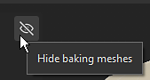

# 굽기 시각화 설정

베이킹 시각화는 베이킹 모드에 있는 동안 Painter 뷰포트 내의 패널입니다. 이 도구를 사용하면 뷰포트에서 망 표시와 관련된 설정을 조정할 수 있습니다.

## 일반 설정

| 설정 | 설명 |
| --- | --- |
| **베이킹 메시 숨기기** | 이 옵션을 활성화하면 이 아이콘이 뷰포트에서 높은 폴리 및 케이지 메시를 숨깁니다. 

 |
| **선택한 텍스처 집합에만 표시** | 이 옵션을 활성화하면 현재 활성화된 텍스처 세트의 케이지 및 높은-폴리 메시만 뷰포트에 표시됩니다. |

### 고해상도 메시(HP)

| 설정 | 설명 |
| --- | --- |
| <b>메시</b> | 활성화된 경우 3D 보기에서 하이 폴리 메시를 표시합니다. 비활성화된 경우 높은 폴리 메시도 메모리에서 언로드되므로 성능이 향상됩니다. 이 설정 옆의 색상 옵션을 사용하여 뷰포트에서 메시 표면 색상을 제어합니다. |
| <b>일치 오류</b> | 활성화하면 지정된 색상으로 케이지 메쉬의 셸 외부에 있는 하이 폴리 메쉬의 영역을 표시합니다. 이 설정은 베이킹 과정에서 누락될 영역을 식별하는 데 도움이 되며 세부 사항/정보가 손실될 수 있습니다. 이 설정 옆에 있는 색상 옵션을 사용하여 뷰포트에서 교차하는 영역의 색상을 제어합니다. |

### 케이지

| 설정 | 설명 |
| --- | --- |
| <b>케이지 표면</b> | 활성화되면 케이지 메시 표면이 3D 뷰에 표시됩니다. 케이지 표면은 설정 옆의 색상 버튼으로 정의됩니다. |
| <b>케이지 표면 불투명도</b> | 메시를 투명도를 높이거나 낮추어 기본 메시의 세부 사항의 가시성을 관리합니다. |
| <b>케이지 와이어프레임</b> | 활성화되면 케이지 메쉬의 와이어프레임이 뷰포트에 표시됩니다. 이 설정 옆의 색상 버튼을 사용하여 와이어프레임 색상을 조정할 수 있습니다. |
| <b>케이지 와이어프레임 불투명도</b> | 와이어프레임을 더 투명하거나 덜 투명하게 만듭니다. |

### UV 이음새

| 설정 | 설명 |
| --- | --- |
| <b>뚜렷한 가장자리에 이음새 없음</b> | 활성화되면 UV 솔기가 아닌 메시 표면의 딱딱한 가장자리가 설정 옆의 버튼으로 정의된 색상으로 강조 표시됩니다. 강조표시된 가장자리는 케이지와 낮은 폴리 메쉬에서만 표시됩니다. 가장자리는 2D 보기와 3D 보기 모두에서 볼 수 있습니다. 이 설정을 사용하면 UV 풀기 이음새 없이 꼭지점 표준이 분할된 가장자리를 식별할 수 있으며, 이는 나중에 베이킹 문제로 이어질 수 있습니다. |

### 프로젝트 메시

<table data-preserve-html="true">
<colgroup><col/><col/><col/></colgroup><tbody><tr><th scope="col">설정</th>
<th scope="col">보조 설정</th>
<th scope="col">설명</th>
</tr><tr><td><b>프로젝트 메시</b></td>
<td> </td>
<td>
이 옵션을 활성화하면 상위-폴리 메쉬가 베이킹되는 하위-폴리 메쉬가 뷰포트에 표시됩니다. <b>베이킹 메시 숨기기</b>를 사용하도록 설정하면 빈 뷰포트를 방지하기 위해 이 설정도 자동으로 사용하도록 설정됩니다.

이 설정 옆에 있는 색상 옵션을 사용하여 프로젝트 메쉬의 색상을 조정합니다.

</td>
</tr><tr><td rowspan="7"><b>중립 재질</b></td>
<td><b>품질</b></td>
<td>낮은 폴리 메시 표면의 Specular 반사 품질을 제어합니다. 높은 값을 사용하면 반사에서 더 나은 충실도를 얻을 수 있지만, 높은 값은 성능에 영향을 줄 수 있습니다. 값이 낮으면 음영에 표준 맵과 함께 이음새가 생길 수 있습니다(참고: 표시 문제일 뿐입니다).</td>
</tr><tr><td><b>거칠기</b></td>
<td>뷰포트에 있는 낮은 폴리 메시 재질의 거칠기를 제어합니다.</td>
</tr><tr><td><b>금속재질</b></td>
<td>뷰포트에 있는 낮은 폴리 메시 재질의 금속성을 제어합니다.</td>
</tr><tr><td><b>AO 강도</b></td>
<td>구워진 앰비언트 오클루전이 뷰포트의 낮은 폴리 메시 음영에 기여하는 정도를 제어합니다.</td>
</tr><tr><td><b>노멀 구부리기</b></td>
<td>활성화된 경우 구겨진 굽은 수직 을 사용하여 뷰포트에서 낮은 폴리 메쉬 음영을 개선합니다.</td>
</tr><tr><td><b>노멀 구부리기 확산 양</b></td>
<td>구부러진 법선이 확산 음영에 미치는 영향을 제어합니다.</td>
</tr><tr><td><b>노멀 구부리기 반사 양</b></td>
<td>구부러진 법선이 Specular 음영에 미치는 영향을 제어합니다.</td>
</tr></tbody></table>
