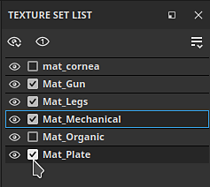

# 메시 맵을 분리하는 방법

Substance 3D Painter의 전용 베이킹 모드를 사용하면 멋진 스마트 재료 및 기타 도구를 강화할 수 있는 메시 맵을 쉽게 베이킹할 수 있습니다. Substance 3D Painter을 사용하여 베이킹을 시작하는 방법에 대해 알아보려면 계속 읽거나 아래 비디오를 시청하십시오.

## 1 - 베이킹 모드로 전환

기본적으로 Painter은 프로젝트를 만들거나 열 때 페인팅 모드에서 시작합니다. 메시 맵을 분리할 수 있으려면 [베이킹] 모드로 전환해야 합니다. 다음 옵션 중 하나를 사용하여 [베이킹] 모드로 전환합니다.

* 뷰포트의 오른쪽 상단에 있는 상황별 도구 모음에서 <b>베이킹 모드 버튼</b>(<b>크루아상 아이콘</b>)을 사용합니다

  

  >[!NOTE]
  >
  > 작업 영역 레이아웃에 따라 <b>베이킹 모드 단추</b>를 다른 패널 뒤에 숨길 수 있습니다.
* [모드] 메뉴를 사용하여 <b>메시 맵 굽기를 선택합니다.\
  </b>
* <b>F8</b> 키보드 단축키를 사용합니다.

### 2 - 텍스처 세트 및 UV 타일 선택

<b>텍스처 집합 목록</b>에서 각 텍스처 집합(및 UV 타일 번호가 있는 경우) 옆의 확인란을 사용하여 구울 부분을 선택합니다.

### 3 - 베이커 선택

메시 맵 베이커 창에서 확인란을 사용하여 구울 맵을 선택합니다.

### 4 - 일반 설정 변경

[메시 맵 베이커] 패널에서 일반 설정을 클릭하여 모든 맵에서 공유되는 베이킹된 맵 해상도, 확장 폭 및 높은 폴리 매개 변수와 같은 설정을 변경합니다.

일반 설정에서 HD 메시로 사용할 파일을 정의할 수 있습니다. HD 망을 선택하면 망에 대해 케이지가 생성되는 방식을 정의할 수 있습니다.

* 거리 기준: 모델에서 균일한 거리를 두고 메쉬에서 정점을 부풀려서 케이지를 만듭니다.
* 자동(시험적): Painter은 메쉬를 분석하고 케이지를 자동으로 생성하여 교차점을 만들지 않고도 케이지를 표면에 가깝게 유지해 최상의 결과를 얻을 수 있도록 합니다.
* 사용자 정의 파일: 케이지로 사용하기 위해 만든 파일을 가져옵니다. 불러온 파일은 기본 메쉬와 동일한 개수의 정점을 가져야 올바르게 작동합니다.

높은 폴리 메시에서 굽지 않는 경우에는 대신 <b>낮은 폴리 메시를 높은 폴리 메시로 사용</b> 확인란을 활성화하십시오.

### 5 - 케이지 조정

사용 중인 케이지 방법에 따라 케이지를 조정하는 다양한 옵션을 사용할 수 있습니다. 거리 기반 케이지를 사용하면 앞뒤 거리를 조정하여 케이지와 메쉬 간의 교차량을 최소화할 수 있습니다.

>[!NOTE]
>
> 빨간색 반점은 케이지가 모델의 형상과 교차할 때 나타납니다. 교차하는 케이지는 일반적으로 교차 영역의 인공물 및 문제를 유발한다.

### 6 - 베이킹 프로세스 시작

뷰포트 하단에서 베이크 버튼을 클릭하여 베이크 프로세스를 시작합니다.

### 7 - 오류 발생 시 베이킹 로그 Inspect

베이킹 프로세스가 완료되면 [베이킹 로그] 창을 확인하여 보고된 오류가 있는지 확인할 수 있습니다.

해당하는 경우 오류 메시지 옆에 있는 화살표를 사용하여 관련 베이커 설정을 확인합니다.

