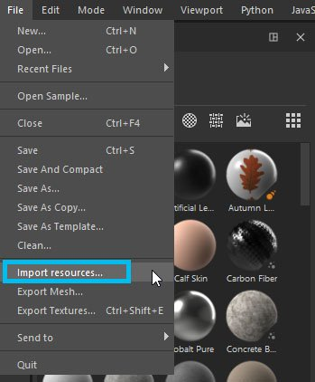
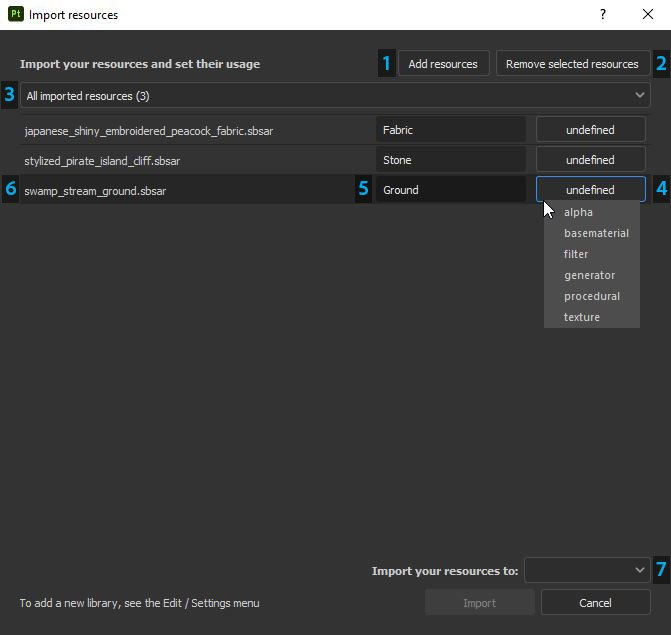

# 가져오기 창을 통해 자원 추가

## 가져오기 창 열기

Substance 3D Painter에서 가져오기 창을 여는 방법에는 세 가지가 있습니다.

* **파일 > 리소스 가져오기...** 메뉴 항목을 통해

* 에셋 창의 **전용 버튼**&#x200B;을(를) 통해

* 에셋 창으로 하나 이상의 파일/폴더 중 **드래그 앤 드롭**&#x200B;을 통해

{width="700px"}

## 가져오기 창 구성

* **1 - 리소스 추가**: 가져올 추가 파일을 선택하여 [가져오기] 창의 목록 표시에 추가할 수 있습니다.
* **2 - 선택한 리소스 제거:** 목록에서 선택한 파일을 제거합니다.
* **3 - 드롭다운 필터**: 사용량별로 파일 목록을 필터링할 수 있습니다. 이 옵션은 &#39;정의되지 않음&#39; 형식이 있는 리소스를 격리하는 데 유용합니다.
* **4 - 사용** : 사용할 수 있는 사용 유형이 여러 가지 있습니다. 제안된 사용 목록은 가져오는 파일 형식에 따라 변경될 수 있습니다. 파일 형식에 하나의 사용 유형만 있는 경우(예: Painter presets .sppr 이 자동으로 정의됨) 또는 파일 형식을 만든 사람이 원본 Designer 그래프에 사전 정의한 경우, 파일에 대해 사용을 사전 선택할 수 있습니다.
* **5 - 접두사** : 접두사는 리소스를 저장할 위치를 정의하는 폴더 경로가 될 수 있습니다.
* **6 - 파일 이름** : 현재 리소스의 이름입니다. 리소스가 저장된 폴더를 나타낼 수 있는 경우 이 정보는 가져오기 프로세스 중에 사용되지 않습니다.
* **7 - 가져오기 위치** : 다음 중 하나일 수 있습니다.
  * **현재 세션** : 임시 세션에서는 응용 프로그램을 다시 시작한 후 리소스가 손실됩니다.
  * **프로젝트 &quot;프로젝트 이름&quot;** : 현재 열려 있는 프로젝트 파일에 연결합니다. 리소스가 **spp** 파일에 포함되어 있습니다.
  * **셸프 &quot;셸프 이름&quot;** : 쓰기 가능으로 정의된 현재 라이브러리로. 자세한 내용은 이 페이지 [라이브러리 구성](../../interface/settings/libraries-configuration.md)을 참조하십시오.

가져오기 창에서(일반적인 시스템 단축키 사용) 리소스를 다중 선택하여 해당 리소스를 빠르게 편집할 수 있습니다.
