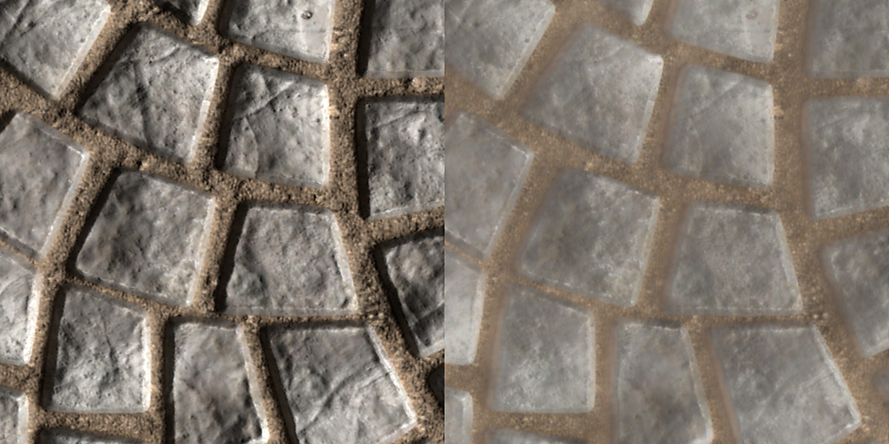

# 드래그 앤 드롭을 통해 리소스 추가

리소스를 가져오려면 응용 프로그램 외부에서 인터페이스의 다른 영역으로 파일을 끌어다 놓는 방법만 있으면 됩니다.

## 에셋 창으로 가져오기

리소스를 Painter으로 가져오려면 에셋 창으로 해당 리소스를 드래그 앤 드롭하면 됩니다.

이렇게 하면 리소스를 놓을 위치(프로젝트 내부, 프로젝트 전체에서 다시 사용하기 위한 디스크 또는 임시 사용을 위한 세션)를 제어할 수 있는 리소스 가져오기 창이 열립니다. 이 창에서는 일부 파일 형식이 모호할 수 있으므로 리소스 사용을 적절하게 구성할 수도 있습니다.

### 뷰포트로 가져오기

재질을 가져와 프로젝트에 바로 적용하려면 해당 재질을 뷰포트로 끌어다 놓기만 하면 됩니다. 파일을 드래그하는 동안 메쉬를 강조하여 적용할 프로젝트 부분을 나타냅니다.

SVG 파일을 뷰포트에 끌어다 놓는 방법으로도 가져올 수 있습니다. 이렇게 하면 뒤틀기 투영 모드와 소스 <b>그래픽을 재질로</b>를 사용하여 새 레이어를 만들어 데칼을 쉽게 만들 수 있습니다.

### 레이어 스택으로 가져오기

리소스를 레이어로 드래그하여 놓으면 놓았을 때 레이어(또는 효과)가 만들어집니다. Substance 자료나 필터가 아닌 경우 어떤 채널에 리소스를 넣을지 묻는 메뉴가 나타날 수 있습니다.

<table>
<tr style="border: 0;">
<td style="border: 0;" valign="top">

<b>오디오</b>

오디오를 조정하거나 프로젝트에 추가합니다.

* 오디오가 있는 소스 비디오 볼륨을 조정합니다.
* 외부 오디오 파일을 추가, 제거 또는 교체합니다.
* 외부 오디오 파일 볼륨을 조정합니다.

</td>
<td style="border: 0;" valign="top">

</td>
</tr>
</table>

### 리소스 슬롯으로 가져오기

파일을 인터페이스의 리소스 슬롯 중 하나(예: 채우기 레이어 내의 채널)로 드래그하여 놓으면 리소스를 가져와 자동으로 적용합니다.

