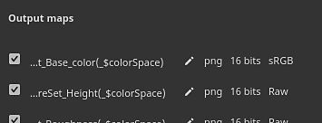

# 내보내기 설정

{width="500px"}

<b>텍스처 내보내기 창</b>의 <b>내보내기 설정 탭</b>을 사용하면 내보낸 텍스처의 구성, 크기 및 위치를 구성할 수 있습니다.

## 일반 및 텍스처 세트 구성

창의 첫 번째 요소는 왼쪽에 있는 텍스처 세트 목록입니다. 전역 설정 섹션에서는 모든 텍스처 세트의 공통 매개 변수에 액세스할 수 있습니다. 이렇게 하면 프로젝트의 모든 텍스처 집합에 적용할 단일 설정 집합을 쉽게 조정할 수 있습니다. 개별 텍스처 세트 설정을 변경하면 해당 텍스처 세트의 전역 설정이 재정의됩니다. 예를 들어, 전역 설정에서 해상도를 2048로 설정하고 특정 텍스처 세트에 대한 재정의로 1024를 설정하면 1024로 설정된 것을 제외한 모든 텍스처 세트가 2048 해상도로 내보내집니다.

각 텍스처 세트 이름 옆의 확인란은 연관된 텍스처를 내보낼 것인지 여부를 나타냅니다.

드롭다운 메뉴는 <b>모두 선택</b>, <b>모두 선택 해제</b> 및 <b>모든 </b>동작을 반전하여 선택 영역을 빠르게 수정할 수 있으므로 많은 수의 텍스처 집합이 있는 프로젝트에 유용합니다.

## 일반 내보내기 매개 변수

이 섹션에는 생성될 각 텍스처의 공유 설정이 포함되어 있습니다.

| 설정 | 설명 |
| --- | --- |
| <b>출력 디렉터리</b> | 내보낸 텍스처의 위치를 저장합니다. |
| <b>출력 템플릿</b> | 출력 템플릿 이름을 지정하고 텍스처 파일에 채널을 합성하는 데 사용되는 채널을 선택합니다. 템플릿에 대한 자세한 내용은 [출력 템플릿](../export-presets/export-presets.md) 목록을 참조하십시오. |
| <b>파일 형식 </b> | 파일 형식 및 해당 비트 심도 <b>출력 템플릿 기반</b> 옵션을 선택하면 내보내기 사전 설정에서 파일 형식이 상속됩니다. 이렇게 하면 전역이 아닌 텍스처별로 형식과 비트 심도를 결정할 수 있습니다. 사용 가능한 비트 심도는 파일 유형에 따라 다릅니다. 자세한 내용은 아래 표를 참조하십시오. |
| <b>크기 </b> | 내보낸 텍스처 파일의 해상도이다. 가능한 값:<ul data-preserve-html="true"> <li data-preserve-html="true"><b>각 텍스처 집합의 크기에 따라</b></li> <li data-preserve-html="true"><b>128</b></li> <li data-preserve-html="true"><b>256</b></li> <li data-preserve-html="true"><b>512</b></li> <li data-preserve-html="true"><b>1024</b></li> <li data-preserve-html="true"><b>2048</b></li> <li data-preserve-html="true"><b>4096</b></li> <li data-preserve-html="true"><b>8192</b>(Vram이 1.5GB 이상인 GPU에서만 사용 가능)</li> </ul> |
| <b>패딩 </b> | UV 섬 외부 영역을 텍스처 내부에 채우는 방법입니다. 가능한 값은 다음과 같습니다.<ul data-preserve-html="true"> <li data-preserve-html="true"><b>패딩(통과) 없음</b>: 텍스처의 현재 상태를 그대로 사용합니다.</li> <li data-preserve-html="true"><b>확장 무한</b>: UV 섬 테두리가 인접 테두리 또는 텍스처 끝에 도달할 때까지 늘립니다.</li> <li data-preserve-html="true"><b>확장 + 투명</b>: UV 섬 테두리를 픽셀 단위로 지정된 거리만큼 늘리고 나머지는 투명합니다.</li> <li data-preserve-html="true"><b>확장 + 기본 배경색</b>: UV 섬 테두리를 픽셀 단위로 지정된 거리만큼 늘리고 나머지는 텍스처 집합 채널의 기본 색상으로 채웁니다.</li> <li data-preserve-html="true"><b>확장 + 기본 배경색</b>: UV 섬 테두리를 픽셀 단위로 지정된 거리만큼 늘리고 나머지는 텍스처 집합 채널의 기본 색상으로 채웁니다.</li> <li data-preserve-html="true"><b>확장 + 확산</b>: UV 섬 테두리를 픽셀 단위로 지정된 거리만큼 늘리고 나머지는 흐릿한 버전의 UV 섬(mip-maps 기반)로 채웁니다.</li> </ul> |

>[!NOTE]
>
> **psd** 파일 형식은 컨테이너입니다. 즉, 출력 맵이 디스크의 단일 파일 안에 함께 모입니다.

### 디더링

8비트 텍스처를 내보내면 그레이디언트가 밴딩될 수 있습니다. 이 현상은 표준 및 Height 지도에서 특히 두드러집니다. 이 문제를 해결하는 방법에는 두 가지가 있습니다: 더 높은 정밀도를 사용하는 방법과 디더링을 사용하는 방법.

높은 정밀도(16 또는 32비트)가 이상적이지만, 일부 애플리케이션에서는 호환되지 않을 수 있습니다. 가장 주목할 만한 것은 게임 엔진이 종종 8비트로 압축된다는 점이다. 디더링을 사용하면 8비트 정보를 사용하는 동안 밴딩 문제를 완화하는 데 도움이 되는 노이즈가 발생합니다.

### 텍스처 파일 형식

다음은 Painter에서 지원하는 모든 내보내기 파일 형식 목록입니다.

| 형식 이름 | 형식 확장명 | 지원되는 비트 깊이 |
| --- | --- | --- |
| **비트맵** | bmp | 8, 8 + 디더링 |
| **OpenEXR** | exr | 16(부동), 32(부동) |
| **그래픽 교환 형식** | gif | 8, 8 + 디더링 |
| **레이디언스 HDR** | hdr | 32(부동) |
| **아이콘** | ico | 8, 8 + 디더링 |
| **Jpeg 2000** | j2k | 8, 8 + 디더링, 16 |
| **Jpeg 네트워크 그래픽** | jng | 8, 8 + 디더링, 16 |
| **Jpeg 2000** | jp2 | 8, 8 + 디더링, 16 |
| **Jpeg** | jpeg | 8, 8 + 디더링 |
| **JPEG 확장 범위** | jpeg-xr | 8, 8 + 디더링, 16, 32(부동) |
| **휴대용 비트맵** | pbm | 8, 8 + 디더링, 16 |
| **휴대용 부동 지도** | pfm | 32(부동) |
| **휴대용 회색 지도** | pgm | 8, 8 + 디더링, 16 |
| **이동식 네트워크 그래픽** | png | 8, 8 + 디더링, 16 |
| **휴대용 픽셀 맵** | ppm | 8, 8 + 디더링, 16 |
| **Photoshop 문서** | psd | 8, 8 + 디더링, 16 |
| **Truevision TGA** | 타르가 | 8, 8 + 디더링 |
| **태그 이미지 파일 형식** | tiff | 8, 8 + 디더링, 16, 32(부동) |
| **무선 응용 프로그램 프로토콜 비트맵 형식** | wbmp | 8, 8 + 디더링 |
| **WebP** | webp | 8, 8 + 디더링 |
| **X PixMap** | xpm | 8, 8 + 디더링 |

## 출력 맵

특정 텍스처 세트를 선택하면 해당 텍스처 세트에 대해 출력 맵 섹션이 표시됩니다.

이 섹션에는 현재 내보내기 사전 설정을 기반으로 생성되는 모든 텍스처가 나열됩니다. 이는 [색상 관리](../../features/color-management/color-management.md)를 사용하도록 설정한 경우 텍스처 이름 템플릿, 파일 형식, 비트 심도 및 색상 공간도 나타냅니다.

이 섹션에서는 특정 파일의 내보내기를 비활성화하거나 <b>파일 형식</b> 및 <b>비트 심도</b>을 재정의할 수 있습니다.

## USD 에셋 내보내기

이 상자를 선택하면 USD 형식으로 내보낼 수 있습니다. <b>출력 템플릿</b>에서 사용할 수 있는 USDz(Apple AR) 사전 설정과 달리, 이 내보내기는 내보내기에 구성한 모든 템플릿이나 매개 변수를 고려합니다. USD 에셋 상자를 선택하면 다음 파일이 내보내집니다.

* 텍스처 맵이 있는 폴더
* 텍스처 맵 폴더를 가리키는 *.usda*&#x200B;입니다.
* 원본 메시 파일과 재질을 어셈블하는 선택적 .usd입니다. Omniverse에서 직접 사용하여 재질이 자동으로 적용된 메쉬를 표시할 수 있습니다.
* 프로젝트에 사용된 메쉬를 포함하는 선택적 .usd 파일입니다. 원본 메시 파일이 USD가 아니거나 Painter의 자동 줄 바꿈 해제를 사용하여 UV를 생성한 경우에만 내보내집니다.
