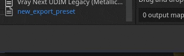

# 출력 템플릿

{width="500px"}

출력 템플릿 탭을 사용하여 새 출력 템플릿을 관리하고 생성할 수 있습니다. 출력 템플릿을 사용하여 내보낸 텍스처의 이름, 형식 및 구성을 수정할 수 있습니다.

## 사전 설정 목록

[사전 설정] 목록에는 사용 가능한 모든 출력 템플릿이 표시됩니다. 이 목록에는 [기본 출력 템플릿](../export-presets/default-presets.md)의 컬렉션과 사용자가 만든 모든 사용자 지정 템플릿이 포함되어 있습니다.

이 목록에서 템플릿은 <b>생성</b>, <b>이름 변경</b>, <b>복제</b> 또는 <b>삭제</b>될 수 있습니다.

| 액션 | 시각적 | 설명 |
| --- | --- | --- |
| **복제** | 

 | 목록에서 현재 선택한 출력 템플릿의 복사본을 만듭니다. |
| **제거** | 

 | 목록에서 현재 선택된 출력 템플릿을 제거합니다.  **참고:** 템플릿 삭제는 실행 취소할 수 없습니다. |
| **추가** | 

 | 새 빈 출력 템플릿을 추가합니다. |
| **두 번 클릭** | 

 | 선택한 출력 템플릿의 이름을 바꿉니다. |
| **마우스 오른쪽 단추** | 

 | 템플릿을 마우스 오른쪽 버튼으로 클릭하여 컨텍스트 메뉴를 열고 템플릿을 삭제하거나 이름을 바꾸거나 복제할 수 있습니다. |

## 출력 맵 목록

이 섹션에는 템플릿과 해당 컴포지션에 의해 생성될 모든 텍스처가 나열됩니다.

### 맵 유형 및 키워드

맨 위 줄에는 만들 수 있는 모든 텍스처 유형 목록이 표시됩니다.

| 버튼 | 시각적 | 설명 |
| --- | --- | --- |
| **회색** | 

 | 새 회색 음영 맵을 추가합니다. |
| **RGB** | 

 | 새 RGB 색상 맵을 추가합니다. |
| **R+G+B** | 

 | 개별 회색 음영 슬롯 3개를 사용하여 새 RGB 맵을 추가합니다. |
| **RGB+A** | 

 | 새 RGB 맵에 알파(회색 음영) 슬롯을 추가합니다. |
| **R+G+B+A** | 

 | 4개의 개별 회색 음영 슬롯이 있는 새 RGBA 맵을 추가합니다. |

>[!NOTE]
>
> 일부 유형은 비어 있거나 동일한 입력 맵을 공유할 때 병합/축소될 수 있습니다.
> 
> 

### 맵 이름

각 텍스처는 사용자 정의 이름 지정 규칙을 사용하여 이름을 지정할 수 있습니다. 최종 파일을 생성할 때 애플리케이션에서 자동으로 대체되도록 몇 개의 키워드를 추가할 수 있습니다(**$** 버튼 사용).

| 키워드 | 설명 |
| --- | --- |
| **$프로젝트** | 프로젝트 파일의 이름(.spp)으로 대체되었습니다. |
| **$메시** | 메시 파일의 이름으로 대체되었습니다(입력 메시 파일, 예: .fbx). |
| **$textureset** | 텍스처가 생성된 재료/텍스처 세트의 이름으로 대체됩니다. |
| **$udim** | 텍스처가 생성된 UDIM 숫자로 대체됩니다. |
| **$colorSpace** | 지정된 채널에 사용된 색상 공간의 이름으로 대체됩니다(RGB 또는 G, Alpha 무시). |

### 파일 형식 및 비트 심도 매핑

첫 번째 드롭다운은 현재 출력 맵의 파일 포맷을 지정하는 데 사용될 수 있다.

두 번째 드롭다운은 출력 맵의 비트 심도를 지정하는 데 사용됩니다. 비트 심도는 선택한 파일 형식에 따라 달라집니다. 자세한 내용은 [내보내기 설정](export-settings.md)을 참조하세요.

>[!NOTE]
>
> 내보낼 때 형식 및 비트 심도 설정을 고려하려면 일반 설정의 파일 형식을 **출력 템플릿 기준**&#x200B;으로 설정해야 합니다.

## 소스 맵 목록

### 입력 맵

입력 맵 목록은 [텍스처 집합 설정](../../interface/texture-set/texture-set-settings.md)을 통해 추가할 수 있는 모든 채널을 다시 그룹화합니다.

>[!NOTE]
>
> **사용자** 채널은 원래 이름(**사용자\_x**)을 기반으로 하며 사용자 지정 이름은 무시됩니다.

### 메시 맵

메시 맵은 구운 텍스처입니다.

| 이름 | 설명 |
| --- | --- |
| **표준** | 구운 노멀 맵. |
| **월드 스페이스 표준** | 베이킹 월드 스페이스 정상. |
| **ID** | Baked ID. |
| **주변 오클루전** | 구운 앰비언트 오클루전 |
| **곡률** | 구운 곡률. |
| **위치** | 유리한 위치. |
| **Thickness** | 구운 Thickness. |
| **Height** | 구운 Height. |
| **표준 구부리기** | 구운 표준 구부리기. |

### 전환된 맵

변환된 맵은 다른 소스에서 응용 프로그램에 의해 생성되는 맵입니다.

| 이름 | 설명 |
| --- | --- |
| **표준 OpenGL** | 구운 표준과 텍스처 세트의 표준 노멀 맵의 OpenGL 형식이 결합된 채널입니다. |
| **일반 DirectX** | 구운 표준과 텍스처 세트의 표준 노멀 맵의 DirectX 형식으로 된 결합된 채널입니다. |
| **혼합된 AO** | 구운 앰비언트 오클루전과 텍스처 세트 앰비언트 오클루전 채널의 결합된 앰비언트 오클루전 |
| **확산** | **기본 색상** 및 **금속** 채널에서 생성된 확산 텍스처(금속 영역은 검정색으로 바뀜). |
| **Specular** | **기본 색상** 및 **금속** 채널에서 Specular 텍스처가 생성되었습니다. |
| **광택** | 광택도 텍스처의 역방향으로부터 생성된 거칠기 채널의 역방향으로부터 생성된다. |
| **Unity4 확산** | 사용되지 않습니다. Unity 4 셰이더와 일치하도록 **기본 색상** 채널에서 확산 텍스처가 생성되었습니다. |
| **Unity4 광택** | 사용되지 않습니다. Unity 4 셰이더와 일치하도록 **거칠음** 및 **금속** 채널에서 광택도 텍스처가 생성되었습니다. |
| **반사** | 텍스처에서 흰색은 유전체를 나타내고 다른 색상은 금속 재료를 나타냅니다. |
| **1/ior** | 1을 **IOR** 값으로 나눈 텍스처 **IOR**&#x200B;은(는) 금속 맵에서 생성됩니다. 유전체는 1.4, 금속(검정색)은 100입니다. |
| **광택도2** | **광택도** 채널의 정사각형 버전(**광택도** \* **광택도**) |
| **f0** | 반사도 값을 프레넬 0으로 포함하는 텍스처(유전체의 경우 0.04, 금속의 경우 1.0). |
