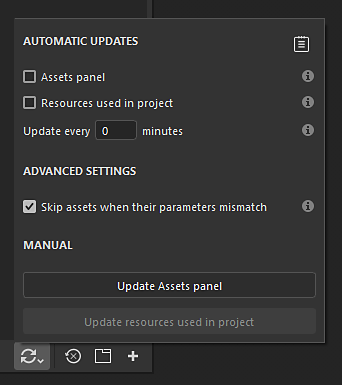
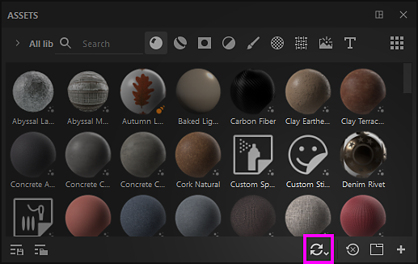
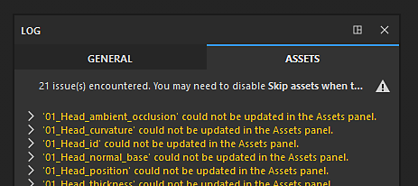

# 자동 리소스 업데이트

자동 리소스 업데이트 또는 <b>자동 업데이트</b>는 새 버전을 사용할 수 있을 때 리소스를 다시 로드하고 업데이트할 수 있는 [에셋 창](../interface/assets/assets.md)의 기능입니다. 이 프로세스는 인터페이스에서 자동 또는 수동으로 트리거되거나 Python 스크립팅을 통해 트리거될 수 있습니다.

## 튜토리얼

빠른 튜토리얼을 통해 기능에 대한 개요를 살펴볼 수 있습니다.

## 자동 업데이트 활성화

<b>자동 업데이트</b>를 사용하려면 에셋 창의 맨 아래로 이동하여 이중 화살표 아이콘을 클릭하십시오. 모든 설정이 포함된 자동 업데이트 메뉴가 열립니다. 그런 다음 <b>자동 업데이트</b> 섹션에서 사용할 수 있는 옵션 중 하나를 활성화합니다.

### 자동 업데이트

자동 업데이트 설정은 응용 프로그램이 업데이트를 찾는 빈도와 위치를 제어합니다.

| 설정 | 설명 |
| --- | --- |
| <b>에셋 패널</b> | 활성화되면 자동 업데이트는 현재 로드된 모든 라이브러리에서 업데이트할 에셋을 찾습니다. 여기에는 현재 프로젝트가 포함됩니다. 그러나 레이어 스택, 표시 설정, 셰이더 설정 등에 사용되는 리소스는 업데이트되지 않습니다. |
| <b>프로젝트에서 사용되는 리소스</b> | 활성화되면 자동 업데이트는 현재 프로젝트에서 가져오고 사용하는 업데이트할 에셋을 찾습니다. 이는 레이어 스택, 표시 설정, 셰이더 설정 등에 사용되는 리소스에 적용됩니다. |
| <b>x분마다 업데이트</b> | 응용 프로그램에서 리소스 업데이트를 찾는 빈도를 제어합니다. 0분의 지연은 몇 초마다 업데이트를 트리거합니다. 이러한 낮은 지연으로 인해 성능 문제가 발생할 수 있습니다. |

>[!NOTE]
>
> 자동 업데이트가 활성화된 경우 애플리케이션은 포커스를 다시 얻을 때마다 변경 내용을 자동으로 찾습니다.

### 수동 업데이트

수동 업데이트 동작은 원할 때 업데이트 시스템을 트리거하는 편리한 방법입니다. 자동 업데이트 설정을 사용하거나 사용하지 않고 사용할 수 있습니다.

| 설정 | 설명 |
| --- | --- |
| <b>에셋 패널 업데이트</b> | 자동 업데이트 프로세스를 시작합니다. <b>에셋 패널</b> 설정과 동일하게 작동합니다(위 참조). |
| <b>프로젝트에 사용된 리소스 업데이트</b> | 자동 업데이트 프로세스를 시작합니다. 프로젝트에서 사용되는 <b>리소스</b>과(와) 같은 방식으로 작동합니다(위 참조). |

## 고급 설정

고급 설정을 사용하여 업데이트 프로세스의 동작을 제어할 수 있습니다.

| 설정 | 설명 |
| --- | --- |
| <b>매개 변수가 일치하지 않는 경우 에셋 건너뛰기</b> | 활성화되면 새 버전이 이전 버전과 일치하지 않으면 자동 업데이트 프로세스에서 리소스가 업데이트되지 않습니다. 예를 들어, Substance 자료에 새 버전에 더 이상 존재하지 않는 매개 변수가 있는 경우(제거 또는 이름이 변경되어) 업데이트 프로세스는 리소스를 무시하고 이전 버전을 대신 유지합니다. |

>[!NOTE]
>
> 일치하지 않는 에셋을 강제로 업데이트하려면 <b>매개 변수 불일치 시 에셋 건너뛰기</b> 설정을 비활성화하면 됩니다.

## 업데이트 상태 및 로그

리소스 업데이트가 발생하면(자동 또는 수동) 프로세스 결과가 <b>로그</b> 창의 <b>에셋</b> 탭에 나타나 업데이트 성공 및 문제를 모두 보고합니다. 리소스가 일치하지 않는 경우(위 참조), 리소스별로 문제에 대한 세부 정보가 제공됩니다.

로그는 자동 업데이트 메뉴의 오른쪽 상단에 있는 전용 아이콘을 클릭하여 빠르게 열 수 있습니다.

>[!NOTE]
>
> 업데이트 후 하나 이상의 문제가 발생하면 로그 아이콘에 작은 경고 아이콘이 표시됩니다.

업데이트 프로세스의 진행 방식에 따라 다음과 같은 몇 가지 유형의 문제가 발생할 수 있습니다.

| 문제 | 설명 |
| --- | --- |
| <b>에셋 패널에서 업데이트할 수 없습니다.</b> | 이 메시지는 문제가 발생하여 업데이트 시스템을 계속할 수 없음을 의미합니다. 리소스 이름을 확장하여 자세한 내용을 확인하십시오. |
| <b>(파일 이름).(형식)이(가) 없습니다. (리소스 이름)</b>을(를) 다시 로드할 수 없습니다. | 이 메시지는 리소스의 소스 파일을 더 이상 찾을 수 없음을 의미합니다(이동 또는 제거되었기 때문). 간단한 수정 사항은 리소스를 다시 가져오거나 오른쪽 클릭 메뉴를 통해 에셋 창에서 리소스를 재배치하는 것입니다. |

## 이전 프로젝트 메시지

이전 프로젝트를 열 때 팝업 메시지 경고 내에 자동 업데이트 프로세스에 대해 알리는 옵션이 제공됩니다. 이 방법을 사용하면 이전 프로젝트를 열기 전에 활성화된 상태를 유지하는 경우 자동 업데이트 프로세스를 빠르게 비활성화할 수 있습니다.
