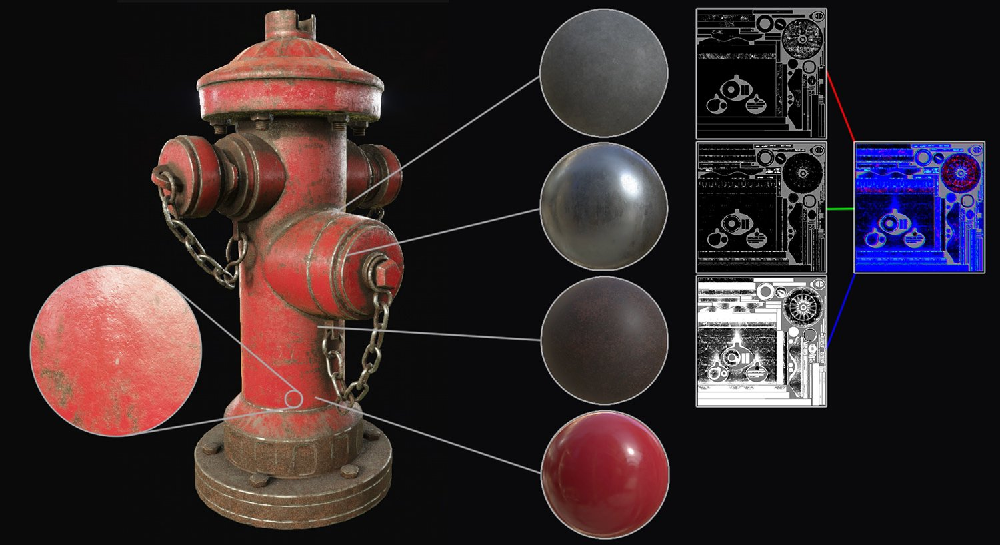
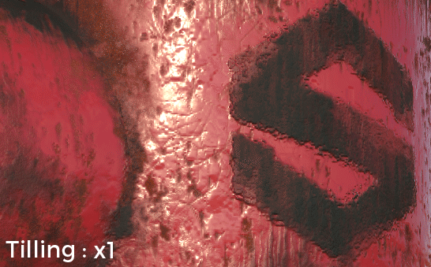

# 동적 재질 레이어

{width="450px"}

**동적 재질 레이어**&#x200B;은 제네릭 재질이 단일 텍스처가 아닌 셰이더 내에서 함께 혼합되는 특정 작업 과정입니다. 이 워크플로우의 주요 이점은 혼합이 동적이고 셰이더 내에서 제네릭 재질을 타일링하여 특정 수준의 품질을 제어하고 유지할 수 있다는 것입니다. 재질이 일반적이지만 재질을 혼합하는 데 사용되는 마스크는 메쉬에 한정되므로 반복하지 않습니다.

{width="400px"}

재질 레이어 작업 과정을 활성화하려면 특정 셰이더가 필요합니다.\
기본적으로 Substance 3D Painter과 함께 제공되는 셰이더 &quot; **pbr-material-layering**&quot;을(를) 사용하면 4개의 재질을 3개의 마스크로 혼합할 수 있습니다.

## 하위 레이어 스택

이러한 셰이더 서브-스택들에서, 셰이더에 의해 직접 정의되고 샘플링될 수 있다. Substance 3D Painter 와 함께 제공된 셰이더 &quot;pbr-material-layering&quot;의 예:

```
//: stacks [ 

//:   { 

//:     "id": "Mask", 

//:     "channels": [ 

//:   {"id": "opacity"} 

//:  ] 

//:   }, 

[...] 

//: ]
```


 이 예에서 셰이더는 각각 &quot;opacity&quot; 채널을 사용하여 지정된 텍스처 집합에 3개의 하위 스택을 만듭니다. 하위 스택은 TextureSet 목록 창에서 액세스할 수 있습니다.

하위 레이어 스택의 **채널**&#x200B;이(가) 셰이더&#x200B;**에**&#x200B;정의되어 있으므로 텍스처 집합 설정에 새 채널을 추가할 수 없습니다. 채널을 추가하거나 제거하려면 셰이더 파일의 업데이트가 필요합니다.

지원되는 최대 채널 수는 하드웨어에서 지원하는 총 샘플 수로 정의됩니다.\
Substance 3D Painter은 매개 변수로 로드된 재질에 대해 무제한 텍스처를 지원하지만, 엔진이 레이어 스택용으로 제공하는 채널은 Windows에서 32개로 제한됩니다. 이 제한에는 프로젝트의 메쉬에 적용된 표준 및 주변 오클루전 등의 다른 텍스처도 포함됩니다.

## 재질 입력

마스크와 함께 재질 을 정의하기 위해 하위 스택을 설정할 수도 있지만 셰이더에 재질 입력을 정의하고 셸프의 재질을 직접 사용하는 것이 더 실용적인 경우가 많습니다. 대부분의 경우 이러한 소재는 Unity 또는 Unreal Engine 4와 같은 최종 응용 프로그램에도 존재합니다. 재질을 선언하는 명명 규칙은 셰이더 &quot;pbr-material-layering&quot;에서 다음과 같이 표시됩니다.

```
//: materials [ 

//:   { 

//:      "id": "Material1", 

//:      "label": "Material 1", 

//:      "default": "", 

//:      "size": 1024, 

//:      "default_color": [0.5, 0.5, 0.5] 

//:   }, 

[...] 

//: ]
```


 다음은 일부 재질(substance 재질 또는 재질 사전 설정)을 로드한 결과입니다.

재료 해상도는 &quot;size&quot; 매개변수로 정의할 수 있습니다. &quot;default&quot; 매개 변수를 사용하여 셰이더를 만들 때 로드해야 하는 리소스의 이름/레이블을 사용하여 기본적으로 재질을 로드할 수도 있습니다.

셰이더 자체의 재질과 마스크에 액세스하려면 &quot;param auto&quot; 키워드와 연결하기만 하면 됩니다.

```
//: param auto Material1.channel_basecolor 

uniform sampler2D color1; 

 

//: param auto Mask.channel_opacity 

uniform sampler2D mask;
```


이 특정 워크플로에서 가장 중요한 부분은 마스크 및 셰이더 매개 변수입니다. 따라서 Substance 3D Painter의 내보내기 창에서 &quot;**셰이더스 매개 변수 내보내기**&quot; 설정을 활성화하는 것이 좋습니다. 그러면 텍스처 옆에 하위 스택 설정, 사용된 재질, 셰이더와 매개 변수에 대한 정보가 포함된 **JSON** 파일이 디스크에 만들어집니다. 매개 변수 내보내기 및 가져오기

현재 단일 텍스처로의 마스크 패킹은 내보내기 중에 지원되지 않습니다. 그러나 이를 위한 간단한 해결 방법은 스크립팅 기능을 사용하고 Substance 일괄 처리 도구를 호출하여 대신 Substance으로 패킹을 수행하는 것입니다.


이 JSON 파일을 사용하여 프로젝트의 레이어 스택 및 셰이더를 설정할 수 있습니다.\
이렇게 하면 공통 매개 변수를 공유하여 여러 응용 프로그램 간에 쉽게 주고받을 수 있습니다.


