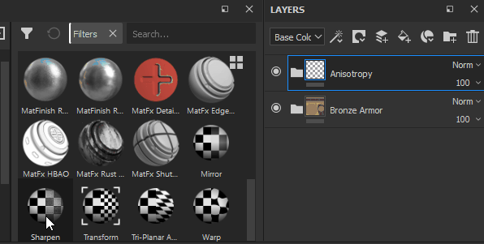

# 필터

필터 효과는 레이어 또는 레이어의 내용을 마스킹하는 물질입니다.

## 필터를 적용하는 방법

필터 유형에 따라 레이어의 콘텐츠 또는 마스크에 필터 효과를 만들어야 합니다.\
필터를 적용하는 방법에는 두 가지가 있으며, 필터를 적용할 방식에 따라 필터를 사용하는 방법이 달라집니다.

## 수동으로 필터 적용.

다음 예제에서는 흐림 효과 필터가 레이어의 내용에 적용되지만 마스크에 필터를 적용하는 데 더 일반적으로 사용됩니다.

### 1 - 필터 효과 추가

먼저 레이어의 콘텐츠(왼쪽 축소판)를 선택한 다음 효과 버튼을 클릭하거나 마우스 오른쪽 버튼으로 클릭하여 컨텍스트 메뉴를 엽니다.\
목록에서 &quot; **필터 추가**&quot; 옵션을 선택합니다.

### 2 - 속성 창에서 필터 선택

속성 창에서 매개 변수 또는 필터는 현재 비어 있습니다. 선택 버튼만 사용할 수 있습니다.\
버튼을 클릭하여 미니 선반을 열고 원하는 필터를 선택합니다. 여기서 흐림 효과 필터를 선택합니다.

## 셸프에서 필터 드래그 앤 드롭

이 방법은 전체 Layerstack에 적용해야 하는 필터를 위해서만 제공됩니다. 모든 채널 [혼합 모드](../../interface/layer-stack/blending-modes.md)가 자동으로 설정됩니다. 마스크에 필터를 적용하는 데는 작동하지 않습니다.

### 1 - 선반의 필터 영역 열기

셸프에서 왼쪽의 &quot;필터&quot; 섹션을 클릭합니다.

## 2 - 필터 끌어서 놓기

선반에 사용할 필터를 선택합니다. 레이어 스택에 끌어다 놓아 올바른 위치에 배치해야 합니다(예: 원치 않는 그룹에 떨어뜨리지 마십시오).

위의 예시에서 드롭된 필터에 이미 [패스스루 혼합] 모드가 있는 방법은 무엇입니까? 문서의 모든 채널에 적용됩니다.

## 새 유형의 필터 추가

모든 필터는 Substance 이며, Substance 3D Designer으로 만들 수 있습니다.\
빠른 시작으로서, Substance 3D Designer은 Substance 3D Painter에 사용할 수 있는 템플릿을 제공합니다.

자세한 내용은 이 페이지([사용자 지정 효과 만들기](../../content/creating-custom-effects/creating-custom-effects.md))를 참조하십시오.
