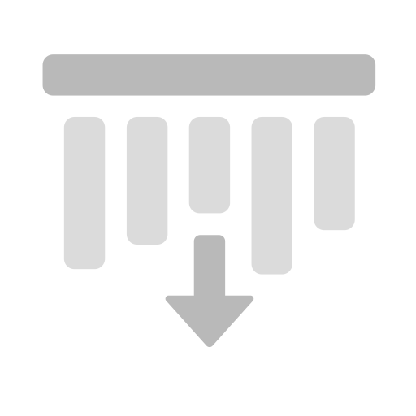

# 방향 거리

<table>
  <tr style="border: 0;">
    <td style="border: 0;" valign="top"> <strong>인:</strong> 효과/색상, 거리, 방향, 누수, 비</td>
    <td style="border: 0;" valign="top">설명 방향 거리 필터는 선택한 방향으로 이동하는 거리 그레이디언트를 만듭니다. 텍스처 레이어에서 방향 줄무늬, 누수 및 기타 거리 기반 효과를 만드는 데 사용됩니다. 방향 거리 필터를 Height 채널의 마스크로 사용하여 일반 채널에 차원을 추가할 수도 있습니다.</td>
  </tr>
</table>

## 입력

| 입력 이름 | 설명 |
| --- | --- |
| **거리 맵:** 회색 음영 | 사용자 정의 텍스처 또는 고정점을 사용합니다. |

## 매개변수

| 매개 변수 이름 | 설명 |
| --- | --- |
| **거리:** | 정규화된 이미지 공간에서 거리 구배에 의해 이동한 거리를 조정합니다. 여기서 1은 입력 이미지의 짧은 변의 길이입니다. |
| **각도:** | 거리 그레이디언트의 방향을 번갈아 조정합니다. 여기서 0은 수평으로 오른쪽으로 또는 (1,0) 벡터를 따라 움직입니다. |
| **대비:** | 결과의 대비 또는 감소를 조정합니다. |
| **거리 맵 승수:** | 거리 맵이 최대 거리에 미치는 영향을 조정합니다. 거리 맵 입력이 연결되지 않은 경우 이 매개 변수는 영향을 주지 않습니다. |

## 예

아래 예에서는 방향 거리 필터를 사용하여 셀 2 생성기가 3차원으로 나타나도록 합니다.

이는 Height 채널이 활성화되어 있고 값이 1로 설정된 채우기 레이어를 만들어 수행할 수 있습니다.

그런 다음 채우기 레이어에 검은색 마스크를 추가하고 마스크에서 회색 음영이 설정된 채우기를 **셀 2**&#x200B;에 추가합니다. 그러면 다음과 같은 마스크가 만들어집니다.

>[!NOTE]
>
> Alt 키를 누른 상태에서 마스크 아이콘을 클릭하거나 칠 레이어가 선택된 상태에서 **뷰포트**&#x200B;의 채널 드롭다운을 사용하여 **마스크**&#x200B;를 선택하면 **뷰포트**&#x200B;에서 마스크를 볼 수 있습니다.

그런 다음 마스크에 필터를 추가하고 방향 거리 필터를 선택합니다.

원하는 결과에 대한 필터 설정을 조정하지만 마스크는 아래 예제와 같이 보여야 합니다.

재질 보기로 다시 전환하여 뷰포트에서 효과를 확인합니다.
