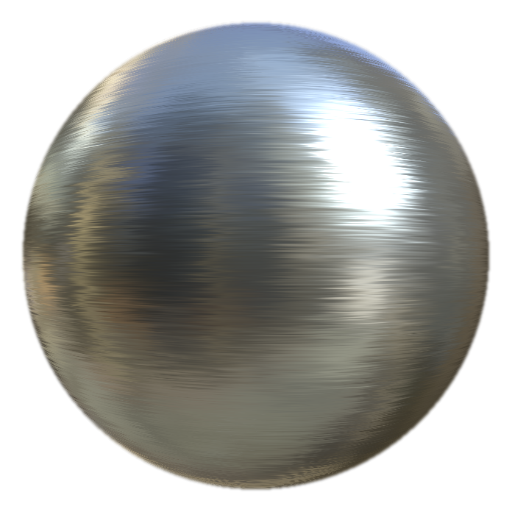

# MatFinish 브러시 적용 선형

<table>
<tr style="border: 0;">
<td width="33.33%" style="border: 0;" valign="top">

<b>내부:</b> 효과/완료, 표면

</td>
<td width="100.00%" style="border: 0;" valign="top">

## 설명

MatFinish 브러시로 칠한 선형 필터는 금속 마무리 컬렉션의 일부로 선형 브러시로 칠한 금속 효과를 만드는 데 사용됩니다.

칠 레이어에 사용됩니다. 기본 칠 층의 색상, 거칠기, 금속 및 기타 특성을 조정한 다음 최종 표면 처리를 위한 필터를 추가합니다.

</td>
</tr>
</table>

## 매개변수

| 매개 변수 이름 | 설명 |
| --- | --- |
| <b>시드:</b> | 전체 설정을 변경하지 않고 다른 변형을 만들려면 임의의 값을 할당합니다. |
| <b>크기 조절:</b> | 마무리의 전체 배율을 조정합니다. |
| <b>브러시 강도:</b> | 브러시 효과의 강도를 조정합니다. |
| <b>길이:</b> | 브러시로 칠한 줄무늬의 길이를 조정합니다. |
| <b>회전:</b> | 브러시로 칠한 패턴의 회전을 조정합니다. |

