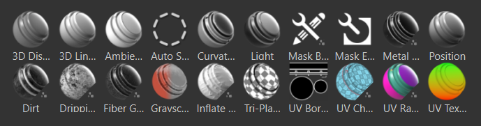

# Generators

생성기는 [위치], [곡률] 및 [월드 스페이스 표준]과 같은 구워진 유틸리티 맵을 사용하여 [메시 토폴로지를 기반으로 마스크 또는 텍스처를 생성하는 물질입니다](../../baking/baking.md).

>[!NOTE]
>
> 대부분의 제네레이터에서는 단색(흑백) 텍스처를 출력하므로 재질 레이어를 제어하는 마스크를 만드는 데 가장 유용합니다. 그러나 단색 생성기를 채우기 레이어로 사용하거나 전체 색상 생성기를 마스크로 사용하는 것을 방지할 수 있는 방법은 없습니다.

마스크에 생성기를 추가하려면 다음을 수행하십시오.

1. **레이어 패널**&#x200B;에서 마스크를 마우스 오른쪽 단추로 클릭합니다.
1. **생성기 추가**&#x200B;를 선택합니다.
1. 마스크를 선택하면 생성기가 **레이어 패널**&#x200B;의 레이어 아래에 표시됩니다.
1. 생성기를 선택한 상태에서 **속성 패널**&#x200B;에서 **생성기** 단추를 클릭하여 적용할 특정 생성기를 선택합니다.

레이어에 생성기를 추가하려면 다음을 수행하십시오.

1. 레이어를 마우스 오른쪽 버튼으로 클릭합니다.
1. **생성기 추가**&#x200B;를 선택합니다.
1. 생성기는 **레이어 패널**&#x200B;의 레이어 아래에 나타납니다.
1. 생성기를 선택한 상태에서 **속성 패널**&#x200B;에서 **생성기** 단추를 클릭하여 적용할 특정 생성기를 선택합니다.

>[!NOTE]
>
> 특정 레이어 또는 마스크에 생성기, 필터 또는 기타 효과를 적용할 수 있습니다. 레이어를 선택하면 해당 효과가 레이어 아래에 표시됩니다. 마스크에 적용된 효과를 보려면 레이어만이 아니라 마스크를 선택합니다.

각 생성기에는 결과 마스크를 미세 조정할 수 있도록 하는 매개 변수 세트가 있습니다.\
셸프에 사용자 지정 생성기를 추가하려면 [셸프에 콘텐츠 추가](https://helpx.adobe.com/substance-3d/unlisted/documentation/spdoc/adding-content-to-the-shelf-142213317.html)를 참조하십시오.

>[!NOTE]
>
> Substance 3D Designer에서 새 Substance를 만들 때 **Painter 생성기 템플릿**&#x200B;을 선택하여 새 생성기에 대한 좋은 시작점을 얻을 수 있습니다.
