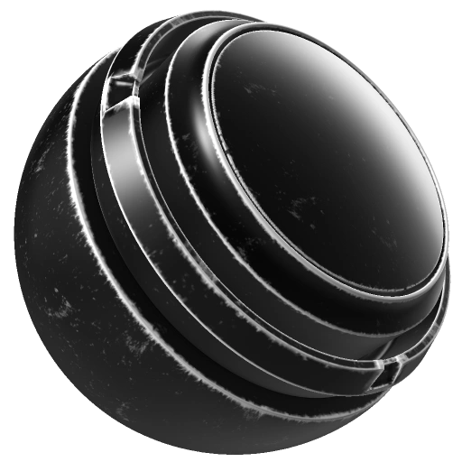

# 금속 Edge Wear

<table>
  <tr style="border: 0;">
    <td style="border: 0;" valign="top"> <strong>인:</strong> 마스크, 생성기</td>
    <td style="border: 0;" valign="top"><strong>설명</strong> 금속 Edge Wear 발생기는 파손과 마모의 모양을 메쉬에 만들어 냅니다.  금속 Edge Wear 생성기는 단색(흑백) 텍스처를 출력합니다. 따라서 레이어에 가장자리 마모 세부 사항을 추가하기 위해 마스크를 생성하는 데 유용합니다.  구겨진 위치, 곡률, 주변 오클루전 및 세계 공간 표준 맵이 이미지 입력으로 필요합니다. <a href="../../../baking/baking.md">여기서 굽는 방법에 대해 자세히 알아보세요</a>.</td>
  </tr>
</table>

## 입력

| 입력 이름 | 설명 |
| --- | --- |
| **월드 스페이스 표준** 색상 | 구워진 World Space Normal 지도를 사용합니다. |
| **위치** 색상 | 구워진 위치 맵을 사용합니다. |
| **사용자 지정 그런지** 회색 음영 | 사용자 정의 텍스처 또는 고정점을 사용합니다. |
| **곡률** 회색 음영 | 구워진 곡률 맵을 사용합니다. |
| **주변 오클루전** 회색 음영 | 구워진 Ambient 오클루전 맵을 사용합니다. |
| **마이크로 표준** 색상 | 사용자 정의 표준 텍스처 또는 고정점을 사용합니다. |
| **마이크로 Height** 색상 | 사용자 정의 텍스처 또는 고정점을 사용합니다. |

## 매개변수

<table>
  <tr>
    <th>매개 변수 이름</th>
    <th>설명</th>
  </tr>
  <tr>
    <td><strong>시드</strong></td>
    <td>Dirt 텍스처를 생성하는 데 사용되는 시드 값을 설정합니다.  <ul><li>[임의]를 클릭하여 다른 임의 시드로 전환합니다.</li><li>연필을 클릭하여 현재 시드 값을 보고 원하는 경우 특정 값을 입력합니다.</li></ul></td>
  </tr>
  <tr>
    <td><strong>반전</strong></td>
    <td>금속 가장자리 마모 마스크를 반전합니다.</td>
  </tr>
  <tr>
    <td><strong>마모 수준</strong></td>
    <td>마모의 총량을 설정합니다.</td>
  </tr>
  <tr>
    <td><strong>마모 대비</strong></td>
    <td>최종 마모 결과의 대비를 조정합니다.</td>
  </tr>
  <tr>
    <td><strong>삼각 평면 사용</strong></td>
    <td><strong>삼각 </strong> 사용 이 활성화되면 텍스처가 UV에만 의존하지 않고 세 방향(X, Y, Z축)에서 투영됩니다.  <ul><li>삼각형을 사용하지 않으면 텍스처가 UV 레이아웃을 따릅니다.</li><li>삼면체를 사용하면 텍스처가 여러 각도에서 투영되어 혼합됩니다.</li></ul></td>
  </tr>
  <tr>
    <td><strong>삼평면 혼합 대비</strong></td>
    <td>트리평면 매핑을 사용하여 텍스처를 투영할 때 얼마나 부드럽게 혼합할지 조정합니다. 각 방향의 투영 간 혼합의 부드러움을 조정합니다.</td>
  </tr>
  <tr>
    <td><strong>그런지 양</strong></td>
    <td>그런지 세부 사항의 양을 조정합니다.</td>
  </tr>
  <tr>
    <td><strong>그런지 비율</strong></td>
    <td>그런지 세부 사항의 비율을 조정합니다.</td>
  </tr>
  <tr>
    <td><strong>사용자 정의 그런지 사용</strong></td>
    <td>사용자 정의 그런지 맵 사용을 켜거나 끕니다.</td>
  </tr>
  <tr>
    <td><strong>가장자리 Smoothness</strong></td>
    <td>전체 가장자리의 Smoothness을 조정합니다.</td>
  </tr>
  <tr>
    <td><strong>앰비언트 오클루전 마스킹</strong></td>
    <td>주변 오클루전을 마스크로 사용하여 가려진 영역이 풍화 효과를 받지 않도록 합니다.</td>
  </tr>
  <tr>
    <td><strong>곡률 두께</strong></td>
    <td>곡률 맵이 최종 결과에 미치는 영향을 조정합니다. 곡률 맵은 발전기가 모서리를 정의하기 위해 사용하는 것으로, 매우 낮은 곡률 중량은 모든 모서리 마모를 제거하고 그런지만 남길 수 있습니다.</td>
  </tr>
</table>

### 마이크로 세부 사항

<table>
  <tr>
    <th>매개 변수 이름</th>
    <th>설명</th>
  </tr>
  <tr>
    <td><strong>마이크로 Height</strong></td>
    <td>사용자 정의 Micro Height 맵 사용을 켜거나 끕니다.</td>
  </tr>
  <tr>
    <td><strong>미량 정상</strong></td>
    <td>사용자 정의 Micro Normal 맵 사용을 켜거나 끕니다.</td>
  </tr>
  <tr>
    <td><strong>곡률 유형</strong></td>
    <td>곡률 유형을 설정합니다.  <ul><li><strong>표준</strong>: 일반적으로 매우 선명한 결과를 만들지만 더 넓은 세부 사항은 부족할 수 있습니다.</li><li><strong>Sobel</strong>: Sobel 필터를 사용하여 표준 맵을 평가하기 때문에 표준과 유사한 결과를 얻지만 약간 더 흐립니다.</li><li><strong>매끄럽게</strong>: 정보를 누적하기 위해 다양한 수준의 흐림 효과(예: 밉맵)를 생성합니다. 이 옵션을 선택하면 일반적으로 곡선이 더 매끄러워지지만 세부 묘사가 손실될 수 있습니다.</li></ul></td>
  </tr>
  <tr>
    <td><strong>곡률 강도</strong></td>
    <td><strong>표준 </strong> 및 <strong>소벨 </strong>곡률 모드에서 곡률 강도를 조정합니다.</td>
  </tr>
  <tr>
    <td><strong>Height 세부 정보 강도</strong></td>
    <td>마이크로 Height 세부 사항의 강도를 조정합니다.</td>
  </tr>
  <tr>
    <td><strong>AO 반경</strong></td>
    <td>미세한 세부 사항에서 주변 오클루전의 반경(범위)을 조정합니다.</td>
  </tr>
  <tr>
    <td><strong>AO 깊이</strong></td>
    <td>미세한 세부 사항에서 주변 오클루전의 깊이(강도)를 조정합니다.</td>
  </tr>
</table>
