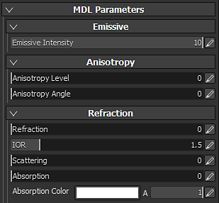

# 뷰어 및 MDL 설정

{width="400px"}

## 환경

일반 뷰포트와 마찬가지로 Iray에서 사용되는 환경 맵은 조명을 제어합니다.\
버튼을 클릭하거나 HDR 텍스처를 드래그하여 놓아 환경 맵을 변경할 수 있습니다.

* **환경 노출** : HDR 환경 맵의 노출 수준을 제어합니다.
* **환경 회전** : 환경 텍스처를 이동하고 장면 주변의 조명을 회전합니다.

>[!NOTE]
>
> 실제 기반 렌더러인 Illustrator에서 환경 텍스처는 장면의 조명과 모양을 크게 정의합니다.

## 돔

돔은 배경의 환경 맵을 투영할 모양입니다.\
장면에 따라 다음과 같은 3가지 유형의 돔을 사용할 수 있습니다.

* **무한 구** : 지평선을 시뮬레이션하기 위해 구면의 배경에 환경이 프로젝트되므로 항상 장면에서 멀리 떨어져 있습니다
* **구** : 환경이 크기를 조정할 수 있는 일반 구에 투영됩니다.
* **바닥이 있는 구** : 이전 모양과 마찬가지로 이 모양에도 바닥을 시뮬레이션하기 위해 구의 아래쪽을 평평하게 하는 컨트롤이 있습니다.

>[!NOTE]
>
> 지면이 있는 구에는 바닥의 크기/반경을 정의할 수 있는 컨트롤이 있지만 큰 반경은 환경에 왜곡을 만듭니다.\
>  선택한 유형에 따라 조명이 영향을 받을 수 있습니다.

추가 설정을 사용할 수 있습니다.

| *설정* | *설명* |
| --- | --- |
| **반경** | 구의 크기(무한하지 않은 경우) |
| **텍스처 크기 조절** | **지면이 있는 구** 유형에 대해 텍스처가 얼마나 늘어날지 지정합니다. |
| **색상 지우기** | 활성화되면 환경 맵의 배경 이미지를 균일한 색상으로 바꿉니다. 이것은 조명에 영향을 미칩니다. |

### 지표 설정

지면 설정을 사용하면 층이 있는 위치를 지정할 수 있습니다.\
기본적으로 이 값은 장면의 테두리 상자 아래쪽을 고정하도록 설정되어 있습니다.

| ***설정*** | ***설명*** |
| --- | --- |
| **X, Y, Z 값** | 세 축에서 바닥의 위치를 정의합니다.   0,0,0 값은 장면의 테두리 상자 중간에 해당합니다. |
| **반사율** | 지면 반사의 강도와 색상을 정의합니다.   흰색 밝기 값은 지면이 100% 반사된다는 것을 의미하고, 검정은 전혀 반사되지 않는다는 것을 의미합니다. 

 |
| **광택** | 반사의 광택(또는 거친) 정도를 정의합니다. 

 |
| **그림자 강도** | 이 매개 변수는 조명이 계산된 후 그림자의 최종 불투명도를 정의합니다. |
| **아래에서 표시** | 지면이 아래에서 보이는지 여부를 정의합니다. 이 옵션을 선택하면 그라운드가 그 위에 있는 요소를 가린다는 의미입니다. |

## MDL 및 Shader 매개변수

Illustrator에서는 MDL을 사용하여 오브젝트의 렌더링에 사용되는 재질을 정의합니다. 자세한 내용은 [형식의 공식 Nvidia 페이지](http://www.nvidia.com/object/material-definition-language.html) 를 참조하십시오.

기본적으로 Substance 3D Painter에서 MDL은 GLSL 셰이더와 연계되므로 아무것도 구성할 필요 없이 일반 뷰포트 및 Iray 간을 전환할 수 있습니다.\
그런 다음 MDL의 매개변수가 뷰어 설정의 아래쪽에 표시됩니다. 다음은 기본 MDL(PBR 금속/거칠기 셰이더와 호환 가능)의 매개 변수입니다.

>[!NOTE]
>
> 사용자 정의 MDL을 로드하려면 사용자 정의 glsl 셰이더가 필요합니다.\
>  셰이더에서 일부 메타데이터를 추가하여 mdl 경로 를 지정할 수 있습니다.
> 
> //- 이 셰이더와 함께 사용할 iray mdl 재질을 선언합니다. //: 메타데이터 { //: &quot;mdl&quot;:&quot;mdl::alg::materials::physically\_metallic\_roughness::physically\_metallic\_roughness&quot; //: }
> 
> * **mdl** : 셰이더와 함께 사용할 Ray mdl 재질을 정의합니다. 경로 구문은 다음과 같습니다. *mdl::folder1::folder2::mdl\_filename::material\_name*. 여기서 *folder1::folder2::mdl\_filename*&#x200B;은(는) mdl 파일에 대한 셸프 *mdl* 폴더 중 하나의 내부 경로이고 *::material\_name*&#x200B;은(는) 이 mdl 파일 내에 선언된 재질의 이름입니다. (예: &quot;mdl&quot; : &quot;mdl::alg::materials::physically\_metallic\_roughness::physically\_metallic\_roughness&quot;)

>[!NOTE]
>
> 프로젝트의 각 자재 인스턴스에 대해 MDL이 설정됩니다. 따라서 텍스처 세트 간에 재질 속성을 분리하려면 MDL을 별도로 구성하기 위해 새 재질 인스턴스를 설정합니다.

Substance 3D Painter의 기본 MDL은 다음 속성을 지원합니다.

| *설정* | *설명* |
| --- | --- |
| **발광 강도** | 방출 채널의 승수. 값이 높으면 빛이 나기 시작할 것이다. 

 |
| **굴절** | 굴절 정도를 제어합니다. |
| **IOR** | 재질의 굴절 색인을 정의합니다.   참고 : 공기 = 1.0, 물 = 1.2, 유리 = 1.5. |
| **분산** | 표면을 통해 산란되는 빛의 양을 제어합니다. |
| **흡수** | 표면을 통해 흡수되는 빛의 양을 제어합니다. |
| **흡수 색상** | 빛이 표면을 통과할 때 색상의 변화를 시뮬레이션합니다. |
