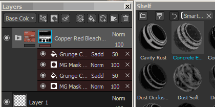

# 스마트 재질 및 마스크

Substance 3D Painter은 고급 **레이어 사전 설정** 사용을 지원합니다. 이러한 사전 설정을 사용하면 **메시 토폴로지에 맞게** 결과를 다르게 유지하면서 **유사한 텍스처링 프로세스**&#x200B;를 빠르게 **텍스처 집합 또는 프로젝트 간에 공유**&#x200B;하는 데 사용할 수 있습니다.

>[!NOTE]
>
> 레이어 스택에 추가하면 사용된 스마트 재질을 검색할 방법이 없습니다. 스마트 재질을 업데이트해야 하는 경우 프로세스를 수동으로 수행해야 합니다.\
> 그러나 개별 리소스는 [리소스 업데이트 프로그램](plugins/resources-updater.md)으로 업데이트할 수 있습니다.

## 스마트 재질/마스크는 어떻게 사용합니까?

스마트 재질은 레이어 스택의 어디에서나 사용할 수 있는 반면 스마트 마스크는 효과 스택에서만 사용할 수 있습니다.\
차이점에 대한 자세한 내용은 [레이어 스택](../interface/layer-stack/layer-stack.md) 및 [효과](effects/effects.md)를 참조하세요.

### 스마트 재질 추가

스마트 재질은 다음 두 가지 방법으로 추가할 수 있습니다.

* 선반에서 스마트 재질을 레이어 스택으로 드래그 앤 드롭합니다.\
  
* 스마트 재질 버튼을 클릭하여 미니 쉘프를 엽니다 .\
  

### 스마트 마스크 추가

스마트 마스크는 효과의 사전 설정이므로 (마스크의 경우) 효과 스택에만 추가할 수 있습니다.

* 스마트 마스크를 추가하려면 셸프에서 **대상** 레이어로 마스크를 **드래그 앤 드롭**&#x200B;하면 됩니다.\
  
* **여러** 스마트 마스크를 끌어다 놓으면 누적됩니다.\
  
* 그러나 끌어서 놓기 중에 **CTRL**&#x200B;을 눌러 전체 효과 스택을 **바꾸기**&#x200B;할 수 있습니다.\
  

### 스마트 재질/마스크를 만드는 방법

스마트 재질을 만들려면 **폴더**&#x200B;가 필요합니다.\
스마트 재질의 콘텐츠는 폴더에 포함됩니다. 그런 다음 폴더를 마우스 오른쪽 단추로 클릭하고 &quot;**스마트 재질 만들기**&quot;를 선택합니다. 그러면 스마트 재질이 현재 선반에 추가되고 선택한 폴더에 따라 이름이 지정됩니다.

스마트 마스크를 만들려면 레이어를 마우스 오른쪽 단추로 클릭하고 &quot;**스마트 마스크 만들기**&quot;를 선택하면 됩니다.

## 스마트 재질/마스크를 공유/검색하는 방법 ?

사전 설정은 **디스크**&#x200B;에 저장되며 전용 폴더에서 검색할 수 있습니다.\
**선반 위치** 를 찾으려면 : [하드 드라이브에 콘텐츠 추가](../content/importing-assets/adding-content-on-the-hard-drive.md) 를 참조하십시오.

그러면 누구나 Substance 3D Painter 셸프로 파일을 **가져오기**&#x200B;하여 사전 설정을 사용할 수 있습니다.
