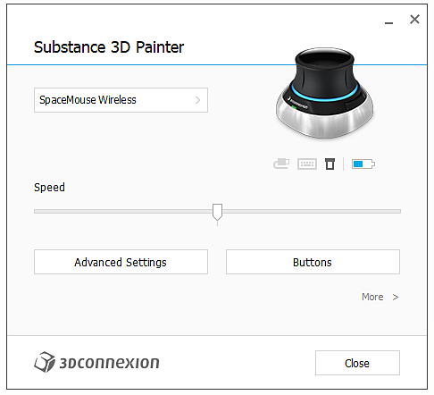

# SpaceMouse® by 3Dconnection

SpaceMouse® by 3D 연결은 3D에서 쉽게 탐색할 수 있는 장치입니다. 응용 프로그램 뷰포트에서 카메라/3d 모델을 조작하는 데 사용할 수 있습니다.

* SpaceMouse®는 버전 7.4.2 이후 지원됩니다.
* 이 장치를 올바르게 사용하려면 [3Dconnection](https://3dconnexion.com/uk/drivers/)에서 최신 드라이버를 설치하십시오.

>[!NOTE]
>
> 소형 모델을 사용하고 환경 맵을 자주 회전해야 하는 사용자는 SHIFT 키를 왼쪽 버튼에 할당할 수 있습니다.

## 튜토리얼

## 개요

기본 컨트롤 노브 또는 SpaceMouse®를 사용하면 일반 마우스/스타일러스 및 키보드 컨트롤에서는 불가능한 방식으로 뷰포트를 회전, 팬 및 확대/축소할 수 있습니다. 이 장치는 스타일러스와 함께 마우스 및 태블릿과 조합하여 사용될 수 있다.

모든 모델 및 버전은 애플리케이션과 호환되어야 합니다.

| 모델 | 설명 | 시각적 |
| --- | --- | --- |
| **소형 모델** | 노브 컨트롤이 있는 기본 모델 | 

 |
| **프로 모델** | 키보드 단축키를 위한 노브 컨트롤 및 추가 버튼. | 

 |
| **엔터프라이즈 모델** | 노브 컨트롤, 추가 버튼 및 문맥 표시. | 

 |

>[!NOTE]
>
> Compact, Pro 및 Enterprise 모델은 응용 프로그램에서 제대로 작동하도록 테스트되고 검증되었습니다.

## 방사형 메뉴

메뉴는 디바이스에서 직접 액세스할 수 있습니다.

* 왼쪽 버튼을 클릭하고 방사형 메뉴에서 특성(Properties)을 선택하여 소형 모델의 경우

  {width="250px"}
* Pro 및 Enterprise 모델에서 속성 메뉴는 메뉴 버튼을 눌러 액세스할 수 있습니다.

또는 시스템 트레이(시스템 시계 옆)에서 3Dconnection 아이콘을 마우스 오른쪽 단추로 클릭하고 **3Dconnection 설정 열기**&#x200B;를 선택합니다. 이 메뉴는 마지막 활성 창을 기준으로 상황에 맞게 표시됩니다. 제목 표시줄은 해당하는 프로그램을 나타냅니다(Adobe Substance 3D Painter이 아닌 경우 Painter 창으로 전환한 다음 설정 창으로 돌아갑니다.

## 기본 설정

{width="400px"}

SpaceMouse®의 설정 패널에서 최신 버전의 드라이버에서는 Painter의 기본 설정을 사용할 수 있습니다. 추가 구성이 필요하지 않으며 장치를 연결하기만 하면 플러그 앤 플레이가 됩니다.

상단 드롭다운 메뉴에서 올바른 장치를 선택해야 합니다. 기본적으로 올바른 장치를 선택해야 합니다.

&quot;속도&quot; 슬라이더는 모든 축과 방향의 감도를 변경합니다.

### 고급 설정

고급 설정 단추를 클릭하면 기본 컨트롤의 자세한 동작을 변경할 수 있습니다.

모든 기본 설정을 수정할 수 있습니다. **내비게이션 모드** 및 **회전 중심** 탭이 있는 두 개의 중요한 섹션이 있습니다.

#### 탐색 모드

{width="400px"}

3D에서 노브가 작동하는 방식 비헤이비어를 정의합니다.

| 설정 | 설명 |
| --- | --- |
| 개체 모드 | 노브는 3D 오브젝트 자체이며 기본값입니다. |
| 카메라 모드 | 카메라를 3D로 자유롭게 제어하세요. |
| 대상 카메라 모드 | 카메라는 항상 3D 공간의 한 지점을 대상으로 합니다. |
| 헬리콥터 모드 | 3D 공간에서 헬리콥터를 제어합니다. |
| 수평선 잠그기 | 수평선이 항상 수평이 되도록 카메라를 고정합니다. Painter은 해당 설정에서 이미 유사한 옵션을 제공하지만 여기에서 별도로 제어할 수 있습니다. 기본적으로 잠겨 있습니다. |

#### 회전 중심

{width="400px"}

작은 피벗 아이콘 동작을 정의합니다.

| 설정 | 설명 |
| --- | --- |
| 자동 | 피벗 또는 카메라 대상을 자동으로 이동합니다. 꺼져 있는 경우 항상 메시 원본 피벗에 고정됩니다. |
| 항상 표시 | 디바이스와 상호 작용하지 않는 경우에도 피벗 포인트는 항상 3D 뷰포트에 표시됩니다. |
| 모션에 표시 | 디바이스와 상호 작용할 때만 3D 뷰포트에 기준점이 표시됩니다. 이것이 기본 옵션입니다. |
| 숨기기 | 3D 뷰포트에서 피벗 포인트를 완전히 제거합니다. |

>[!NOTE]
>
> 피벗 포인트는 Painter용으로 특별히 설계되었지만 필요한 경우 숨길 수 있습니다.

### 버튼

{width="400px"}

**단추**&#x200B;를 클릭하면 명령, 매크로 또는 방사형 메뉴를 할당할 수 있습니다. 자세한 내용은 [3Dconnection 설명서](https://3dconnexion.com/uk/support/faq/)를 참조하십시오.
