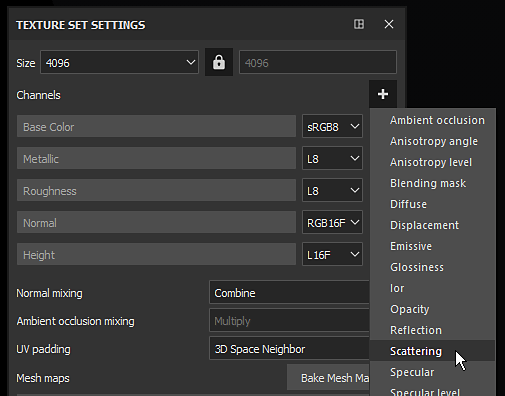

# 프로젝트에서 서브서피스 활성화

Substance 3D Painter에서 서브서피스 산란을 제대로 활성화하려면 몇 가지 매개 변수를 먼저 설정해야 합니다.\
이 페이지에서는 활성화할 매개변수에 대한 안내서를 제공합니다.

## 1 - 텍스처 설정

[텍스처 집합](../../interface/texture-set/texture-set.md)에 **분산** 채널이 없으면 추가합니다.

>[!NOTE]
>
> 분산 채널은 **표면**&#x200B;에서 **마스크**&#x200B;처럼 작동합니다. 채널이 검정이면 하위 표면이 전혀 없고, 흰색이면 하위 표면 강도가 최대입니다. 이 채널은 **기본적으로 검정**&#x200B;인 회색 음영 값입니다. 레이어 스택에 칠 레이어를 추가하여 기본 색상을 제어하거나 페인트 레이어를 사용하여 수동으로 강도를 제어합니다.

## 2 - 글로벌 하위 서피스 설정

[디스플레이 설정](../../interface/display-settings/display-settings.md)(포스트 효과 설정 아래)에서 기본 서브서피스 분산 설정을 활성화합니다.

>[!NOTE]
>
> [표면 아래] 효과를 활성화/비활성화하면 전체 프로젝트에 영향을 줍니다. 이 전역 매개 변수가 성능 측면에서 너무 무겁다면 사용하는 것이 도움이 될 수 있습니다.

## 3 - 셰이더 설정

기본 셰이더가 있는 [셰이더 설정](../../interface/shader-settings/shader-settings.md) 창에서 두 개의 설정이 있는 &quot; **SSS 매개 변수**&quot; 그룹을 찾을 수 있습니다.\
대상 재질에 맞게 비율과 색상을 변경합니다. 이러한 설정에 대한 자세한 내용은 [하위 표면 매개 변수](subsurface-parameters.md)를 참조하십시오.

## 보너스 : 그림자 활성화

서브서피스 스캐터링 효과는 잘 작동하지만 혼자 있는 경우 이상하게 보일 수 있습니다.\
그림자를 활성화하면 뷰포트에 최종 모양이 표시되고 최종 재질의 사실감이 향상됩니다.

[환경 설정](../../interface/display-settings/environment-settings.md) 창에서 &quot; **어두운 영역**&quot; 설정을 활성화합니다.

