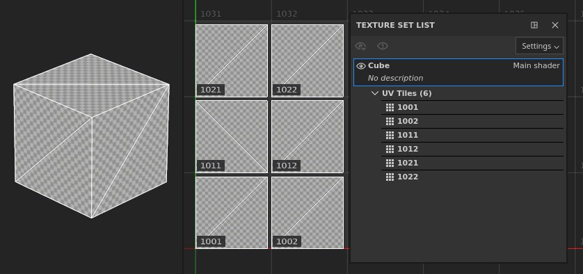
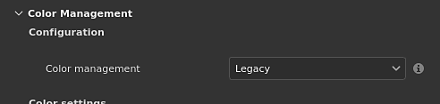

# 프로젝트 생성

<b>새 프로젝트 창 </b>을(를) 사용하면 3D 모델 및 해당 텍스처링 정보를 저장할 프로젝트 파일을 만들 수 있습니다.

가져온 3D 모델에 있는 재질 정의별로 새 [텍스처 집합](../interface/texture-set/texture-set.md)이 만들어집니다. 즉, 재질이 다른 경우 여러 개체를 한 파일(겹치는 UV도 포함)을 통해 가져올 수 있습니다.

## 새 프로젝트 만들기

새 프로젝트를 만들려면 <b>파일 > 새로 만들기</b>를 클릭하거나 키보드 단축키 <b>Ctrl + N</b>을(를) 사용하십시오.

다음은 새 프로젝트 창에서 사용할 수 있는 모든 매개변수에 대한 설명입니다.

### 기본 설정

| *매개 변수* | *설명* |
| --- | --- |
| **파일** | 로드할 3D 모델 파일을 지정하려면 &quot;선택&quot; 버튼을 클릭합니다. [지원되는 파일 형식 목록을 여기서 사용할 수 있습니다.](https://experienceleague.adobe.com/en/docs/substance-3d/general-knowledge/ecosystem/import-and-export-formats) |
| **템플릿** | 프로젝트의 기본 설정을 정의할 템플릿을 지정합니다. 템플릿에는 다음과 같은 매개변수가 포함됩니다.<ul data-preserve-html="true"> <li data-preserve-html="true">텍스처 세트 설정.</li> <li data-preserve-html="true">디스플레이 설정.</li> <li data-preserve-html="true">베이킹 설정.</li> <li data-preserve-html="true">셰이더 리소스(연결된 텍스처 포함).</li> <li data-preserve-html="true">환경 맵 파일입니다.</li> </ul>  **참고:** 템플릿은 [파일 메뉴](../interface/main-menu/file-menu.md)를 통해 기존 프로젝트에서 만들고 Assets 폴더 내에 저장하여 팀 구성원과 쉽게 공유할 수 있는 <b>\*.spt</b> 파일입니다. |
| <b>해상도</b> | 각 텍스처 세트에 대해 프로젝트의 기본 텍스처 해상도를 정의합니다. 애플리케이션 내에서 작업할 때는 해상도가 최대 4K(4096x4096픽셀)이고 내보낼 때는 8K(8192x8192픽셀)일 수 있습니다. 해상도는 나중에 [텍스처 설정](../interface/texture-set/texture-set-settings.md)을 통해 언제든지 변경할 수 있습니다.  **참고:** 8K 내보내기를 사용하려면 GPU에서 2.5GB 이상의 VRam을 사용해야 합니다. |

### 파일 유형별 설정

USD를 선택하면 다른 파일 유형별 설정을 사용할 수 있습니다.

| *매개 변수* | *설명* |
| --- | --- |
| <b>범위 및 변형</b> | USD 파일의 특정 부분을 선택합니다. 기본적으로 &#39;Root&#39;로 설정됩니다. 즉, 전체 USD 파일이 Painter 프로젝트를 만드는 데 사용됩니다.  <b>변경...</b>은(는) USD의 내용을 표시하는 새 창을 엽니다. 변형이 감지되면 프로젝트 제작을 위해 특정 변형을 선택할 수 있습니다. [프로젝트 구성](../interface/project-configuration.md) 설정에서 프로젝트를 만든 후 범위 및 변형을 변경할 수 있습니다. 참고:<ul data-preserve-html="true"> <li data-preserve-html="true">모델링 변형 선택만 프로젝트에 영향을 줍니다.</li> <li data-preserve-html="true">변형 내에 중첩된 변형은 현재 검색되지 않습니다.</li> </ul> |
| <b>서브디비전 수준</b> | 세분화해야 하는 형상의 경우 이 설정을 사용하면 Painter에서 텍스처링하기 위해 메시를 얼마나 세분화할 것인지를 지정할 수 있습니다. USD 파일에서 하위 분할이 명시적으로 &#39;없음&#39;으로 설정된 경우 이 설정은 회색으로 표시됩니다.  UV 풀기 후 세분화가 적용되어 메쉬 UV 모양이 바뀌지 않습니다. [프로젝트 구성](../interface/project-configuration.md) 설정에서 프로젝트를 만든 후 서브디비전 수준을 변경할 수 있습니다. |
| <b>프레임</b> | 애니메이션이 감지된 USD 파일의 경우 이 설정을 사용하여 Painter 프로젝트를 만드는 데 사용할 프레임을 선택할 수 있습니다. 선택한 USD 파일에 애니메이션이 없는 경우 이 설정은 회색으로 표시됩니다. [프로젝트 구성](../interface/project-configuration.md) 설정에서 프로젝트를 만든 후 프레임을 변경할 수 있습니다. |

### 고급 설정

| *매개 변수* | *설명* |
| --- | --- |
| **표준 맵 포맷** | 프로젝트의 표준 맵 포맷을 정의합니다. 다음 중 하나를 수행할 수 있습니다.<ul data-preserve-html="true"><li data-preserve-html="true"><strong>DirectX</strong>(X+, Y-, Z+)</li><li data-preserve-html="true"><strong>OpenGL</strong>(X+, Y+, Z+)</li></ul>  **참고:** 미리 알림:<ul data-preserve-html="true"> <li data-preserve-html="true"><b>언리얼 엔진</b>은 기본적으로 DirectX을 사용합니다.</li> <li data-preserve-html="true"><b>Unity</b>에서는 기본적으로 OpenGL을 사용합니다.</li> </ul> |
| **조각당 탄젠트 공간 계산** | 활성화된 경우 비트량은 꼭지점 셰이더 대신 조각(픽셀) 셰이더에서 계산됩니다. 이 매개변수는 뷰포트에서 셰이더가 표준 맵을 디코딩하는 방법에 영향을 줍니다. 이 설정을 변경하면 표준 맵을 다시 굽아야 합니다.  **참고:** 미리 알림:<ul data-preserve-html="true"> <li data-preserve-html="true"><b>Unreal 엔진</b>에서는 이 설정을 사용하도록 설정해야 합니다.</li> <li data-preserve-html="true"><b>Unity</b>에서는 이 설정을 사용하지 않도록 설정하거나 HDRP 워크플로를 사용하는 경우 사용하도록 설정해야 합니다.</li> </ul> |

### UV 타일 설정(UDIM)

>[!NOTE]
>
> 프로젝트를 만든 후에는 이러한 설정을 수정할 수 없습니다.

| *매개 변수* | *설명* |
| --- | --- |
| **UV 타일 작업 과정 사용** | 선택하면 가져온 메쉬가 다르게 처리되어 일반 UV 범위(0-1) 외부에서 페인팅이 가능합니다. UDIM을 사용하는 프로젝트는 이 설정을 활성화해야 합니다. 메쉬 처리는 설정에 따라 다를 수 있습니다.   자세한 내용은 [UV 타일 설명서](../features/uv-tiles/uv-tiles.md)를 참조하십시오. |
| <b>재질당 UV 타일 레이아웃을 유지하고 타일 간 페인팅을 활성화합니다</b> | 메쉬의 재료 할당별로 UV 타일(UDIM)을 가져와 그룹화합니다. 이는 단일 텍스처 세트가 2D 뷰에서 여러 UV 타일을 나란히 포함할 수 있음을 의미합니다. 동일한 텍스처 세트 내에 있는 UV 타일을 매끄럽게 페인트할 수 있습니다.  

 |
| <b>UV 타일을 개별 텍스처 세트로 변환(레거시)</b> | UV 타일(UDIM)은 재료 지정을 무시하고 개별 텍스처 세트로 분리되고 이름이 바뀝니다. 각 UV 타일은 페인트 가능한 UV [0-1] 범위로 이동됩니다.  

 |

### 가져오기 설정

| ***매개 변수*** | ***설명*** |
| --- | --- |
| **카메라 가져오기** | 메시 파일에 카메라가 있는 경우 이를 프로젝트로 가져와 시각화를 위한 사전 설정으로 액세스할 수 있습니다.  **참고:** Substance 3D Painter은 특정 조건에서 일부 카메라를 지원하지 않습니다.<ul data-preserve-html="true"><li data-preserve-html="true">3DS Max의 물리적 카메라.</li><li data-preserve-html="true">알렘빅 파일(&#42;.abc)에 저장된 직교 카메라.</li></ul> |
| **자동 줄 바꿈** | 활성화되면 가져온 메쉬에 누락된 UV가 생성됩니다. **옵션** 단추를 통해 선택한 설정에 따라 처리가 변경될 수 있습니다.자세한 내용은 [자동 UV 감싸기 해제 설명서](../features/automatic-uv-unwrapping.md)를 참조하십시오. |

### 베이크된 맵 가져오기

<b>추가</b> 단추를 사용하여 텍스처 파일을 메시 맵으로 로드하고 [텍스처 설정](../interface/texture-set/texture-set-settings.md)에서 자동으로 할당합니다. 메시 맵이 해당 텍스처 세트에 자동으로 할당되려면 특정 이름 지정 규칙을 따라야 합니다. 메시 맵은 응용 프로그램 내부에서 직접 구울 수도 있습니다. Baking 설명서를 참조하십시오.

명명 규칙:<b> TextureSetName\_MeshMapName</b>

예:<b> DefaultMaterial\_ambient\_user.png </b>

지원되는 메시 맵 및 이름 지정 목록:

| *메시 맵* | *파일 이름 규칙* |
| --- | --- |
| **주변 오클루전** | 앰비언트\_오클루전 |
| **곡률** | 곡률 |
| **표준** | normal\_base |
| **월드 스페이스 표준** | world\_space\_normals |
| **ID** | id |
| **위치** | 위치 |
| **Thickness** | 두께 |

### 실제 크기

물리적 크기 설정을 사용하면 Painter이 메쉬 물리적 크기를 실제 단위로 결정하는 방법을 조정할 수 있습니다. 재질이 사실적인 크기로 적용되도록 하는 데 유용합니다.

* 메쉬 파일의 내부 단위 비율 사용: 대부분의 파일 유형에는 3D 모델링 애플리케이션에서 내보낸 개체의 물리적 크기 정보가 포함됩니다. 이 옵션을 선택하면 Painter은 가져온 파일의 정보를 사용합니다.
* 사용자 정의 단위 크기 : 가져온 파일의 단위 크기를 덮어쓰거나 단위 크기가 포함되지 않은 경우 사용자 정의 입력 상자를 사용하여 단일 &quot;단위&quot;의 크기를 조정합니다.
* 재질을 할당할 때 칠 레이어 비율을 물리적 크기로 전환: 이 옵션을 활성화하면 물리적 크기 정보가 있는 재질이 적용 중인 표면의 물리적 크기에 맞게 비율을 조정할 수 있습니다.

### 색상 관리

이 섹션에서는 프로젝트의 색상 관리 설정을 제어합니다. 기본적으로 레거시(sRGB / 선형 워크플로우)로 설정되어 있습니다.

이 작업 과정을 사용하는 방법과 설정이 수행하는 작업에 대해 자세히 알아보려면 [색상 관리](../features/color-management/color-management.md) 설명서를 살펴보십시오.
