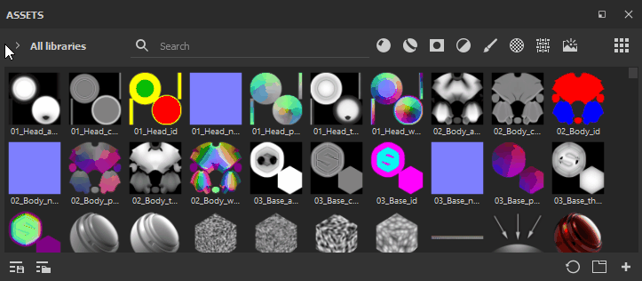

# 레이아웃 사용자 정의

하위 라이브러리, 줄어든 너비 및 축소판 크기와 같은 몇 가지 인터페이스 옵션이 있으므로 필요에 따라 에셋 패널 레이아웃을 변경할 수 있습니다.

>[!NOTE]
>
> 마우스 휠을 사용하거나 스크롤 막대를 조작하여 에셋을 스크롤할 수 있습니다. 또는 Painter 창에서 스크롤할 수 있는 다른 방법은 **Ctrl+Alt를 유지하고 원하는 패널 내에서 드래그**&#x200B;하는 것입니다.

도킹 및 방향

설치 후 Painter을 처음 열면 앱의 왼쪽에 세로로 도킹된 에셋 창이 표시됩니다. 하지만 고정 해제하고 가로로 배치할 수 있습니다. 또한 추가 [하위 라이브러리](sub-library-tab.md) 창을 사용하는 경우, 이 창도 원하는 대로 고정하고 고정 해제할 수 있습니다.

{width="600px"}

## 폭 감소

이 경우 에셋 유형은 하나 또는 여러 옵션을 선택할 수 있는 단일 메뉴로 축소됩니다.

## 축소판 크기

에셋 축소판 크기는 [작게], [중간] (기본값), [크게] 및 [목록] 옵션을 제공하는 맨 왼쪽 아이콘을 사용하여 조정할 수 있습니다.

{width="600px"}
