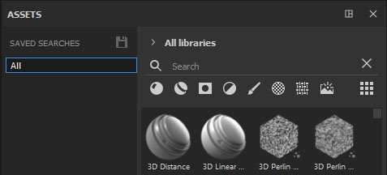
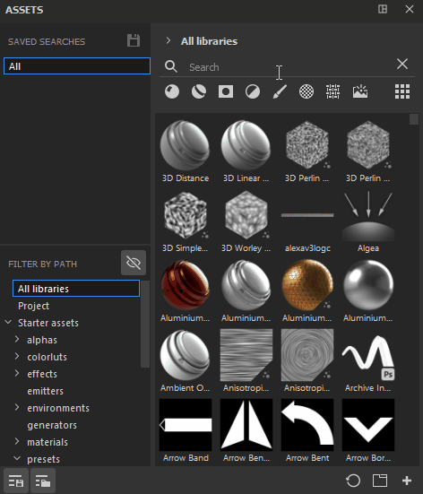

# 저장된 검색

저장된 검색은 경로별 필터링 과 함께 에셋 창 내에서 열 수 있는 또 다른 새로운 섹션입니다. 가장 자주 사용하는 검색 및 쿼리를 저장하고, 언제든지 쉽게 액세스하고, 개별적으로 도킹할 수 있는 새 하위 라이브러리 탭으로 열 수도 있습니다.

저장된 검색을 생성하려면 다양한 탐색 유형을 결합할 수 있습니다. 검색 필드에 서면 쿼리를 입력하고, 원하는 에셋 유형(또는 여러 에셋 유형)을 선택하고, 경로 또는 탐색 경로 필터링 을 통해 위치를 선택할 수 있습니다. 이러한 모든 항목을 저장된 단일 검색으로 저장하거나 저장된 개별 검색으로 나눌 수 있습니다. 예를 들어, 동적 스톡을 자주 사용하는 브러시에 대해 저장된 검색을 만들 수 있습니다.

>[!NOTE]
>
> 저장된 검색은 수동으로 편집할 수 있는 구성 파일에 저장됩니다. 자세한 내용은 [저장된 검색을 수동으로 추가](../../pipeline-and-integration/resource-management/adding-saved-searches-manually.md)해 보십시오.

저장된 검색을 생성하면 검색 목록에 나타납니다. 마우스 오른쪽 버튼으로 클릭하여 새 하위 라이브러리 탭을 만들고 이름을 바꾸거나 삭제할 수 있습니다.

검색 필드에서 검색 태그 위로 마우스를 가져가 검색 내용에 대한 정보를 볼 수도 있습니다.

