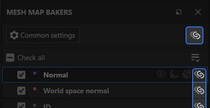

# 메시 맵 베이커 패널

<table>
  <tr style="border: 0;">
    <td style="border: 0;" valign="top"></td>
    <td style="border: 0;" valign="top"><strong>메시 맵 베이커 패널</strong>을 사용하면 베이킹할 맵을 선택하고 각 맵 유형에 대한 설정에 액세스할 수 있습니다.</td>
  </tr>
</table>

## 맵별 컨트롤

메시 맵 목록의 각 맵에는 다음과 같은 일련의 컨트롤이 있습니다.

1. 지도 굽기를 **확인**&#x200B;하거나 **확인 해제**&#x200B;합니다.
1. 뷰포트에서 지도를 **시각화**&#x200B;합니다.
1. 이 맵에만 **빠른 굽기**.
1. 선택한 메시 맵에 대해 **자동 다시 굽기**&#x200B;를 켭니다. **자동 다시 굽기** 맵은 굽기 매개 변수 또는 기울이기 교정이 변경되면 자동으로 다시 굽습니다.
1. 텍스처 집합 간에 이 맵 형식에 대한 **동기화** 설정을 동기화합니다. 개별 맵의 베이킹 설정을 사용자 정의하려면 이 옵션을 끕니다.

## 메시 맵 설정 관리

여러 가지 방법으로 프로젝트를 관리하여 메시 맵 또는 텍스처 세트 간에 베이킹 설정을 공유할 수 있습니다. 복잡한 프로젝트의 경우 설정 공유 방법을 이해하면 제작 과정을 단순화하는 데 도움이 될 수 있습니다.

텍스처 세트 간에 공유할 수 있는 설정에는 두 가지 유형이 있습니다.

* 베이킹 설정: **일반 설정** 및 **메시 맵 설정 패널**&#x200B;에서 변경할 수 있는 매개 변수입니다.
* 상태 확인: 특정 메시 맵에 대한 굽기를 켜거나 끄려면 이 옵션을 사용합니다.

### 텍스처 세트 간 베이킹 설정 동기화

프로젝트에 텍스처 집합이 여러 개 있으면 텍스처 집합 간에 동기화하는 옵션이 **메시 맵 베이커 패널**&#x200B;에 나타납니다.

**메시 맵 베이커 패널**&#x200B;의 위쪽에 있는 **설정 동기화 단추**&#x200B;를 선택하면 **공통 설정 동기화 창**&#x200B;이 열립니다.

이 창에서 공통 설정을 동기화할 텍스처 세트를 선택할 수 있습니다. 모든 텍스처 세트를 선택한 상태에서 텍스처 세트의 공통 설정을 변경하면 다른 모든 텍스처 세트의 공통 설정이 변경됩니다.

마찬가지로 개별 메시 맵 옆에 있는 **설정 동기화 단추**&#x200B;를 사용하면 텍스처 세트를 선택하여 메시 맵과 관련된 설정을 공유할 수 있습니다.

#### 비동기식 텍스처 세트 간 설정 공유

텍스처 세트 간에 메시 맵을 동기화하지 않고 그대로 유지하면서도 한 텍스처 세트에서 다른 텍스처 세트로 베이킹 설정을 복사하려는 경우가 있습니다.

동기화하지 않고 일반적인 설정을 특정 텍스처 집합에 복사하려면 **메시 맵 베이커 드롭다운**&#x200B;에서 **모든 설정을 더 많은 텍스처 집합에 동기화...**&#x200B;를 선택합니다.

**모든 설정을 모든 텍스처 집합에 동기화**&#x200B;를 사용하여 프로젝트의 모든 텍스처 집합에 설정을 복사할 수도 있습니다.

또는 단일 메시 맵에 대한 설정을 특정 텍스처 세트로 복사하려는 경우:

1. 메시 맵을 마우스 오른쪽 버튼으로 클릭합니다.
1. **더 많은 텍스처 집합에 &lt;메시 맵> 설정 적용...**&#x200B;을 선택합니다.

*위의 예에서 각 텍스처 세트는 AO에 대해 다른 설정으로 시작합니다. 동기화될 AO 메시 맵을 설정하지 않고&#x200B;**더 많은 텍스처 집합에 주변 문합 설정 적용...**을 사용하여 동일한 기준선에서 새 텍스처 집합에 대한 AO 설정 수정을 시작할 수 있습니다.*

### 메시 맵의 확인 상태 관리

확인 상태는 메시 맵을 분리할 때 지정된 맵이 포함되는지 여부를 결정합니다. 현재 텍스처 세트의 검사 상태를 관리하는 방법은 다양합니다.

* 개별 맵을 선택하거나 선택 해제합니다.
* 모든 메시 맵을 선택하거나 선택 해제하려면 **모두 확인** 또는 **모두 선택 해제**&#x200B;를 사용하십시오.
* **메시 맵 베이커 드롭다운**&#x200B;에서 **확인된 메시 맵 반전**&#x200B;을 사용하여 모든 맵의 확인 상태를 전환할 수 있습니다.

>[!TIP]
>
> 확인란을 클릭하고 드래그하여 여러 맵을 빠르게 선택하거나 선택 해제할 수 있습니다(위의 애니메이션 참조).

*위 예제에서&#x200B;**확인된 메시 맵 반전**을 사용하여 선택 영역을 빠르게 전환한 다음 아직 베이킹되지 않은 메시 맵을 베이킹합니다.*

여러 텍스처 세트를 사용하여 작업할 때 **더 많은 텍스처 세트에 체크 표시 적용...**&#x200B;을 선택하여 맵의 체크 표시 상태를 다른 텍스처 세트에 복사하거나 **모든 텍스처 세트에 체크 표시 적용**&#x200B;을 사용하여 모든 텍스처 세트에 체크 표시 상태를 복사할 수도 있습니다.

*위 예제에서&#x200B;**Material.001**텍스처 세트의 Height, 구부러진 수직 또는 불투명도를 아직 설정하지 않았습니다.**질감**질감 집합에서 이러한 메시 맵을 이미 선택했으므로&#x200B;**더 많은 질감 집합에 선택한 항목 적용...**을 사용하고&#x200B;**질감.001**을 선택하여 확인된 상태를 복사합니다. 그런 다음 맵을 굽습니다. 맵이 구워질 때 시각화가 메시 맵을 두 번 순환합니다. 이는 두 텍스처 세트 모두에 대해 구워지기 때문입니다.*