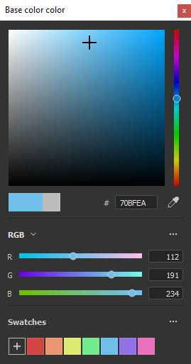

# 색상 피커

[색상 피커]를 사용하면 메시에 페인트하거나 투영하도록 색상을 설정할 수 있습니다. 외부 이미지에서 색상을 선택하거나 응용 프로그램 내의 기존 색상을 조정하는 데 사용할 수 있습니다.

색상 피커 창은 Painter에서 색상 필드를 클릭할 때 나타나며, [속성]이나 [표시] 또는 [셰이더] 매개 변수와 같은 추가 설정이나 메뉴 내에서 찾을 수 있습니다.

## 색상 피커 개요

열린 상태의 색상 피커는 반영구적이므로 문맥을 변경할 때까지(예: 페인트 레이어에서 칠 레이어로 전환) 계속 열려 있습니다. 창문을 이리저리 옮겨 가용한 어느 화면에서나 배치가 가능하다. 그러나 다른 창과 달리 색상 피커를 고정할 수 없습니다.

창에는 세 개의 섹션으로 구성된 세로 레이아웃이 있습니다.

* 그레이디언트 피커(또는 스펙트럼)
* 슬라이더(RGB/HSV)
* 색상 견본

{width="200px"}

### 그레이디언트 피커(스펙트럼)

| 이름 및 시각적 요소 | 설명 |
| --- | --- |
| **표시 선택기** 

 | 색상 편집에 사용할 디스플레이(스펙트럼 및 슬라이더)를 선택할 수 있습니다. 기본값은 기본 뷰포트에서 사용하는 디스플레이와 일치합니다.  **참고:** 이 설정은 [색상 관리](../features/color-management/color-management.md)를 사용하도록 설정한 경우에만 사용할 수 있습니다. |
| **스펙트럼** 

 | 세로 슬라이더는 일반 색조입니다. 이 도구를 사용하면 그라디언트 필드 내에 표시할 색상의 음영을 선택할 수 있습니다.일반 음영을 선택하면 그라디언트 필드에서 십자 커서를 길게 드래그하여 원하는 색상을 선택할 수 있습니다.  **참고:** [색상 관리](../features/color-management/color-management.md)가 활성화되면 현재 디스플레이의 HDR 색상이 작업 색상 공간에서 클램프됩니다. 이는 색상 관리 채널의 출력 HDR 값을 피하기 위한 것입니다. |
| **현재 및 이전 색상** 

 | 왼쪽 사각형은 색상 피커에서 출력될 최종 색상을 나타냅니다.오른쪽 사각형에는 이전 색상(색상 피커를 열 때)이 표시됩니다. 이것을 클릭하여 이전 색상을 복원하고 현재 색상으로 만들 수 있습니다. |
| **16진수 필드** 

 | 16진수 필드는 현재 색상을 16진수 값으로 나타냅니다. RGB 구성 요소는 문자 쌍으로 표시됩니다.예를 들어 #FF0000은 빨간색을 나타냅니다.  **참고:** [색상 관리](../features/color-management/color-management.md)를 사용하도록 설정하면 16진수 필드가 항상 표준 sRGB 색상 공간에서 작동하여 프로젝트에서 사용하는 현재 표시 또는 작업 영역에 관계없이 소프트웨어 간에 값을 더 쉽게 복사/붙여넣기할 수 있습니다. |
| **스포이드** 

 | 스포이드를 사용하여 외부 소스에서 색상을 선택할 수 있습니다. 아이콘을 **클릭**&#x200B;하려면 마우스를 이동하고 원하는 색상을 다시 복사합니다.  **참고:** 뷰포트 내에서 색상을 선택할 때 **Shift** 수정자를 사용하여 직접 편집한 현재 채널을 선택할 수 있습니다. 이렇게 하면 원래 텍스처와 화면에 표시되는 색상 간에 손실 있는 색상 변환이 수행되지 않습니다. 이 기능은 **재질** 표시 모드에서 전환하지 않고도 색상을 선택하는 데 유용합니다. 

  **참고:** 색상 필드 옆에는 스포이드도 있으며 색상 피커를 열지 않고도 색상을 빠르게 선택하는 데 사용할 수 있습니다. 

  **참고:** Mac OS에서는 개인 정보 보호 설정으로 인해 스포이드가 응용 프로그램 인터페이스 외부의 색상을 선택하지 못할 수 있습니다. 이 문제를 해결하려면 `System Preferences > Security & Privacy > Privacy > Screen Recording`에서 응용 프로그램에 적절한 권한을 할당하십시오. |

### 색상 설정

| 설정 | 설명 |
| --- | --- |
| **스포이드 색상 공간** | 뷰포트 외부에서 선택한 색상의 색상 공간을 지정합니다.**자동** 설정은 프로젝트 설정의 표준 sRGB 색상 공간을 사용합니다. 

 **참고:** 이 설정은 색상 단추 옆의 스포이드에도 적용됩니다.  **참고:** Shift 수정자를 사용하지 않는 경우 뷰포트 내에서 선택한 색상도 이 프로필을 사용합니다. |

### 슬라이더

색상 슬라이더를 사용하면 개별 값을 수동으로 조정할 수 있습니다.

슬라이더는 **HSV** 또는 **RGB**&#x200B;의 두 가지 모드를 설정할 수 있습니다. 모드를 변경하려면 전용 드롭다운 메뉴를 사용합니다.

#### HSV

**HSV**&#x200B;은(는) **H** ue, **S** aturation 및 **V**&#x200B;값을 나타냅니다.

**색조**&#x200B;를 사용하면 세로 그레이디언트 슬라이더처럼 전체 색상 패밀리를 순환할 수 있습니다.

**채도**&#x200B;는 선택한 색상의 풍부함을 제어하며 회색 음영에서 채도가 완전히 높아집니다.

**값**&#x200B;은 색상의 어둡거나 밝은 정도를 결정하며, 범위는 완전한 검정에서 완전한 흰색까지입니다.

#### RGB

**RGB**&#x200B;은 **R** ed, **G** reen 및 **B** lue를 나타냅니다.

컴퓨터 그래픽에 색상을 저장하는 데 디지털 방식으로 사용되는 기본 구성 요소입니다. 각 슬라이더는 최종 색상에 있는 구성 요소의 양을 나타냅니다.

예: 아래 이미지의 색상은 빨간색의 100%이지만 파란색과 녹색의 비율은 50%입니다.

RGB 슬라이더는 0~255개의 값을 통해 측정되는 것이 더 일반적입니다. 이 작업은 **부동 소수점 값** 옵션을 사용하지 않도록 설정하여 수행할 수 있습니다.

### 슬라이더 설정

설정 메뉴를 통해 다음과 같은 몇 가지 추가 비헤이비어를 구성할 수 있습니다.

| 설정 | 설명 |
| --- | --- |
| **동적 슬라이더** | 활성화되면 슬라이더의 배경색이 현재 색을 기준으로 조정됩니다. |
| **부동 소수점 값** | 활성화되면 슬라이더 값이 0.0에서 1.0으로 표시됩니다.비활성화되면:<ul data-preserve-html="true"> <li data-preserve-html="true"><strong>HSV</strong>: 색조 슬라이더는 색상 휠과 같이 도 단위로 측정됩니다. 채도 및 값 사용 백분율입니다. </li> <li data-preserve-html="true"><strong>RGB</strong>: 구성 요소는 0에서 255까지의 값으로 표시됩니다.</li> </ul> |

## 작업 색상 공간

이 섹션에서는 현재 작업 색상 공간에 지정된 최종 색상 값을 보여 줍니다.

마우스로 **작업 색상 공간** 제목을 마우스로 가리키면 현재 색상 공간의 이름을 표시할 수 있습니다.

>[!NOTE]
>
> 이 섹션은 [색상 관리](../features/color-management/color-management.md)를 사용하도록 설정한 경우에만 사용할 수 있습니다.

## 색상 견본

색상 견본은 색상을 저장하여 나중에 다시 사용할 수 있는 방법을 제공합니다. 색상 견본은 투영 및 세션 간에 사용할 수 있습니다.

### 견본 추가

이 버튼을 클릭하면 현재 세트에 새 견본 색상이 만들어집니다.

견본 색상은 마지막 색상(단추 옆에 있는 색상)이 현재 편집된 색상과 다른 경우에만 만들어집니다.

>[!NOTE]
>
> 견본 색상은 현재 [색상 관리](../features/color-management/color-management.md) 구성이 무엇으로 설정되었든 관계없이 sRGB 색상으로 관리 및 저장됩니다.

### 색상 견본

색상 견본 색상을 클릭하여 불러옵니다.

견본을 마우스로 가리키면 해당 16진수 값이 표시됩니다.

>[!NOTE]
>
> [색상 관리](../features/color-management/color-management.md)를 사용하도록 설정하면 현재 선택한 디스플레이에 따라 색상 표시가 조정됩니다.

### 색상 견본 설정

견본 색상을 마우스 오른쪽 버튼으로 클릭하면 메뉴가 열리고 삭제됩니다.

### 설정 메뉴

설정 메뉴를 사용하여 모든 색상 견본을 삭제합니다.

>[!NOTE]
>
> 색상 견본은 사용자의 문서 폴더에 있는 구성 파일에 저장됩니다. 자세한 내용은 [보관 및 자산 위치](../pipeline-and-integration/resource-management/shelf-and-assets-location.md) 페이지를 참조하세요.
