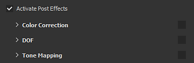

# 카메라 설정

**디스플레이 설정**&#x200B;의 이 섹션은 카메라의 비헤이비어와 뷰포트의 최종 모양을 제어합니다.

## 카메라

| *설정* | *설명* |
| --- | --- |
| **보기 필드** | 카메라의 필드 보기(도 단위)를 제어할 수 있습니다. |
| **초점 거리** | 포커스점이 있는 거리를 정의합니다.  이 점은 [필드] 효과의 깊이에 사용됩니다. 

 **참고:** 포커스 거리는 바로 가기 **CTRL + 마우스 가운데 단추**&#x200B;로 메시 지점을 클릭하여 자동으로 설정할 수 있습니다. |
| **조리개** | 필드 깊이 범위를 정의합니다. 

 **참고:** Iray가 이 매개 변수를 제어하는 경우 매개 변수를 변경하면 계산을 다시 트리거합니다. |

## 후처리 효과

자세한 내용은 [효과 후 페이지](../../features/post-processing/post-processing.md)를 참조하세요.

## 임시 안티앨리어싱

활성화하면 **임시 안티앨리어싱**(**TAA**)이 뷰포트에서 들쭉날쭉한 가장자리를 제거합니다.\
**TAA**&#x200B;은(는) 렌더링 중 여러 프레임에 정보를 누적하여 작동합니다. 즉, 카메라가 움직임을 멈추거나 다른 작업이 수행될 때까지 효과가 비활성화됩니다.

| *설정* | *설명* |
| --- | --- |
| **누적** | 앨리어싱을 줄이기 위해 누적할 프레임 수를 정의합니다.<ul data-preserve-html="true"> <li data-preserve-html="true">16: 대부분의 경우 권장 값</li> <li data-preserve-html="true">64: 고대비 값(예: Alpha 테스트 셰이더 및 디더링 결합)을 정리하는 데 유용합니다.</li> </ul>  **참고:** 이 설정은 성능에 영향을 주지 않습니다. 그러나 값이 높으면 결과가 좋기까지 시간이 더 걸릴 수 있습니다. |

{width="500px"}

&quot;**Alpha**&quot; 설정이 활성화된 경우 앤티 앨리어스를 사용하여 **알파 디더링 테스트** 셰이더를 필터링할 수도 있습니다.

{width="500px"}

## 표면 하부 산란

자세한 내용은 [하위 표면 분산](../../features/subsurface-scattering/subsurface-scattering.md) 페이지를 참조하세요.

## 색상 프로필

자세한 내용은 [색상 프로필 페이지](../../features/post-processing/color-profile.md)를 참조하세요.

## 톤 매핑

| 설정 | 설명 |
| --- | --- |
| **함수** | 모니터 표시 기능을 초과하는 색상 값을 맞추는 데 사용되는 함수를 지정합니다(HDR 값을 LDR 범위에 다시 매핑).가능한 값은 다음과 같습니다.<ul data-preserve-html="true"><li data-preserve-html="true"><strong>선형</strong>(기본값): 변환 없음, 1.0보다 큰 값은 고정됩니다.</li><li data-preserve-html="true"><strong>ACES</strong>: ACES 파일 톤 매핑 곡선을 사용합니다.</li></ul> 

 **참고:** 일부 게임 엔진과 렌더링 소프트웨어는 ACES 톤 매퍼를 사용합니다. 이 기능을 활성화하면 응용 프로그램 간에 색상을 일치시키고 차이를 방지하는 데 도움이 됩니다. |
