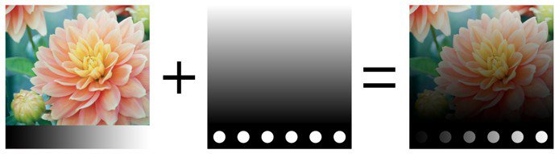
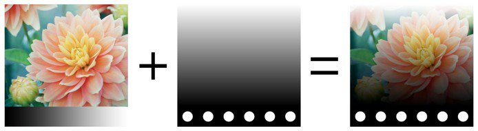
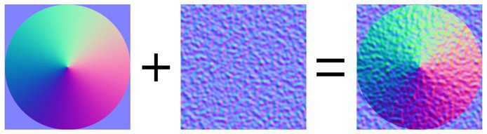

# 혼합 모드

레이어 및 효과는 여러 **혼합 모드**&#x200B;에 액세스할 수 있습니다. 이러한 기능을 사용하면 레이어의 결과를 아래의 다른 레이어와 다양한 방식으로 혼합할 수 있습니다.

모든 혼합 모드가 모든 사용 사례에 적합한 것은 아닙니다. 예를 들어 **노멀 맵** 혼합 모드는 텍스처 집합의 **표준 채널**&#x200B;에만 유용합니다.

## 혼합 모드 순서

혼합 모드가 적용되는 방법과 시기를 이해하려면 **레이어 스택**&#x200B;에서 작업이 수행되는 순서를 이해하는 것이 중요합니다.

1. 맨 아래에 있는 레이어가 계산됩니다.
1. 맨 위에 있는 레이어는 혼합 모드(예: 곱하기)를 기준으로 아래 레이어와 계산 및 혼합됩니다.
1. 마스크 적용,

## 혼합 모드 변경

레이어의 **각 채널**&#x200B;에 대해 혼합 모드를 변경할 수 있습니다. 채널 간에 전환하려면 레이어 스택 창에서 사용할 수 있는 왼쪽 상단 드롭다운을 사용합니다.

혼합 모드를 변경하려면 특정 레이어의 [혼합 모드] 드롭다운을 클릭하면 됩니다.

>[!NOTE]
>
> 드롭다운에 포커스가 있는 경우 다음 단축키를 사용하여 혼합 모드 간에 빠르게 전환할 수 있습니다.
> 
> * 위쪽 또는 아래쪽 화살표 키보드 단축키
> * 마우스 휠 위 또는 아래

## 혼합 모드 목록

다음은 Substance 3D Painter 레이어 및 효과에서 사용할 수 있는 모든 혼합 모드 목록입니다. 대부분의 혼합 모드는 RGB(또는 회색 음영)의 작업을 통해 작동하지만 일부 작업은 [HSV(색조, 채도, 값)](https://en.wikipedia.org/wiki/HSL_and_HSV)인 다른 모드를 통해 수행됩니다. 모든 혼합 모드는 내부적으로 **선형 감마 공간**&#x200B;에서 수행됩니다.

| *이름* | *설명* |
| --- | --- |
| 표준 | 변형 없이 맨 아래 레이어 위에 맨 위 레이어를 표시합니다(복사 모드). 위쪽 레이어에 투명도(알파)가 있는 경우 아래쪽 레이어가 투명 픽셀을 통해 표시됩니다. 

 |
| 통과 지점 | 맨 아래 레이어를 맨 위 레이어로 병합합니다. 주로 다음과 같은 경우에 유용합니다.<ul data-preserve-html="true"> <li data-preserve-html="true">맨 위 레이어 아래에 있는 모든 레이어에 효과 적용</li> <li data-preserve-html="true">상위 레이어 아래에 있는 레이어에 손가락 효과 또는 복제 적용</li> </ul> 

 **참고:** **효과**&#x200B;를 **드래그 앤 드롭**&#x200B;할 수 있습니다. 이렇게 하면 모든 채널에 대해 혼합 모드가 패스스루으로 설정된 레이어가 만들어집니다. |
| 비활성화 | 레이어의 혼합을 버리고 이전 레이어만 표시합니다. 상위 계층에서 채널을 무시하여 채널 계산을 최적화하는 데 사용할 수 있습니다. 

 |
| 바꾸기 | 맨 아래 레이어를 덮어씁니다. 이는 예를 들어 아래 레이어와 정보를 혼합하지 않도록 하는 데 유용합니다. [바꾸기]는 상위 레이어에 있는 알파를 무시하므로 [표준] 혼합과 다르게 작동하며, 이로 인해 [투명] 픽셀이 될 수 있습니다. 

 |
|  |  |
| 곱하기 | 맨 아래 레이어 위에 맨 위 레이어를 곱합니다. 결과는 항상 더 어두운 색상입니다. 

 |
| 나누기 | 아래 레이어를 현재 레이어의 색상 정보로 나눕니다. 결과 이미지는 대부분 더 밝으며 때에 따라 타버린 것처럼 보일 수 있습니다. 

 |
| 역 나누기 | [나누기] 혼합 모드와 동일하지만 혼합 작업에서 위쪽 레이어와 아래쪽 레이어를 교환합니다. 

 |
| 어둡게(최소) | 맨 위 레이어와 맨 아래 레이어 사이의 최소 색상 값을 유지합니다. 

 |
| 밝게(최대) | 맨 위 레이어와 맨 아래 레이어 사이의 최대 색상 값을 유지합니다. 

 |
|  |  |
| 선형 닷지(추가) | Top 레이어 색상 값을 Bottom 레이어에 추가합니다. 결과에는 0보다 작거나 1보다 높은 색상이 지정될 수 있습니다. 이 경우 채널이 HDR이 아닌 경우에는 결과가 클램프/클리핑됩니다. 이 혼합 모드는 Height 정보를 누적하는 데 유용합니다. 예를 들어, 

 |
| 빼기 | 맨 아래 레이어에서 맨 위 레이어 색상을 뺍니다. 결과에는 0 미만의 색상이 표시될 수 있습니다. 이 경우 채널이 HDR이 아닌 경우 결과가 클램프/클리핑됩니다. 

 |
| 역감산 | [빼기 혼합 모드]와 동일하지만 혼합 작업에서 위쪽 레이어와 아래쪽 레이어가 교환됩니다. 

 |
| 차이 | [맨 아래] 레이어에서 [맨 위] 레이어 색상을 빼고 결과의 절대값을 가져옵니다(음수 값은 양수가 됨). 

 |
| 제외 | [차이] 혼합 모드와 유사하지만 대비가 더 낮은 결과를 생성합니다. 

 |
| 서명된 추가(AddSub) | [모두] 위쪽 레이어 색상을 기준으로 아래쪽 레이어의 색상 정보를 더하고 뺍니다. 회색 음영 값은 효과가 없지만 더 어두운 색상은 정보를 빼고 더 밝은 색상은 정보를 추가합니다. 

 |
|  |  |
| 오버레이 | [스크린] 및 [곱하기] 혼합 모드를 모두 결합합니다. 맨 위 레이어의 회색 음영 값은 영향을 주지 않지만 어두운 색상은 색상을 곱하고 밝은 색상은 색상을 밝게 합니다. 

 |
| 장면 | 맨 위 레이어와 맨 아래 레이어의 색상 정보를 반전한 다음 서로 곱하고 이 결과를 다시 반전합니다. 이렇게 하면 곱하기 혼합 모드와 반대되는 시각적 결과가 만들어지고 더 밝은 이미지가 만들어집니다. 

 |
| 선형 번 | 맨 위 및 맨 아래 레이어 색상 정보를 함께 추가한 다음 결과에서 1을 뺍니다. 

 |
| 색상 번 | 아래쪽 레이어를 위쪽 레이어로 나눕니다. 작업이 수행되기 전에 [아래쪽] 레이어가 반전됩니다. 이 혼합 작업은 위쪽 레이어를 어둡게 하고 대비를 높여 아래쪽 레이어의 색상을 표시합니다. [아래쪽] 레이어가 어두울수록 더 많은 색상이 사용됩니다. 

 |
| 색상 닷지 | 아래쪽 레이어를 반전된 위쪽 레이어로 나눕니다. 이 작업은 [Top] 레이어의 값에 따라 [Bottom] 레이어를 밝게 합니다. Top 레이어의 색상이 밝을수록 Bottom 레이어에 더 많은 색상이 영향을 미칩니다. 

 |
|  |  |
| 소프트 조명 | [오버레이 혼합 모드]와 유사하지만 다른 곡선을 적용하여 색상 정보를 혼합하면 이미지의 대비가 줄어듭니다. 

 |
| 하드 라이트 | [오버레이 혼합 모드] ([곱하기] 및 [화면] 작업을 모두 결합)와 비슷합니다. 차이는 작업 순서가 반전되어 이미지의 색상이 더 어둡거나 밝아지지만 대비가 더 줄어든다는 것입니다. 

 |
| 선명한 조명 | 색상 닷지 및 색상 번 혼합 모드를 결합합니다. 회색보다 밝은 색상에 닷지 적용, 회색보다 어두운 색상에 번 적용 회색 값은 영향을 받지 않습니다. 그러면 더 대조되는 이미지가 만들어집니다. 

 |
| 선형 라이트 | 선형 닷지와 선형 번을 결합합니다. 회색보다 밝은 색상에 닷지 적용, 회색보다 어두운 색상에 번 적용 회색 값은 영향을 받지 않습니다. 선명한 라이트와 비슷하지만 대비가 낮습니다. 

 |
| 핀 라이트 | 맨 위 레이어 색상을 기준으로 색상 정보를 밝게 하고 어둡게 합니다. Top 레이어의 어두운 색상이 Bottom 레이어의 어두운 색상보다 더 어두운 경우, 보이지 않으면 사라집니다. 밝은 색상에 대해서도 동일한 원리가 적용됩니다. 이 혼합 모드에서는 패치나 반점(큰 노이즈)이 생길 수 있으며 모든 중간 톤을 완전히 제거합니다. 

 |
|  |  |
| 색조 | HSV 모델을 사용하여 작업을 수행합니다. 상위 레이어의 색조만 유지하고 하위 레이어의 채도와 값을 사용합니다. 검정색과 매우 어두운 색상은 색조가 없으므로 아래쪽 레이어의 색상은 변경되지 않습니다. 

 |
| 채도 | HSV 모델을 사용하여 작업을 수행합니다. 상위 레이어의 채도만 유지하고 하위 레이어의 색조 및 값을 사용합니다. 검정색과 매우 어두운 색상의 채도가 감소하므로 아래쪽 레이어의 색상은 회색 음영 값이 됩니다. 

 |
| 색상 | HSV 모델을 사용하여 작업을 수행합니다. 상위 레이어의 색조 및 채도만 유지하고 하위 레이어의 값을 사용합니다. 검정색과 매우 어두운 색상은 색조가 없고 채도가 낮으므로 아래쪽 레이어의 색상은 회색 음영 값이 됩니다. 

 |
| 값 | HSV 모델을 사용하여 작업을 수행합니다. 맨 위 레이어의 값만 유지하고 맨 아래 레이어의 색조 및 채도를 사용합니다. 

 |
|  |  |
| 노멀 맵 결합 | 혼합 작업을 화이트아웃합니다. 평면 표준이 제대로 작동하는지 확인하면서 세부 사항을 유지합니다. 자세한 내용은 [노멀 맵 페인팅](../../painting/advanced-channel-painting/normal-map-painting.md)을 참조하세요. 

 |
| 노멀 맵 세부 사항 | 세부 방향 혼합 작업(방향 변경 표준 매핑)으로 노멀 맵 결합 방식보다 더 세밀하게 수행됩니다. 플랫 노멀 맵과 두 소스의 강도를 유지합니다. 맨 위 레이어의 방향이 맨 아래 레이어의 표면을 따르도록 재지정됩니다. 자세한 내용은 [노멀 맵 페인팅](../../painting/advanced-channel-painting/normal-map-painting.md)을 참조하세요. 

 |
| 노멀 맵 역 세부 사항 | 노멀 맵 세부 사항 혼합 작업과 동일한 동작을 수행하지만 최상위 레이어의 표면에 Bottom 레이어가 맞춰집니다. 자세한 내용은 [노멀 맵 페인팅](../../painting/advanced-channel-painting/normal-map-painting.md)을 참조하세요. 

 |

&#x200B;>>
