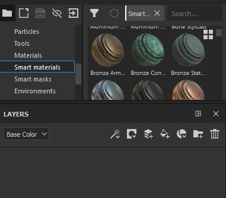

# 레이어 만들기

레이어 스택에서 레이어를 추가하거나 만드는 방법은 다양합니다.

| *동작* | *데모* |
| --- | --- |
| 전용 단추를 클릭하여 **레이어 페인팅**&#x200B;을 만듭니다. 

 | 

 |
| 전용 버튼을 클릭하여 **칠 레이어**&#x200B;를 만듭니다. 

 | 

 |
| 전용 버튼을 클릭하여 **폴더**&#x200B;를 만듭니다. 

 | 

 |
| 다음 방법 중 하나를 사용하여 레이어를 **복제**<ul data-preserve-html="true"><li data-preserve-html="true">마우스 오른쪽 버튼 클릭 > 복제</li><li data-preserve-html="true">단축키 CTRL+D 또는 COMMAND+D</li><li data-preserve-html="true">Ctrl 또는 Command를 누른 상태에서 레이어를 드래그하여 놓기</li></ul> | 

 |
| 전용 버튼을 클릭하여 레이어 삭제 

 | 

 |

>[!NOTE]
>
> 이러한 작업 중 일부에는 [전용 단축키](../settings/shortcuts.md)에서 참조할 수 있는 연결된 키보드 페이지가 있습니다.

선반에서 리소스를 드래그하여 놓기도 레이어를 만드는 방법이 될 수 있습니다 .

| *동작* | *데모* |
| --- | --- |
| [에셋](../assets/assets.md)에서 **재질**&#x200B;을 레이어 스택으로 끌어 놓기 | 

 |
| [에셋](../assets/assets.md)에서 **스마트 재질**&#x200B;을(를) 레이어 스택으로 끌어 놓으세요. | 

 |
| [에셋](../assets/assets.md)에서 **효과**&#x200B;를 레이어 스택으로 끌어 놓기 | 

 |
