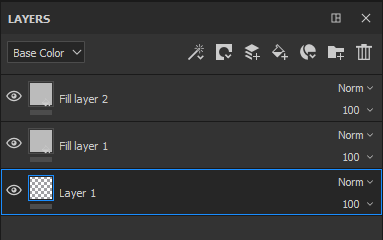
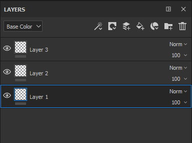

# 레이어 관리

다음은 레이어 스택 내에서 가능한 조작입니다.

| *동작* | *데모* |
| --- | --- |
| 클릭하고 드래그하여 레이어를 이동합니다. 레이어를 이동할 때 레이어가 놓일 위치를 나타내는 막대가 표시될 수 있습니다.<ul data-preserve-html="true"><li data-preserve-html="true"><strong>레이어 위에 막대 표시</strong>: 레이어가 레이어 위에 놓입니다.</li><li data-preserve-html="true"><strong>두 레이어 사이의 가로 막대</strong> : 레이어가 두 레이어 사이에 놓입니다.</li><li data-preserve-html="true"><strong>레이어 아래 가로 막대</strong>: 레이어가 레이어 아래에 놓입니다.</li></ul> | 

 |
| **폴더로 이동** : 레이어 마우스를 가져간 다음 안에 놓습니다. | 

 |
| **다중 선택** : 다음 두 가지 방법으로 수행할 수 있습니다.<ul data-preserve-html="true"><li data-preserve-html="true">Ctrl 또는 Command 키를 눌러 유지합니다.</li><li data-preserve-html="true">첫 번째 레이어와 마지막 레이어를 클릭하면서 Shift 키를 누릅니다</li></ul> | 

 |
| **레이어 그룹화** : 다음 작업 중 하나를 수행하여 현재 선택한 레이어로 폴더를 만들 수 있습니다.<ul data-preserve-html="true"><li data-preserve-html="true">마우스 오른쪽 버튼 클릭 > 레이어 그룹화</li><li data-preserve-html="true">Ctrl+G 또는 Command+G 누르기</li></ul> | 

 |
