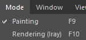

# 모드 메뉴

모드 메뉴에서 서로 다른 인터페이스 간에 전환하여 서로 다른 작업을 수행할 수 있습니다. 각 모드에는 다른 모드에서 액세스할 수 없는 전용 목적 및 인터페이스가 있습니다.

| 액션 | 설명 |
| --- | --- |
| **메시 맵 굽기** | 이 모드를 사용하여 표준, 월드-스페이스 표준, AO 및 ID 맵과 같은 유틸리티 맵을 만듭니다. 고-폴리에서 저-폴리로 굽거나 프로젝트 메시 자체를 사용하여 굽습니다. |
| **페인팅** | Painter에서 대부분의 시간을 보낼 수 있는 곳, 페인팅 모드는 레이어 스택과 재질에 액세스하고 3D 모델에서 직접 페인트 할 수 있는 곳입니다. |
| **렌더링(Iray)** | Ray 렌더링 모드로 전환합니다. Iray는 고품질 렌더러를 만들 수 있는 비실시간 렌더러입니다. 자세한 내용은 전용 페이지 [Ray 렌더러](../../features/iray-renderer/iray-renderer.md)를 참조하세요. |
