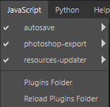

# JavaScript 및 Python 플러그인 메뉴

JavaScript 및 Python 메뉴에는 시작할 때 Painter에서 로드한 모든 플러그인이 나열됩니다. 플러그인은 사용 중인 스크립팅 API(Javascript 또는 Python)를 기반으로 두 개의 메뉴로 분리됩니다.

응용 프로그램에서 검색된 각 플러그인은 추가 기능에 액세스하기 위해 각 메뉴에 항목을 추가합니다. 메뉴에서 각 플러그인에는 다음과 같은 옵션이 있습니다.

* **비활성화/활성화**: 플러그인을 켜거나 끕니다.
* **다시 로드**: 응용 프로그램을 실행하는 동안 스크립트가 업데이트된 경우 플러그인을 다시 로드합니다.
* **구성**: 플러그인에서 지원하는 경우 플러그인을 구성할 함수/창을 표시합니다.
* **정보**: 플러그인에서 지원하는 경우 플러그인에 대한 정보를 표시합니다.

Painter에서 제공하는 기본 플러그인 또는 직접 새 플러그인을 만드는 방법에 대해 알아보려면 전용 [플러그인](../../features/plugins/plugins.md) 페이지를 참조하십시오.
