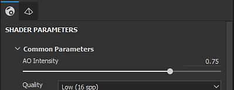

# 셰이더 설정

**셰이더 설정** 창에서 셰이더(및 Ray mdl) 매개 변수와 지오메트리 변위 매개 변수를 제어할 수 있습니다.

셰이더는 뷰포트의 조명 및 그림자와 상호 작용할 때 객체가 어떻게 표시되어야 하는지를 정의하는 함수입니다. 이 응용 프로그램에서는 뷰포트에서 텍스처 세트 채널을 읽고 3D 메시를 렌더링하는 방법을 아는 데 셰이더가 사용됩니다.

## 스택 및 셰이더 파일 실행 취소

셰이더 설정 창의 이 섹션은 셰이더를 조작할 때 기본 매개 변수를 제어합니다.\
셰이더에 대한 실행 취소/다시 실행 스택은 메인 [기록](https://substance3d.adobe.com/display/DRAFTPAINTER/History)과 독립적이므로 페인트할 때 충돌을 만들지 않습니다.

셰이더 파일이 &quot;오래됨&quot;으로 표시된 경우 가능하면 업데이트하는 것이 좋습니다. 참조: [셰이더 업데이트](https://substance3d.adobe.com/display/DRAFTPAINTER/Updating+a+Shader)

| *설정* | *설명* |
| --- | --- |
| **실행 취소** | 셰이더 파일 변경 또는 셰이더 매개 변수 수정 되돌리기/취소 |
| **다시 실행** | 실행 취소를 통해 취소된 변경 사항을 다시 적용합니다. |
| **셰이더 파일** | 사용된 현재 셰이더 파일을 보여 주는 단추입니다. 버튼을 클릭하여 미니 쉘프를 열고 다른 셰이더를 선택합니다. |
| **인스턴스 이름** | 셰이더 인스턴스의 이름입니다. |
| **기본값 복원** | 모든 셰이더 매개 변수를 해당 기본값(셰이더 파일에 있는 그대로)으로 복원합니다. |

### 셰이더 인스턴스

셰이더 인스턴스는 원본 셰이더 파일을 기반으로 하지만 사용자 지정된 매개 변수를 사용하는 셰이더입니다. 셰이더 인스턴스는 텍스처 집합 간에 공유될 수 있으며 텍스처 집합은 고유한 셰이더 인스턴스를 가질 수 있습니다.

**예:** 프로젝트에서 기본 셰이더를 사용할 수 있지만 한 텍스처 집합에서는 사용자 지정 셰이더를 사용하여 불투명도를 지원합니다.

셰이더 인스턴스를 만들고 관리하려면 [텍스처 집합 목록](../texture-set/texture-set-list.md) 창을 참조하세요.

## 셰이더 매개 변수

셰이더 매개 변수는 현재 로드된 셰이더 파일에 종속됩니다.

## 변위 및 테셀레이션

변위 및 쪽맞춤 은 개체의 모양을 수정하여 세부 사항을 추가하는 데 사용할 수 있는 두 가지 기능입니다.

* **변위**: 입력 채널을 기준으로 형상을 밀거나 오프셋합니다.
* **쪽맞춤**: 모양을 세분화하여 수정합니다. 밀도가 높을수록 다각형 사이의 간격이 더 짧아 더 세밀한 세부 사항을 제공합니다.

셸프에서 &quot;**정규로 Height**&quot;이라는 필터를 사용할 수 있으며 최종 표준 맵을 가져오는 데 사용할 수 있습니다(기본 변환이 충분히 강하지 않은 경우).

### 변위

다음은 변위 설정입니다.

| *설정* | *설명* |
| --- | --- |
| <b> 원본 채널 </b> | 메쉬 변형의 기반이 되는 채널입니다. 기본값은 Height 이지만 변위 로 설정할 수도 있습니다. |
| <b>단위 크기 조정</b> | 변위 배율을 정의하는 방법을 선택합니다.<ul data-preserve-html="true"> <li data-preserve-html="true"><b>정규화됨: </b>변위 비율은 메시의 테두리 상자 크기에 상대적입니다.</li> <li data-preserve-html="true"><b>장면: </b>변위 비율은 가져온 장면 파일의 단위를 기준으로 합니다.</li> <li data-preserve-html="true"><b>물리적 크기(cm)</b>: 변위 비율은 개체의 물리적 크기를 기준으로 cm 단위로 측정됩니다.</li> </ul> |
| <b> 비율 양</b> | 선택한 [크기 조절] 단위에 따라 프로젝트의 메쉬에 적용되는 변형 정도를 제어합니다. |

>[!NOTE]
>
> <b>장면</b> 및 <b>물리적 크기(cm) </b>크기 단위 설정을 사용하려면 가져온 모델을 물리적 크기 측정에 사용할 준비가 되어 있어야 합니다. 가져온 파일에서 단위가 올바르게 설정되지 않았거나 가져온 파일 유형에서 물리적 크기 단위를 지원하지 않는 경우 변위는 계속 작동하지만 요구 사항에 맞는 정확한 결과를 제공하지 못할 수 있습니다.

### 테슬레이션

다음은 쪽맞춤 설정입니다.

| *설정* | *설명* |
| --- | --- |
| **하위 분할 모드** | 하위 분할의 계산 방법을 결정합니다. 사용 가능한 구성은 다음과 같습니다.<ul data-preserve-html="true"><li data-preserve-html="true"> 균일(기본값) </li><li data-preserve-html="true"> 가장자리 길이 </li></ul> |
| **하위 분할 수** | (모드 균일)1부터 32까지. 값이 높으면 더 많은 다각형이 생성되어 세부 사항은 더 많지만 성능 문제가 발생할 수 있습니다. |
| **최대 길이** | (모드 가장자리 길이)1 / 값. 모든 다각형 가장자리는 각 세그먼트가 이 숫자와 같거나 이보다 작을 때까지 분할되며, 1/1은 장면의 크기입니다. |
