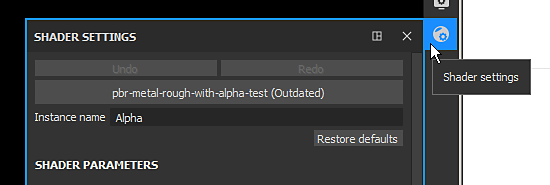

# 셰이더 업데이트

문제를 해결하거나 최신 기능을 활용하기 위해 프로젝트에서 사용하는 셰이더를 업데이트해야 하는 경우가 있습니다. 이 페이지에서는 이 작업을 수행하는 방법에 대해 설명합니다.

다음은 프로젝트의 셰이더를 업데이트하는 방법에 대한 2단계 메서드입니다.

* **셰이더 창을 통해 셰이더 업데이트**
* **Resource Updater 플러그인을 통해 셰이더 업데이트**

프로젝트에서 **사용자 지정 셰이더**(기본적으로 Substance 3D Painter과 함께 제공되지 않음)을 사용하는 경우 [사용자 지정 셰이더](https://substance3d.adobe.com/display/DRAFTPAINTER/Shader+API) 페이지를 참조하여 업데이트 방법에 대한 지침을 확인하십시오.

## 셰이더 창을 통해 셰이더 업데이트

### 1 - 셰이더 설정 창을 엽니다.

**셰이더 설정** 창은 Dock 도구 모음에서 기본적으로 오른쪽에 있습니다.

### 2 - 셰이더 버튼을 클릭하고 업데이트된 셰이더를 선택합니다.

셰이더 단추(실행 취소/다시 실행 단추 아래)를 클릭하고 이미 사용된 셰이더와 일치하는 셰이더를 찾습니다.

### 3 - 셰이더가 업데이트되었습니다.

새 셰이더가 로드되면 언급 **오래된 항목**&#x200B;이 제거되고 3D 모델이 뷰포트에 정상적으로 표시되어야 합니다.

## Resource Updater 플러그인을 통해 셰이더 업데이트

### 1 - Resource Updater 열기

인터페이스의 왼쪽으로 이동하여 **플러그인 도구 모음**&#x200B;을 찾은 다음 **리소스 업데이트 프로그램** 아이콘을 클릭합니다.

### 2 - 셰이더 탭으로 전환

나타나는 새 창에서 &quot;셰이더&quot; 탭을 클릭하여 현재 프로젝트에 있는 셰이더를 표시합니다.

### 3 - 셰이더를 찾아 업데이트합니다.

셰이더 탭에는 현재 프로젝트에서 사용하는 모든 셰이더 리소스 사용자 목록이 표시됩니다. **오래된** 셰이더는 **빨간색 배경** 과 함께 표시됩니다. 자원 옆의 &quot;업데이트&quot; 버튼을 클릭하여 업데이트합니다.

