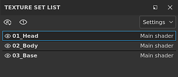
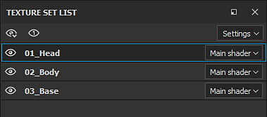

# 텍스처 세트 목록

**텍스처 집합 목록** 창에 프로젝트의 현재 3D 모델의 모든 재질 ID가 표시됩니다. 이를 통해 모델의 각 재질과 관련된 레이어 스택 및 전용 설정을 전환하고 볼 수 있습니다.

[텍스처 세트 목록] 창의 주요 목적은 한 재질을 다른 재질로 전환하여 각 재질과 관련된 레이어 스택에 액세스할 수 있게 하는 것입니다.\
[재질 레이어 구성](../../features/dynamic-material-layering.md) 워크플로의 경우 **하위 스택**&#x200B;이 텍스처 집합 이름 **아래**&#x200B;에 표시됩니다.

>[!WARNING]
>
> 한 번에 하나의 텍스처 세트만 편집/페인트할 수 있습니다.

## 텍스처 설정 상태

텍스처 세트는 다음과 같은 여러 상태를 가질 수 있습니다.

* **선택됨** : 현재 편집 중인 텍스처 집합입니다. 텍스처 집합을 선택하면 [레이어 스택](../layer-stack/layer-stack.md) 및 [셰이더 설정](../shader-settings/shader-settings.md) 창이 그에 따라 업데이트됩니다.
* **표시/숨김** : 자세한 내용은 아래의 표시 가능 섹션을 참조하십시오.
* **사용 안 함** : 이는 텍스처 세트 및 관련 레이어 스택을 메시의 재질에 연결할 수 없음을 의미합니다. 자세한 내용은 [텍스처 집합 재할당](texture-set-reassignment.md)을 참조하세요.

## 가시성

텍스처 세트 표시는 전용 아이콘으로 관리할 수 있습니다.

| *아이콘* | *동작* | *설명* |
| --- | --- | --- |
| 

 | 메뉴 열기 | 다음 동작으로 새 메뉴를 엽니다.<ul data-preserve-html="true"><li data-preserve-html="true"><strong>모두 표시</strong>: 뷰포트에 모든 텍스처 세트를 표시합니다.</li><li data-preserve-html="true"><strong>모두 숨기기</strong>: 뷰포트에 있는 모든 텍스처 세트를 숨깁니다.</li><li data-preserve-html="true"><strong>표시/숨기기 반전</strong>: 표시되는 텍스처 세트는 숨겨지고 숨겨진 텍스처 세트는 표시됩니다.</li></ul> |
| 

 | 포커스 모드 | 이 모드가 활성화되어 있는 동안 현재 활성화된 텍스처 세트를 분리하고 다른 모든 세트를 숨깁니다. 모드를 종료하려면 이 단추를 다시 클릭합니다. |
| 

 | 가시성 | [텍스처 세트] 옆에 있는 이 버튼을 클릭하여 뷰포트에서 텍스처 세트를 숨기거나 표시합니다. |

>[!NOTE]
>
> 기본적으로 **페인팅**&#x200B;할 때는 선택 중인 텍스처 집합만 표시됩니다. &quot;**페인트할 때 선택한 재질만 표시**&quot;를 선택 취소하여 [환경 설정](../settings/settings.md)에서 이 동작을 변경할 수 있습니다.\
> 참고 : 페인팅 중에 다른 텍스처 세트를 숨기는 것은 **성능을 향상시킵니다**.

## 상황별 메뉴

텍스처 세트 이름을 마우스 오른쪽 버튼으로 클릭하면 다음 동작이 있는 컨텍스트 메뉴가 열립니다 .

* **텍스처 집합 표시/숨기기** : 텍스처 집합의 가시성을 전환합니다(이전 섹션에서 설명한 대로).
* **이름 편집** : 텍스처 집합의 이름을 바꿀 수 있습니다. 이 이름은 텍스처 내보내기 프로세스 중에도 사용됩니다. 텍스처 세트 이름을 두 번 클릭하여 이름을 바꿀 수도 있습니다.
* **이름을 \*원본 이름\***(으)로 다시 설정 : 메시 재질이 변경되면 원래 텍스처 세트 이름을 복원합니다.
* **설명 편집** : 텍스처 집합과 관련된 설명을 추가/변경할 수 있습니다.

## 셰이더 관리

각 텍스처 세트 이름의 오른쪽에 있는 버튼을 사용하여 셰이더 할당을 관리할 수 있습니다.\
기본적으로 각 텍스처 집합은 동일한 셰이더 인스턴스를 공유합니다. 그러나 경우에 따라 메시의 특정 부분에만 다른 셰이더를 갖는 것이 편리할 수 있습니다. 이 작업은 단추를 클릭하고 &quot;**새 셰이더 인스턴스**&quot;을(를) 선택하여 수행할 수 있습니다. 이 경우 [셰이더 설정](../shader-settings/shader-settings.md) 창에서 다른 텍스처 집합에 영향을 주지 않고 셰이더 및 해당 매개 변수를 변경할 수 있습니다.

{width="500px"}

## 설정

설정 버튼을 클릭하면 여러 액션을 표시하는 새 메뉴가 열립니다.

* **빈 설명 숨기기** (기본값) : 비어 있는 경우 설명 필드를 숨깁니다.
* **모든 설명 숨기기** : 비어 있지 않더라도 설명 필드를 숨깁니다.
* **모든 설명 표시** : 비어 있는 경우에도 설명 필드를 표시합니다.
* **셰이더 매개 변수 가져오기**: json 파일을 가져와 텍스처 집합의 셰이더 매개 변수를 구성할 수 있습니다.
* **텍스처 집합 다시 할당** : 자세한 내용은 [텍스처 집합 다시 할당](texture-set-reassignment.md)을 참조하세요.
