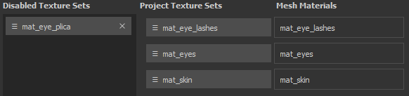

# 텍스처 세트 재할당

Texture Set Reassignment 창을 사용하면 레이어 스택 할당을 장면 메쉬의 다른 부분으로 변경할 수 있습니다. 이 기능은 예를 들어 새 메시를 일부 텍스처 세트가 비활성화되는 기존 프로젝트로 가져온 후에 유용합니다. 이 오류는 레이어 스택이 더 이상 존재하지 않는 재질에 할당되었기 때문에 발생합니다. 재할당 창에서 해당 레이어 스택을 다시 가져올 수 있습니다(아래 &quot;비활성화된 텍스처 세트 복원&quot; 참조).

텍스처 집합 재할당 창에 액세스하려면 [텍스처 집합 목록](texture-set-list.md) 창으로 이동하여 **설정 > 텍스처 집합 재할당**&#x200B;을 선택하십시오.

이 창은 세 부분으로 구분되어 있습니다.

* **비활성화된 텍스처 집합** : 현재 사용되지 않는 모든 텍스처 집합을 나열합니다.
* **프로젝트 텍스처 집합** : 메시 재질에 현재 할당된 모든 텍스처 집합을 나열합니다.
* **망 재질** : 프로젝트의 망 재질을 나열합니다.

창에는 다음 작업을 수행하는 추가 버튼도 있습니다 .

* **실행 취소** : 창의 이전 상태로 되돌립니다.
* **다시 실행** : 실행 취소된 변경 내용을 다시 적용합니다.
* **적용** : 창을 닫고 재할당을 수행합니다.
* **취소** : 창을 닫고 진행 중인 변경 내용을 취소합니다.

## 텍스처 세트 재할당

텍스처 세트 재할당은 버튼을 간단히 드래그하여 놓기만 하면 됩니다.

## 비활성화된 텍스처 세트 복원

텍스처 세트는 메시 재질과 더 이상 연관되지 않을 때 비활성화될 수 있습니다.\
이 아이콘은 재료 이름이 프로젝트와 새 메시 간에 다른 프로젝트로 새 메시를 가져올 때 발생할 수 있습니다.

텍스처 집합을 복원하려면 &quot;**프로젝트 텍스처 집합**&quot; 목록에 있는 집합과 함께 해당 위치를 **바꾸기**&#x200B;하면 됩니다.

## 비활성화된 텍스처 세트 삭제

**비활성화된 텍스처 집합** 목록에서 텍스처 집합 옆의 **십자**&#x200B;를 클릭하면 **삭제 표시**&#x200B;됩니다.\
창 하단에 있는 **적용** 단추를 클릭하면 삭제됩니다.

>[!WARNING]
>
> 창이 &quot;적용&quot; 단추로 닫히면 이 작업을 수행할 수 없습니다.
