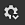

# 텍스처 설정

{width="300px"}

**텍스처 집합 설정**&#x200B;은 현재 선택한 텍스처 집합의 매개 변수를 제어합니다. 여기서 해상도, 채널 및 연관된 메시 맵을 관리할 수 있습니다.

## 일반 속성

| 설정 | 설명 |
| --- | --- |
| **이름** | 텍스처 세트의 이름입니다. 3D 모델에 지정된 재료 이름에 대해 상속됩니다. |
| **설명** | 텍스처 세트에 대한 정보를 추가할 수 있는 텍스트 필드입니다. 이 텍스트는 [텍스처 집합 목록](texture-set-list.md) 및 [굽기](../../baking/baking.md) 창에 표시됩니다. |
| **크기** | 텍스처 세트 내의 채널 해상도를 픽셀 단위로 제어합니다. **정사각형이 아닌** 해상도(예: 2048x1024)를 사용하려면 두 드롭다운 사이에 **잠금 단추**&#x200B;를 사용하지 않도록 설정하십시오.**비파괴 워크플로** 때문에 텍스처 집합 해상도가 **동적**&#x200B;입니다. 이는 낮은 해상도로 작업하여 좋은 성능을 얻었다가 나중에 높은 해상도를 사용하여 더 나은 품질을 얻을 수 있음을 의미합니다. 애플리케이션 내에서 채널의 최대 해상도는 4096x4096 픽셀이지만, 최대값을 내보낼 때는 8192x8192 픽셀(GPU에서 지원하는 경우)입니다. 해상도를 변경하는 것은 엔진의 긴 계산을 트리거할 수 있다. |
| **셰이더 인스턴스** | [뷰포트](../viewport/viewport.md)에서 지정된 텍스처 집합을 렌더링하는 데 사용할 [셰이더](../shader-settings/shader-settings.md)를 정의합니다. |

## 채널

### 채널 목록

이 목록은 채널을 추가하거나 제거하여 언제든지 수정할 수 있습니다([재질 레이어](../../features/dynamic-material-layering.md)워크플로로 재정의되지 않는 한).

| 단추/아이콘 | 설명 |
| --- | --- |
| <b>채널 추가</b>  

 | 목록에 새 채널을 추가하려면 이 단추를 클릭합니다.열리는 팝업 메뉴는 다음 세 가지 범주로 분할됩니다.<ul data-preserve-html="true"><li data-preserve-html="true"><strong>지원되는 채널</strong>: 이 채널은 뷰포트의 현재 셰이더에서 사용할 수 있습니다.</li><li data-preserve-html="true"><strong>지원되지 않는 채널</strong>: 이러한 채널은 뷰포트의 현재 셰이더에서 무시됩니다.</li><li data-preserve-html="true"><strong>사용자 채널</strong>: 추가 정보 페인팅을 위한 추가 채널이며 일반적으로 셰이더에서 지원되지 않습니다.</li></ul>  **참고:** 추가할 수 있는 채널 수에는 제한이 없지만 너무 많은 채널은 성능에 심각한 영향을 줄 수 있으며 더 많은 메모리가 필요합니다. |
| <b>채널 제거</b>  

 | 목록에서 채널을 제거합니다.  **참고:** 프로젝트 내의 페인팅 정보는 채널과 함께 삭제되지 않으므로 텍스처링을 복구해야 하는 경우(다시 계산한 후) 나중에 채널을 다시 추가할 수 있습니다. |
| <b>채널 이름</b>  

 | 지정된 채널의 이름입니다.현재 이름을 두 번 클릭하여 사용자 채널의 이름을 변경할 수 있습니다. 

 |
| <b>채널 설정</b>  

 | 이 버튼을 클릭하면 여러 가지 작업이 있는 채널의 설정 메뉴가 열립니다.첫 번째 작업 목록은 채널의 저장 유형 및 정밀도를 제어합니다.<ul data-preserve-html="true"><li data-preserve-html="true"><strong>sRGB8</strong>: 8비트에 저장된 RGB 색상, 감마 보정 값</li><li data-preserve-html="true"><strong>L8</strong>: 8비트에 저장된 회색 음영 값</li><li data-preserve-html="true"><strong>RGB8</strong>: 8비트에 저장된 RGB 색상입니다.</li><li data-preserve-html="true"><strong>L16</strong>: 16비트에 저장된 회색 음영 값</li><li data-preserve-html="true"><strong>RGB16</strong>: 16비트에 저장된 RGB 색상입니다.</li><li data-preserve-html="true"><strong>L16F</strong>: 회색 음영 값 - 양수 및 음수, 부동 16비트에 저장됨.</li><li data-preserve-html="true"><strong>RGB16F</strong>: RGB 색상 - 양수 및 음수, 부동 16비트에 저장됩니다.</li><li data-preserve-html="true"><strong>L32F</strong>: 회색 음영 값 - 양수 및 음수, 부동 32비트에 저장됨.</li><li data-preserve-html="true"><strong>RGB32F</strong>: RGB 색상 - 양수 및 음수, 부동 32비트에 저장됩니다.</li></ul>  **참고:** 저장소 유형 **은(는) 색상 공간/감마 컨트롤이 아닙니다**. 채널의 정보(예: sRGB8 또는 L32F)를 저장하는 데 사용되는 데이터는 응용 프로그램이 정보를 읽는 방식에는 영향을 주지 않습니다. 예를 들어 [거칠음] 기본 색상은 여전히 데이터/raw로 간주되고 채널은 여전히 감마 교정으로 간주됩니다.  메뉴의 마지막 동작은 채널의 [색상 관리](../../features/color-management/color-management.md)를 활성화하거나 비활성화하는 데 사용할 수 있습니다.<ul data-preserve-html="true"><li data-preserve-html="true"><strong>색상 채널</strong>: 활성화된 경우 채널은 색상 관리됩니다. 이 옵션은 사용자 채널에 대해서만 수동으로 수정할 수 있습니다.</li></ul> |
| <b>색상 관리</b>  

 | 채널 색상이 있는 경우 이는 채널이 색상 관리되고 있음을 나타냅니다. 사용자 채널만 색상 관리됨으로 표시할 수 있으며 그렇지 않으면 다른 채널 비헤이비어가 수정됩니다.색상 관리 대상 채널에 대한 자세한 목록은 [색상 관리](../../features/color-management/color-management.md)를 참조하십시오. |

### 믹싱 설정

이러한 설정은 채널이 생성되는 방식, 특히 채널이 구운 텍스처(메시 맵)과 결합되는 방식에 대한 다양한 동작을 제어합니다.

| 설정 | 설명 |
| --- | --- |
| **일반 믹싱** | &quot;구워진 노멀 맵&quot;를 &quot;표준&quot; 채널과 결합하는 방법을 제어합니다. 가능한 값은 다음과 같습니다.<ul data-preserve-html="true"><li data-preserve-html="true"><strong> </strong> 바꾸기 : &quot;구운 노멀 맵&quot;은 무시하고 이 텍스처 집합에 대해 &quot;일반&quot; 채널만 사용합니다. 구운 노멀 맵 위에 페인트를 하는 데 사용할 수 있습니다. 자세한 내용은 [고급 채널 페인팅](../../painting/advanced-channel-painting/normal-map-painting.md)설명서를 참조하십시오. 표준 노멀 맵이 없거나 표준 채널 출력이 비어 있으면 굽은 채널이 계속 사용됩니다.</li><li data-preserve-html="true"><strong> </strong> 결합(기본값) : 세부 정보 지향 함수를 사용하여 &quot;일반&quot; 노멀 맵과 &quot;구운 채널&quot;을 결합합니다.</li></ul>  **참고:** 채널의 목록에 없는 경우 이 설정을 사용하지 않도록 설정할 수 있습니다. 채널이 없으면 기본 믹싱 값이 사용됩니다. |
| **일반 메서드 Height** | Height 노멀 맵을 채널로 변환하는 데 사용할 메서드를 제어합니다. 가능한 값은 다음과 같습니다.<ul data-preserve-html="true"><li data-preserve-html="true"><strong>선명</strong>: 노이즈와 앨리어싱이 발생할 수 있으므로 좀 더 명확한 노멀 맵을 생성합니다. 패브릭과 같은 반복 패턴에 맞게 조정됩니다.</li><li data-preserve-html="true"><strong>매끄럽게(Sobel)</strong>(기본값): 세부 사항이 손실될 위험이 있는 Sobel 필터를 사용하여 더 매끄러운 노멀 맵을 만듭니다. 대부분의 경우에 적용됩니다.</li></ul> |
| **앰비언트 오클루전 믹싱** | &quot;구워진 앰비언트 오클루전&quot;를 &quot;앰비언트 오클루전&quot; 채널과 결합하는 방법을 제어합니다. 가능한 값은 다음과 같습니다.<ul data-preserve-html="true"><li data-preserve-html="true"><strong> </strong> 바꾸기 : &quot;구워진 앰비언트 오클루전&quot;은 무시하고 이 텍스처 집합에 대해서만 &quot;앰비언트 오클루전&quot; 채널을 사용합니다. 구운 주변 오클루전 위에 페인트를 칠하는 데 사용할 수 있습니다. 자세한 내용은 [고급 채널 페인팅](../../painting/advanced-channel-painting/ambient-occlusion-painting.md) 설명서를 참조하십시오.  </li><li data-preserve-html="true"><strong> </strong> 곱하기(기본값) : 곱하기 작업을 사용하여 &quot;앰비언트 오클루전&quot; 앰비언트 오클루전과 &quot;구워진 채널&quot;을 결합합니다.  </li></ul>  **참고:** 채널의 목록에 없는 경우 이 설정을 사용하지 않도록 설정할 수 있습니다. 채널이 없으면 기본 믹싱 값이 사용됩니다. |
| **UV 패딩** | UV 섬 외부의 패딩이 생성되는 방식을 제어합니다. 가능한 값은 다음과 같습니다.  <ul class="steps" data-preserve-html="true"> <li class="step" data-preserve-html="true">    <strong>3D 공간 인접</strong>(기본값): UV 솔기의 다른 쪽을 보고 인접 픽셀 색상을 찾아 UV 테두리에서 사용합니다. 이 설정은 연속 패턴이 있는 UV 이음새를 페인팅할 때 권장됩니다. 왼쪽에 일반 패딩이 있고 오른쪽에 3D 인접 라우터가 있는 예:           </li> <li class="step" data-preserve-html="true">    <strong>2D Space Neighbor</strong>: 패딩을 생성하기 전에 UV 섬 내부의 픽셀을 UV 섬 외부의 테두리에 복사합니다. 이 설정은 UV 섬이 매우 상반되는 정보를 가지고 있고 중복되지 않을 때 권장됩니다. UV 섬에 따라 고유한 색상을 띠는 구의 예시(왼쪽에는 2D 인접 설정, 오른쪽에는 3D 인접 설정):           </li> </ul>  **참고:** 이 패딩 설정은 텍스처 세트별로 저장되며 뷰포트로 텍스처 내보내기 및 시각화 중에 고려됩니다.3D 공간 이웃이 작동하는 방식 때문에 일반 채널에는 사용할 수 없으며 2D 버전을 대신 사용합니다. |

## 메시 맵

메시 맵은 필터, 스마트 재질 및 스마트 마스크를 사용하여 텍스처링의 품질을 높이는 데 사용되는 메시 및 텍스처 세트와 관련된 구운 텍스처입니다. 자세한 내용은 [굽기](../../baking/baking.md)설명서를 참조하십시오.
