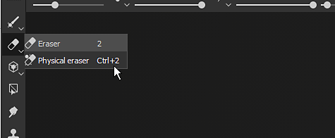

# 도구 모음

이 페이지에서는 사용 가능한 모든 도구 모음에 대한 간략한 개요를 제공합니다. 각각 다른 액션과 설정이 포함되어 있습니다.

아래는 사용 가능한 모든 도구 모음의 목록입니다.

## 도구

{width="450px"}

**도구 도구 모음**&#x200B;은 기본적으로 기본 인터페이스의 왼쪽 상단에서 사용할 수 있습니다. 현재 열려 있는 프로젝트의 3D 메시 텍스처에 사용할 수 있는 [페인팅 도구](../painting/painting.md)가 모두 나열됩니다. 이러한 도구는 레이어 페인팅을 선택한 경우에만 액세스할 수 있습니다.

일부 도구에는 입자 페인팅을 가능하게 하는 &quot;물리적&quot;이라는 두 번째 모드가 있습니다. 입자 페인팅은 [에셋](assets/assets.md) 창에서 입자 브러시 사전 설정을 클릭하여 액세스할 수도 있습니다.

이 도구 모음은 기본 인터페이스의 왼쪽 또는 오른쪽에 세로로만 고정될 수 있습니다.

## 도킹

{width="450px"}

<b>도킹 도구 모음</b>은 기본적으로 기본 인터페이스의 오른쪽 상단에서 사용할 수 있습니다. 그 목적은 도킹 창을 빠르게 열고 닫을 수 있도록 도크 창에 빠르게 액세스할 수 있도록 하는 것입니다.

도구 모음에서 단추 중 하나를 클릭하면 해당 단추 옆에 [고정]이 표시되고 나머지 인터페이스 위에 떠 있게 됩니다. 단추를 다시 클릭하면 해당 단추가 닫힙니다. 도크가 버튼에서 벗어나면 인터페이스에서 도킹할 수 있는 일반 부동 창이 됩니다. 닫혀 있으면 [고정] 도구 모음에서 단추를 다시 사용할 수 있습니다.

{width="450px"}

이 도구 모음은 기본 인터페이스의 왼쪽 또는 오른쪽에 세로로만 고정될 수 있습니다.

## 플러그인

{width="450px"}

**플러그인 도구 모음**&#x200B;은 Substance 3D Painter의 설치된(현재 활성화된) 스크립팅 플러그인을 나열합니다. 플러그인 및 사용에 대한 자세한 내용은 [플러그인](../features/plugins/plugins.md)을 참조하세요.

## 문맥

{width="450px"}

상황별 도구 모음은 선택된 현재 도구나 수정 중인 다른 속성에 따라 내용 일부가 변경되는 도구 모음입니다. 도구 모음의 왼쪽은 변경될 수 있지만 오른쪽은 고정되어 있고 [뷰포트](viewport/viewport.md)의 표시를 수정하기 위한 바로 가기를 나열할 수 있습니다.

이 도구 모음은 다음 요소의 등록 정보를 나열할 수 있습니다.

* [페인팅](../painting/painting.md)
* [칠 레이어 투영 조작기](../painting/fill-projections/fill-projections.md)

이 도구 모음은 이동할 수 없으며 항상 뷰포트의 맨 위에 있습니다.
