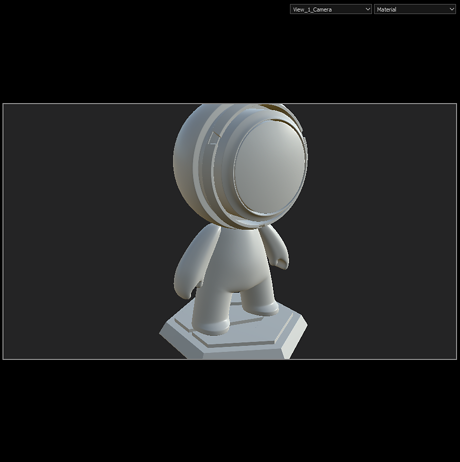

# 카메라 관리

Maya, Max, Blender, Modo 및 DAE에서 만든 카메라를 Substance 3D Painter으로 가져올 수 있습니다.

>[!NOTE]
>
> 직교 카메라 및 표시 비율은 ABC(Alembic) 형식에서 올바르게 지원되지 않습니다.

## Substance 3D Painter에서 카메라 가져오기

카메라는 메시 파일에 FBX 또는 ABC(Alembic) 형식으로 포함되어야 합니다.

이름, 변환 매개변수, FOV 및 종횡비(있는 경우)를 가져옵니다.

새 프로젝트 창에서 카메라가 포함된 메시 파일을 선택하고 **카메라 가져오기** 확인란이 선택되어 있는지 확인합니다. **편집 > 프로젝트 구성 창**&#x200B;에서 **메시 다시 가져오기**&#x200B;를 켠 경우 초기 프로젝트 생성 시 누락된 경우 **카메라 가져오기**&#x200B;를 전환할 수도 있습니다.

그런 다음 **확인**&#x200B;을 클릭합니다.

<table>
  <tr style="border: 0;">
    <td style="border: 0;" valign="top"></td>
    <td style="border: 0;" valign="top"></td>
  </tr>
</table>

## 카메라 선택

현재 프로젝트에 카메라를 가져온 경우 **3D 뷰포트**&#x200B;의 **드롭다운**&#x200B;에서 활성화된 카메라를 선택할 수 있습니다.

기본적으로 이름이 &quot;기본 카메라&quot;인 Painter 카메라가 선택되어 있으며 원근감 모드에 있습니다.

위의 예시에서 세 개의 카메라를 가져와서 기본 카메라가 포함된 경우 드롭다운에 총 4개의 카메라가 제공됩니다.

## 카메라 제어

가져온 카메라를 선택하면 뷰포트에서 패닝, 확대/축소 또는 회전하여 카메라를 이동하면 기본 카메라로 전환됩니다. 이렇게 하면 가져온 카메라가 장면에서 이동되지 않습니다.

>[!NOTE]
>
> 가져온 카메라 위치를 변경해야 하는 경우 선택한 장면 편집 애플리케이션에서 카메라 위치를 업데이트하고 **편집 > 프로젝트 구성**&#x200B;을 사용하여 장면을 다시 가져올 수 있습니다.

**디스플레이 설정 창**&#x200B;에서 가져온 카메라의 매개 변수를 제어할 수 있습니다.

**사전 설정** 드롭다운을 사용하여 수정할 카메라를 선택합니다.

특성이 수정된 경우 **복원 단추**&#x200B;를 사용하여 원래 값으로 되돌릴 수 있습니다.

가져온 카메라에 대한 매개 변수가 수정된 경우 카메라 이름이 이탤릭체로 처리되고 &#39;\*&#39;가 카메라 이름에 추가됩니다.

### 카메라 특성

시야나 FOV는 도 단위로 표시됩니다.

초점 거리는 mm로 표시됩니다.

뷰포트 모드(OpenGL)에서는 초점 거리와 조리개가 비활성화됩니다. 활성화하려면 포스트 효과 및 DOF를 활성화해야 합니다.

### 표시 비율

메쉬 파일에 표시 비율이 있으면 카메라 섹션에 표시됩니다. 카메라의 표시 비율이 정의되지 않은 경우 기본 카메라와 마찬가지로 **지정되지 않음**&#x200B;으로 나열됩니다.

### 잠금

잠금 아이콘을 클릭하여 카메라를 잠글 수 있습니다. 카메라를 잠그면 카메라 매개 변수가 변경되지 않습니다.

## 카메라 프레임

**디스플레이 설정 > 뷰포트 설정**&#x200B;에서 카메라 프레임을 전환할 수 있습니다.

**게이트 마스크 불투명도**&#x200B;를 사용하여 프레임 외부 영역의 불투명도를 조정할 수도 있습니다.

<table>
  <tr style="border: 0;">
    <td style="border: 0;" valign="top"></td>
    <td style="border: 0;" valign="top"></td>
  </tr>
</table>
