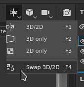

# 뷰포트

{width="600px"}

뷰포트는 3D 메쉬 및 해당 텍스처가 표시되는 위치입니다. 이 영역에서는 3D 메시 표면에 페인팅할 수 있습니다.

## 개요

뷰포트는 다음 네 부분으로 구분됩니다.

* **상황별 도구 모음**: 이 도구 모음은 뷰포트의 맨 위에 있으며 현재 상황에 따라 다양한 속성의 바로 가기를 제공합니다(예: 페인팅 시 브러시 매개 변수).
* **3D 보기**: 이 보기는 카메라로 정의된 특정 각도에서 3D 메시를 표시합니다.
* **2D 보기**: 이 보기는 현재 선택한 [텍스처 집합](../texture-set/texture-set-list.md)에 대한 3D 메쉬의 UV 감싸기를 해제합니다.
* **진행률 표시줄**: 계산이 진행 중일 때(예: 엔진이 텍스처를 생성할 때) 뷰포트 아래쪽에 이 회색/녹색 막대가 나타납니다.

자세한 내용은 전용 페이지를 참조하십시오.

* [2D 보기](2d-view.md)
* [3D 보기](3d-view.md)
* [카메라 관리](camera-management.md)

[표시 설정](../../interface/display-settings/display-settings.md)을 통해 추가 또는 다른 정보를 표시하도록 3D 및 2D 보기를 조정할 수 있습니다.

## 뷰포트 탐색 컨트롤

뷰포트를 이동하는 컨트롤은 2D 뷰와 3D 뷰 모두에서 비슷합니다.

<table>
  <tr>
    <th>이동 유형</th>
    <th>단축키</th>
    <th>설명</th>
  </tr>
  <tr>
    <td>궤도/회전 </td>
    <td><strong>Alt + 왼쪽 클릭</strong></td>
    <td><ul><li>3D 보기: 커서 위치 주변으로 카메라의 궤도를 회전합니다.</li><li>2D 보기: 커서 위치 주위의 UV 공간을 회전합니다.</li></ul></td>
  </tr>
  <tr>
    <td>패닝</td>
    <td><strong>Alt + 가운데 클릭</strong></td>
    <td>카메라를 위, 아래, 왼쪽 또는 오른쪽으로 이동합니다.</td>
  </tr>
  <tr>
    <td>확대/축소/돌리</td>
    <td><strong>Alt + 마우스 오른쪽 버튼 클릭</strong></td>
    <td>메시/UV에 더 가깝게 또는 더 멀리 확대/축소합니다.</td>
  </tr>
</table>

>[!NOTE]
> 2D 및 3D 보기 모두에서 **Alt + Shift + 왼쪽 클릭**&#x200B;을 사용하여 궤도/회전할 때 직각 각도에 스냅할 수 있습니다.

## 레이아웃 변경

기본 레이아웃에서는 3D 보기를 왼쪽에, 2D 보기를 오른쪽에 배치합니다. 레이아웃을 변경할 수 있는 몇 가지 매개 변수는 **컨텍스트 도구 모음**&#x200B;에서 사용할 수 있습니다.

<table>
  <tr>
    <th><em>설정</em></th>
    <th><em>설명</em></th>
  </tr>
  <tr>
    <td><strong>뷰포트 모드</strong> </td>
    <td>다음 설정은 뷰포트의 레이아웃을 제어합니다. <ul><li><strong>3D/2D</strong>(기본값): 3D 보기와 2D 보기를 모두 뷰포트에 표시</li><li><strong>3D 전용</strong>: 3D 보기를 최대화하고 2D 보기를 숨깁니다.</li><li><strong>2D 전용</strong>: 2D 보기를 최대화하고 3D 보기를 숨깁니다.</li><li><strong>3D/2D 교체</strong>: 보기가 표시되는 순서를 바꿉니다. 3D 보기가 왼쪽에 있는 경우 이 동작을 선택하면 오른쪽에 표시됩니다.</li></ul></td>
  </tr>
  <tr>
    <td><strong>원근 모드</strong> </td>
    <td>이러한 설정은 3D 보기에서 3D 메쉬가 표시되는 방식을 제어합니다. <ul><li><strong>원근감 보기</strong>(기본값): 사람의 눈이나 카메라로 볼 수 있는 3D 메시를 표시합니다.</li><li><strong>정사영 보기</strong>: 모든 방향이 동일한 길이를 측정하면 3D 메쉬를 표시합니다.</li></ul></td>
  </tr>
  <tr>
    <td><strong>카메라 회전 모드</strong> </td>
    <td>이 설정은 뷰포트 카메라가 회전할 수 있는 축의 수를 제어합니다. <ul><li><strong>자유 회전</strong>: 카메라가 X, Y 및 Z축을 기준으로 회전합니다.</li><li><strong>제한된 회전</strong>(기본값): 카메라가 X 및 Y축에서만 회전합니다(롤 없음).</li></ul></td>
  </tr>
  <tr>
    <td><strong>렌더링 모드</strong> </td>
    <td><a href="../../features/iray-renderer/iray-renderer.md">렌더링 모드</a>(으)로 전환합니다.</td>
  </tr>
</table>
