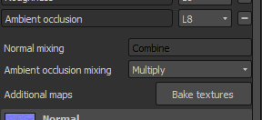

# 앰비언트 오클루전 페인팅

앰비언트 오클루전 채널을 사용하면 개체의 주변 그림자의 세부 사항을 페인트 할 수 있습니다. 이 효과는 재질에서 나오는 AO 세부 사항을 추가하거나 필요할 때 수동으로 베이킹 오류를 수정하는 데 사용할 수 있습니다.

&#x200B;>> 

컴퓨터 그래픽에서 앰비언트 오클루전은 장면의 각 지점이 주변 조명에 노출되는 정도를 계산하는 데 사용되는 음영 및 렌더링 기술입니다. 일반적으로 튜브 내부는 노출된 외부 표면보다 더 가려져(그러므로 어두워짐) 있으며, 튜브 내부로 깊숙이 들어갈수록 조명이 더 가려져(그리고 어두워짐) 됩니다. 앰비언트 오클루전은 각 표면점에 대해 계산되는 접근성 값으로 볼 수 있다.\
출처: &lt;https://en.wikipedia.org/wiki/Ambient_occlusion>

이 계산의 **결과**&#x200B;는 &quot;앰비언트 오클루전&quot; 맵이라는 비트맵에 저장됩니다. 이 맵은 응용 프로그램에서 직접 구울 수 있습니다. [굽기](../../baking/baking.md)를 참조하세요.

## 페인팅 앰비언트 오클루전

사용자 정의 오클루전 세부 정보를 페인트 하려면 앰비언트 오클루전 채널이 필요합니다. [텍스처 집합 설정](../../interface/texture-set/texture-set-settings.md)을 통해 추가할 수 있습니다.

페인트가 텍스처 세트에 추가되면 모든 레이어를 사용하여 새 정보를 내보낼 수 있습니다. AO 채널에는 회색 음영 정보만 포함되어 있으므로 권장 혼합 모드는 **표준**(페인트 오버) 및 **곱하기**(결합)입니다.

이러한 설정과 채널당 변경 방법에 대한 자세한 내용은 [혼합 모드](../../interface/layer-stack/blending-modes.md)를 참조하십시오.

## 앰비언트 오클루전 추가 맵 위에 페인팅

일부 상황에서는 세부 사항을 숨기거나 베이킹 문제를 해결하기 위해 구워진 앰비언트 오클루전 위에 페인트를 설정하는 것이 유용할 수 있습니다.

Substance 3D Painter에서 프로젝트를 기본적으로 설정하면 앰비언트 오클루전 **채널**&#x200B;과 **추가 맵**&#x200B;의 앰비언트 오클루전 맵이 결합됩니다. 즉, 기본적으로 적용된 추가 맵 위에 페인팅할 수 없으며, 각 맵의 결과(베이킹된 맵 및 채널)가 함께 곱해집니다. 이 설정은 다음 설정으로 변경할 수 있습니다.

### 1 - 앰비언트 오클루전 채널 추가

현재 텍스처 세트에서 앰비언트 오클루전 채널 추가 :\

믹싱 모드를 &quot; **곱하기**&quot; 대신 &quot; **바꾸기**&quot;(으)로 설정 :\

### 2 - 구워진 앰비언트 오클루전으로 채우기 레이어 설정

새 칠 레이어를 만들고 구워진 앰비언트 오클루전을 속성 패널을 통해 &quot;앰비언트 오클루전&quot; 슬롯 내에 넣습니다. 칠 레이어가 아직 1로 설정되어 있지 않은 경우 칠 레이어의 기본 속도를 변경하는 것을 잊지 마십시오.\

### 3 - 칠 레이어 혼합 모드 변경

기본적으로 새 레이어에 있는 AO 채널의 혼합 모드는 &quot; **곱하기** &quot;로 설정됩니다. 기본 레이어는 채우기 레이어를 사용하는 것이 좋으므로 비트맵에 알파가 없으므로 &quot;표준&quot; 혼합 모드를 선택한 다음 아래 모든 것을 대체합니다(셰이더의 기본 색상 포함).\

### 4 - 구운 주변 오클루전 맵 위에 페인트할 레이어 만들기

새 레이어(일반 또는 칠)를 만들고 AO 채널의 혼합 모드를 &quot;표준&quot;으로 변경합니다. 이 설정이 완료되면, AO 채널에 그려진 모든 것이 아래 레이어에 있는 구워진 AO 맵을 이어받습니다.\

