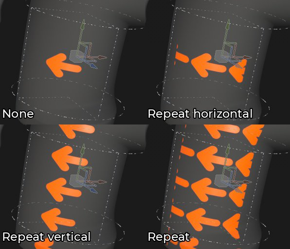
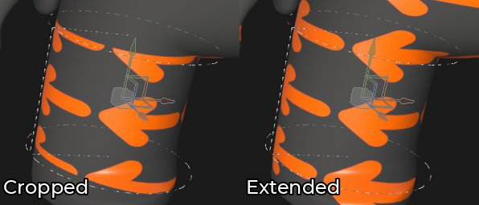
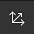
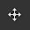
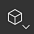
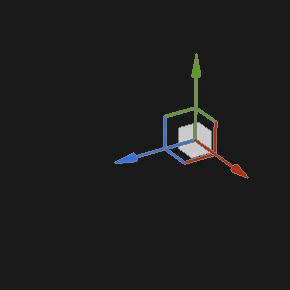

# 원통형 투영

채우기의 원통형 투영을 통해 개체 주위에 이미지와 패턴을 투영할 수 있습니다. 팔과 같은 유기적인 모양뿐만 아니라 기둥이나 기둥을 맞추는 것도 유용할 수 있다.

## 속성

| 설정 | 설명 |
| --- | --- |
| **필터링** | 텍스처 또는 재질을 필터링하는 방법을 제어합니다. 이 설정은 여러 번 반복할 때 텍스처 모양에 영향을 줄 수 있습니다. 기본값과 다른 필터링을 사용하여 높은 비율 값을 지정하면 더 나은 결과를 얻을 수 있습니다. 현재 사용 가능한 설정:<ul data-preserve-html="true"><li data-preserve-html="true"><strong>쌍선형 `\|` HQ</strong>(기본값): 타일링 값이 높을 때 텍스처의 품질을 개선하려는 고급 쌍선형 필터링입니다.</li><li data-preserve-html="true"><strong>쌍선형 `\|` 선명</strong>: 텍스처를 약간 매끄럽게 하지만 세부 사항을 유지하려는 간단한 쌍선형 필터링입니다.</li><li data-preserve-html="true"><strong>가장 가까운</strong>: 필터링이 없습니다. 쌍선형 필터링으로 인해 결과가 흐릿해지고 세부 사항이 세분화된 경우 유용합니다. 텍스처에 앨리어싱을 추가할 수 있습니다.</li></ul> |
| **UV 랩** | 투영 내에서 텍스처가 반복되는 방식을 제어합니다. 가능한 값은 다음과 같습니다.<ul data-preserve-html="true"><li data-preserve-html="true"><strong>없음</strong>: 텍스처가 반복되지 않습니다. 텍스처 밖에 있는 모든 항목은 검정색/투명합니다.</li><li data-preserve-html="true"><strong>가로로 반복</strong>: 텍스처가 가로로만 반복됩니다.</li><li data-preserve-html="true"><strong>세로로 반복</strong>: 텍스처가 세로로만 반복됩니다.</li><li data-preserve-html="true"><strong>반복</strong>(기본값): 텍스처가 두 축 모두에서 반복됩니다.</li></ul> 

 **참고:** 위의 이미지에서는 각도 설정이 90으로 설정되어 투영이 적용되는 거리를 제한합니다. |
| **모양 자르기** | 투영된 텍스처가 투영 영역 외부에 표시되어야 하는지 여부를 정의합니다. 가능한 값은 다음과 같습니다.<ul data-preserve-html="true"><li data-preserve-html="true"><strong>프로젝트가 모양으로 잘림</strong>: 프로젝트가 투영 영역 내에 제한되어 있습니다.</li><li data-preserve-html="true"><strong>투영이 모양 밖으로 확장됨</strong>(기본값): 투영이 투영 영역을 넘어 계속됩니다.</li></ul> 

 |
| **각도** | 원통의 주변에 투영된 크기를 제어합니다. 

 |
| **뒷면 도태** | 백페이스 컬링을 활성화하면 실린더에 수직 각도로 투영을 컬링할 수 있습니다. 경도 슬라이더는 중간 각도(최대 90도가 아님)에서 투영이 얼마나 부드러운지를 정의합니다. 

 |

### UV 변형

UV 변형 설정은 투영 내의 텍스처/재질을 제어합니다.

<table data-preserve-html="true" style="width: 100.0%;"><colgroup> <col style="width: 40.0%;"/> <col style="width: 20.0%;"/> <col style="width: 40.0%;"/> </colgroup><tbody><tr><th>크기 조절 모드</th><th>설정</th><th>설명</th></tr><tr><td>
<strong>타일링</strong>(기본값)<strong>  </strong>

현재 텍스처의 반복 양을 수동으로 설정할 수 있습니다.
</td><td><strong>타일링</strong></td><td>텍스처가 반복되는 횟수를 제어합니다.</td></tr><tr><td rowspan="2">  </td><td colspan="1"><strong>회전</strong></td><td colspan="1">메쉬에 텍스처가 투영되는 각도를 제어합니다.</td></tr><tr><td colspan="1"><strong>오프셋</strong></td><td colspan="1">텍스처가 투영될 위치를 제어합니다. 기본값은 텍스처 중심이 메시 UV의 중심에 있음을 의미합니다.</td></tr><tr><th colspan="1"> </th><th colspan="1"> </th><th colspan="1"> </th></tr><tr><td rowspan="4">
<strong>실제 크기</strong>

메쉬 크기 및 포함된 물리적 크기에 따라 텍스처를 자동으로 조정합니다. 올바른 물리적 크기를 계산하기 위해 너비 및 길이(X 및 Y 측정)를 사용합니다. Z 측정은 고려되지 않습니다.

(자세한 내용은 전용 [설명서 페이지](https://experienceleague.adobe.com/ko/docs/substance-3d-painter/using/features/physical-size)를 참조하십시오.)
</td><td><strong>사용자 정의 크기</strong></td><td>
활성화되면 물리적 크기를 수동으로 입력하고 에셋에서 제공한 템플릿을 재정의할 수 있습니다.

감지된 물리적 크기가 없거나, 동일한 레이어/효과 내에 서로 다른 물리적 크기를 가진 여러 에셋이 사용된 경우 자동으로 선택됩니다.
</td></tr><tr><td colspan="1"><strong>크기(cm)</strong></td><td colspan="1">포함된 물리적 크기는 센티미터로 표시됩니다. 다른 측정 단위를 사용하여 만든 메시 파일로 작업할 수 있습니다. 그러면 올바른 비율이 유지됩니다. 그러나 에셋 크기는 현재 센티미터로만 표시됩니다.</td></tr><tr><td colspan="1"><strong>회전</strong></td><td colspan="1">메쉬에 텍스처가 투영되는 각도를 제어합니다.</td></tr><tr><td colspan="1"><strong>오프셋</strong></td><td colspan="1">
텍스처가 투영될 위치를 제어합니다. 기본값은 텍스처 중심이 메시 UV의 중심에 있음을 의미합니다.
</td></tr></tbody></table>

### 3D 투영 설정

3D 투영 설정은 3D 공간에서 투영 변환을 제어합니다.

| 설정 | 설명 |
| --- | --- |
| **오프셋** | 3D 공간에서 투영 원점의 위치입니다. 단위는 전체 장면의 테두리 상자를 기반으로 합니다. 0이 이 상자의 중심입니다. |
| **회전** | 각 축의 전체 투영을 회전하는 각도(도)입니다. |
| **크기 조절** | 각 축에 있는 전체 투영의 크기입니다. |

## 상황별 도구 모음

뷰포트 맨 위에 있는 [상황별 도구 모음](../../interface/toolbars.md)에서 조작기와 프로젝션을 제어할 수 있는 몇 가지 설정과 도구를 사용할 수 있습니다.

| 아이콘 | 이름 | 설명 |
| --- | --- | --- |
| 

 | 조작기 표시/숨기기 | 이 옵션을 활성화하면 매니퓰레이터가 뷰포트에 표시되고 제어할 수 있습니다. |
| 

 | 매니퓰레이터 설정 | 이 메뉴에는 세 가지 설정이 있습니다.<ul data-preserve-html="true"><li data-preserve-html="true"><strong>조작기 크기</strong>: 뷰포트에서 조작기 크기를 제어합니다.</li><li data-preserve-html="true"><strong>눈금 단계</strong>: 제약 조건을 사용하여 변환할 때 단계의 크기를 정의합니다.</li><li data-preserve-html="true"><strong>각도 단계</strong>: 제약 조건으로 회전할 때 단계의 각도를 정의합니다.</li></ul> |
| 

 | 번역 조작기 | 장면에서 주 축(X, Y, Z)을 따라 투영을 이동할 수 있습니다. |
| 

 | 회전 조작기 | 장면에서 주 축(X, Y, Z)을 따라 투영을 회전시킬 수 있습니다. |
| 

 | 비율 조작기 | 장면에서 주 축(X, Y, Z)을 따라 투영의 비율을 조정할 수 있습니다. |
| 

 | 표면 조작기 | 3D 모델 표면에 투영을 스냅하여 이동할 수 있습니다.  **참고:** 이 조작기는 평면 및 뒤틀기 투영 유형에서만 사용할 수 있습니다. |
| 

 | 조작기 공간 | 변환을 수행할 공간을 정의합니다. 가능한 값은 다음과 같습니다.<ul data-preserve-html="true"><li data-preserve-html="true"><strong>로컬 공간</strong>: 축이 현재 변환에 맞춰 정렬됩니다.</li><li data-preserve-html="true"><strong>월드 공간</strong>: 축이 장면에 정렬됩니다.</li></ul> |
| 

 | X에 미러링 | X축의 변형 뒤집기 |
| 

 | Y에 미러링 | Y축의 변형을 뒤집습니다. |
| 

 | Z에 미러링 | Z축에서 변형을 뒤집습니다. |
| 

 | 변환 재설정 | 투영 변환을 다시 기본 상태로 복원합니다. |

## 조작기

이 투영 조작기는 [3D 뷰포트](../../interface/viewport/3d-view.md)에서만 사용할 수 있습니다.

| 액션 | 단축키 | 설명 |
| --- | --- | --- |
| **번역** | 마우스 클릭 | 변환 조작기를 사용하면 축을 클릭하여 투영을 이동합니다.<ul data-preserve-html="true"><li data-preserve-html="true"><strong>한 축</strong>: 투영의 한 방향으로만 이동합니다.</li><li data-preserve-html="true"><strong>두 축</strong>: 축을 기준으로 정렬된 평면에서 투영을 이동합니다.</li><li data-preserve-html="true"><strong>세 축</strong>: 카메라 공간에서 투영을 이동합니다(마주보는 평면).</li></ul>   <table> <tr style="border: 0;"> <td style="border: 0;" valign="top">  

  </td> <td style="border: 0;" valign="top">  

  </td> <td style="border: 0;" valign="top">  

  </td> </tr> </table> |
| **번역 제한됨** | SHIFT+마우스 클릭 | 변환 매니퓰레이터를 사용하여 선택한 축을 따라 특정 간격(스테핑)으로만 투영을 이동합니다. 간격 크기는 조작기 설정을 통해 정의됩니다. 

 |
| **회전** | 마우스 클릭 | 회전 매니퓰레이터로 한 축을 클릭하면 투영이 회전합니다. 축 사이를 클릭하여 모든 축을 동시에 회전할 수 있습니다.   <table> <tr style="border: 0;"> <td style="border: 0;" valign="top">  

  </td> <td style="border: 0;" valign="top">  

  </td> </tr> </table> |
| **회전 제한됨** | SHIFT+마우스 클릭 | 회전 조작기를 사용하면 한 축을 클릭하여 투영을 회전하는 작업은 특정 간격에만 발생합니다. 단계는 조작기 설정을 통해 각도로 정의됩니다. 

 |
| **크기 조절** | 마우스 클릭 | 배율 매니퓰레이터를 사용하여 한 축 핸들을 클릭하면 주어진 축을 따라 투영 크기가 조정됩니다.   <table> <tr style="border: 0;"> <td style="border: 0;" valign="top">  

  </td> <td style="border: 0;" valign="top">  

  </td> <td style="border: 0;" valign="top">  

  </td> </tr> </table> |
| **크기 조절** | SHIFT+마우스 클릭 | 배율 조작기를 사용하면 단축키를 유지하면서 한 축 핸들을 클릭하면 투영의 크기가 단계적으로 조정됩니다. 단계 크기는 변환 조작기와 동일합니다. 

 |
| **표면** | 마우스 클릭 | 서피스 매니퓰레이터를 사용하여 3D 모델 위로 클릭하고 드래그하면 서피스에서 스냅됩니다. 

 **참고:** 이 조작기는 **평면** 및 **뒤틀기** 투영 유형에서만 사용할 수 있습니다. |
