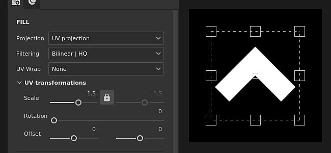
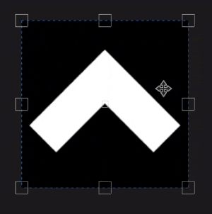
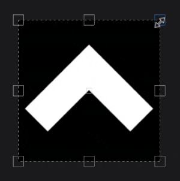

# UV 투영

채우기 UV 투영은 2D 텍스처 공간에서만 작동하는 2D 투영입니다. 이 플러그인에서는 이미지를 이동, 회전 및 크기 조정할 수 있습니다.

## 속성

| *설정* | *설명* |
| --- | --- |
| **필터링** | 텍스처 또는 재질을 필터링하는 방법을 제어합니다. 이 설정은 여러 번 반복할 때 텍스처의 모양에 영향을 줄 수 있습니다. 높은 비율 값을 사용하는 경우 기본값과 다른 필터링 방법을 사용하면 더 나은 결과를 얻을 수 있습니다. 현재 사용 가능한 설정:<ul data-preserve-html="true"><li data-preserve-html="true"><strong>쌍선형 `\|` HQ </strong>: (기본값) 타일링 값이 높을 때 텍스처의 품질을 개선하려고 하는 고급 쌍선형 필터링.</li><li data-preserve-html="true"><strong>쌍선형 `\|` 선명 </strong>: 텍스처를 약간 매끄럽게 하지만 세부 사항을 유지하려는 간단한 쌍선형 필터링입니다.</li><li data-preserve-html="true"><strong>가장 가까운 </strong>: 필터링이 없습니다. 쌍선형 필터링으로 인해 결과가 흐릿해지고 세부 사항이 세분화된 경우 유용합니다. 텍스처에 앨리어싱을 적용할 수 있습니다.</li></ul> |
| **UV 랩** | 투영 모양 내에서 투영된 재질/이미지가 어떻게 반복되는지 제어합니다. 가능한 값은 다음과 같습니다.<ul data-preserve-html="true"><li data-preserve-html="true"><strong>없음</strong>: 프로젝션이 반복되지 않습니다.</li><li data-preserve-html="true"><strong>가로로 반복</strong> : 가로로만 반복합니다.</li><li data-preserve-html="true"><strong>세로로 반복</strong> : 세로로만 반복합니다.</li><li data-preserve-html="true"><strong>반복</strong>(기본값) : 가로와 세로 모두를 반복합니다.</li></ul> 

 |

### UV 변형

UV 변형 설정은 투영 내의 텍스처/재질을 제어합니다.

<table data-preserve-html="true" style="width: 100.0%;"><colgroup> <col style="width: 40.0%;"/> <col style="width: 20.0%;"/> <col style="width: 40.0%;"/> </colgroup><tbody><tr><th>크기 조절 모드</th><th>설정</th><th>설명</th></tr><tr><td>
<strong>타일링</strong>(기본값)<strong>  </strong>

현재 텍스처의 반복 양을 수동으로 설정할 수 있습니다.
</td><td><strong>타일링</strong></td><td>텍스처가 반복되는 횟수를 제어합니다.</td></tr><tr><td rowspan="2">  </td><td colspan="1"><strong>회전</strong></td><td colspan="1">텍스처가 메시에 투영되는 각도를 제어합니다.</td></tr><tr><td colspan="1"><strong>오프셋</strong></td><td colspan="1">텍스처가 투영될 위치를 제어합니다. 기본값은 텍스처 중심이 메시 UV의 중심에 있음을 의미합니다.</td></tr><tr><th colspan="1"> </th><th colspan="1"> </th><th colspan="1"> </th></tr><tr><td rowspan="4">
<strong>실제 크기</strong>

메시 크기와 임베드된 물리적 크기에 따라 텍스처를 자동으로 조정합니다. 올바른 물리적 크기를 계산하기 위해 너비 및 길이(X 및 Y 측정)를 사용합니다. Z 측정은 고려되지 않습니다.

(자세한 내용은 전용 [설명서 페이지](https://experienceleague.adobe.com/ko/docs/substance-3d-painter/using/features/physical-size)를 참조하십시오.)
</td><td><strong>사용자 정의 크기</strong></td><td>
활성화되면 물리적 크기를 수동으로 입력하고 에셋에서 제공한 템플릿을 재정의할 수 있습니다.

감지된 물리적 크기가 없거나, 동일한 레이어/효과 내에 서로 다른 물리적 크기를 가진 여러 에셋이 사용된 경우 자동으로 선택됩니다.
</td></tr><tr><td colspan="1"><strong>크기(cm)</strong></td><td colspan="1">포함된 물리적 크기는 센티미터로 표시됩니다. 다른 측정 단위를 사용하여 만든 메시 파일로 작업할 수 있습니다. 그러면 올바른 비율이 유지됩니다. 그러나 에셋 크기는 현재 센티미터로만 표시됩니다.</td></tr><tr><td colspan="1"><strong>회전</strong></td><td colspan="1">텍스처가 메시에 투영되는 각도를 제어합니다.</td></tr><tr><td colspan="1"><strong>오프셋</strong></td><td colspan="1">
텍스처가 투영될 위치를 제어합니다. 기본값은 텍스처 중심이 메시 UV의 중심에 있음을 의미합니다.
</td></tr></tbody></table>

## 상황별 도구 모음

뷰포트 맨 위에 있는 [상황별 도구 모음](../../interface/toolbars.md)에서 조작기와 프로젝션을 제어할 수 있는 몇 가지 설정과 도구를 사용할 수 있습니다.

| 아이콘 | 이름 | 설명 |
| --- | --- | --- |
| 

 | 조작기 표시/숨기기 | 이 옵션을 활성화하면 매니퓰레이터가 뷰포트에 표시되고 제어할 수 있습니다. |
| 

 | 매니퓰레이터 핸들 크기 | 이 메뉴에는 뷰포트에 있는 변형 핸들의 크기를 정의하는 세 가지 설정이 있습니다.<ul data-preserve-html="true"><li data-preserve-html="true"><strong>작음</strong></li><li data-preserve-html="true"><strong>보통</strong></li><li data-preserve-html="true"><strong>크게</strong></li></ul> |
| 

 | X에 미러링 | X축의 변형 뒤집기 |
| 

 | Y에 미러링 | Y축의 변형을 뒤집습니다. |
| 

 | 피벗 포인트 재설정 | 피벗 포인트를 다시 변환 중간으로 복원합니다. |
| 

 | 변환 재설정 | 투영 변환을 다시 기본 상태로 복원합니다. |

## 조작자

UV 투영은 [2D 보기](../../interface/viewport/2d-view.md)에서만 사용할 수 있는 조작기를 사용합니다.

| 액션 | 단축키 | 설명 |
| --- | --- | --- |
| **번역** | 마우스 클릭 | 변형 내부의 영역을 클릭하고 드래그하여 이동합니다. 

 |
| **변환 제한됨** | SHIFT+마우스 클릭 | 단축키를 누른 채 변형 내부의 영역을 클릭하고 드래그하여 한 축을 따라서만 이동합니다. 축은 수평 또는 수직으로 될 수 있으며 카메라와 정렬되며 마우스 방향을 기준으로 합니다. 

 |
| **회전** | 마우스 클릭 | 변형 외부를 클릭하고 드래그하면 변형의 회전이 가능합니다. 피벗을 이동하면 회전 원점도 변경할 수 있습니다.   <table> <tr style="border: 0;"> <td style="border: 0;" valign="top">  

  </td> <td style="border: 0;" valign="top">  

  </td> </tr> </table> |
| **회전 제한됨** | SHIFT+마우스 클릭 | 단축키를 누른 채 변형 외부에서 클릭하고 드래그하면 45도마다 회전할 수 있습니다. 

 |
| **크기 조절** | 마우스 클릭 | 조작기의 핸들을 클릭하고 드래그하면 변형이 변형됩니다.   <table> <tr style="border: 0;"> <td style="border: 0;" valign="top">  

  </td> <td style="border: 0;" valign="top">  

  </td> </tr> </table> |
| **크기 조절** | SHIFT+마우스 클릭 | 핸들을 드래그하는 동안 바로 가기를 길게 누르면 변형의 비율이 강제 적용됩니다.   <table> <tr style="border: 0;"> <td style="border: 0;" valign="top">  

  </td> <td style="border: 0;" valign="top">  

  </td> </tr> </table> |
| **미러링된 크기 조정** | CTRL+마우스 클릭 | 단축키를 누른 상태에서 핸들을 이동하면 다른 핸들도 유사한 이동을 수행합니다. 그것은 피벗 포인트를 중심으로 대칭 변환을 변형시킬 수 있게 한다.   <table> <tr style="border: 0;"> <td style="border: 0;" valign="top">  

  </td> <td style="border: 0;" valign="top">  

  </td> </tr> </table> |
| **미러링되고 제한된 크기 조정** | SHIFT+CTRL+마우스 클릭 | 두 단축키를 모두 결합하면 종횡비를 유지하면서 변형도 대칭으로 변형할 수 있습니다. 

 |
