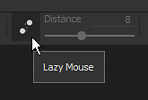
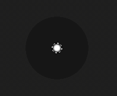

# 레이지 마우스

레이지 마우스는 마우스 커서와 실제 페인팅 사이의 거리 오프셋으로, 이를 통해 보다 정밀하거나 매끄러운 획을 페인트 할 수 있습니다.

[컨텍스트 도구 모음](../interface/toolbars.md)을 통해 활성화할 수 있습니다. 이것은 페인팅을 더 깨끗하고 연속적인 라인을 더 쉽게 만듭니다.

## 활성화 레이지 마우스

레이지 마우스를 활성화하거나 비활성화하려면 컨텍스트 도구 모음에서 사용 가능한 버튼을 클릭하면 됩니다.

활성화하면 뷰포트의 브러시 커서 주위에 회색 원이 표시되어야 합니다.

## 레이지 마우스 반경

상황별 도구 모음에서 레이지 마우스 거리를 변경할 수 있습니다. 이 거리는 원래 페인트 위치에서 브러시 스탬프가 그려지는 반경을 정의합니다. 거리가 작을수록 스탬프를 더 빨리 페인트할 수 있기 때문에 빠른 회전이 가능하지만 페인팅된 선의 매끄러움이 줄어듭니다.

* 장거리:

  {width="400px"}
* 근거리 :

  {width="400px"}
