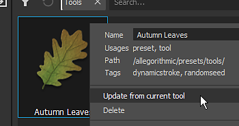

# 사전 설정 만들기 및 저장

[속성 창](../../interface/properties.md)을 사용하여 브러시 매개 변수를 조정한 다음 브러시 구성을 사전 설정으로 저장하여 나중에 빠르게 다시 사용할 수 있습니다.

>[!NOTE]
>
> [경로 도구](../tool-list/path.md)가 설치되어 있으면 [속성 패널](../../interface/properties.md)에서 경로 관련 사전 설정에 빠르게 액세스할 수 있는 사전 설정 섹션을 사용할 수 있습니다. 즐겨찾기에 패스 사전 설정을 추가할 수도 있습니다. 즐겨찾는 [경로 사전 설정 관리에 대해 자세히 알아보세요](../tool-list/path.md).

## 새 사전 설정 만들기

사전 설정은 도구 속성을 사용할 수 있을 때 속성 창을 마우스 오른쪽 버튼으로 클릭하여 만들 수 있습니다(레이어 페인팅 또는 페인트 효과).

속성 창에서 마우스 오른쪽 버튼을 클릭하여 다음 옵션이 있는 컨텍스트 메뉴를 엽니다.

* <b>도구 사전 설정 만들기</b> : 브러시 매개 변수와 재질을 필요한 모든 리소스와 함께 동일한 사전 설정 파일 내에 저장합니다.
* <b>재질 사전 설정 만들기</b> : 재질 속성과 재질 리소스만 사전 설정 파일 내에 저장합니다.
* <b>브러시 사전 설정 만들기</b> : 사전 설정 파일 내에 브러시 매개 변수와 알파 및 스텐실 리소스만 저장합니다.

## 기존 사전 설정 업데이트

속성 창의 현재 값을 기반으로 기존 사전 설정을 업데이트할 수 있습니다. [에셋](../../interface/assets/assets.md) 창에서 에셋을 마우스 오른쪽 버튼으로 클릭하고 &quot;현재 도구에서 업데이트&quot;를 선택하여 사전 설정을 업데이트합니다.
