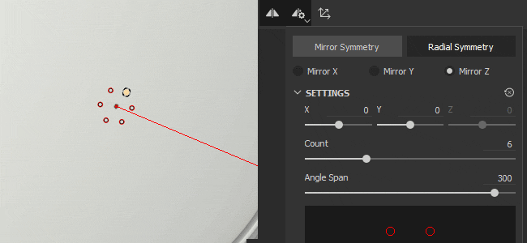

# 대칭

대칭은 브러시 및 칠 레이어에서 기하학적 제한을 기반으로 콘텐츠를 간편하고 정확하게 복제할 수 있는 유용한 설정입니다.

* 브러쉬 레이어가 있는 경우 대칭을 사용하여 대칭 축을 기준으로 메쉬의 다른 위치에 개별 브러쉬 획을 복제합니다.
* 채우기 레이어가 있는 경우 대칭 를 사용하여 대칭 축 주변의 전체 채우기 레이어를 복제합니다.

Painter에서 사용할 수 있는 대칭 유형에 대해 자세히 알아보기:

* [거울 대칭](mirror-symmetry.md)
* [방사형 대칭](radial-symmetry.md)

## 페인트 도구로 대칭 사용

상황별 대칭 모음에서 <b> 대칭 단추</b>을(를) 사용하여 도구를 활성화할 수 있습니다.

컨텍스트 도구 모음에서 <b>대칭 설정 단추</b>를 사용하여 대칭 옵션을 조정합니다.

>[!NOTE]
>
> 2D 보기의 페인트 투영 및 스텐실 투영은 대칭을 지원하지 않습니다. 필요한 경우 대신 3D 보기를 사용하는 것이 좋습니다.

## 칠 레이어에서 대칭 사용

칠 레이어를 선택하면 브러시 대칭 대칭과 마찬가지로 컨텍스트 도구 모음에서 <b>도구 단추</b>를 사용할 수 있습니다. 칠 레이어를 사용하면 <b>대칭 패널</b>에서 속성 옵션을 활성화하고 액세스할 수도 있습니다. 대칭은 다음 투영 메서드에서만 사용할 수 있습니다.

<table>
<tr style="border: 0;">
<td style="border: 0;" valign="top">

* 3평면 투영
* 평면 투영
* 구 투영
* 원통형 투영
* 뒤틀기 투영

적합한 투영 방법을 선택한 경우 [속성] 패널의 [대칭] 섹션에서 [대칭 활성화]를 통해 대칭 옵션에 액세스할 수 있습니다.

지원되지 않는 투영 방법을 선택하면 <b>대칭 사용</b> 옵션을 사용할 수 없으며 컨텍스트 도구 모음의 <b>대칭 단추</b>가 회색으로 표시됩니다.

</td>
<td style="border: 0;" valign="top">

{width="400px"}

</td>
</tr>
</table>

>[!NOTE]
>
> 대칭 표시 옵션은 컨텍스트 도구 모음의 <b>대칭 설정 단추</b>에서만 사용할 수 있습니다. <b>대칭 패널</b>에서 속성 표시 설정을 수정할 수 없습니다.
