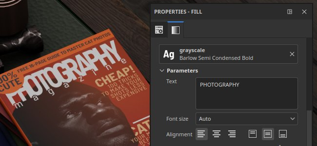

# 텍스트 리소스

특정 <b>텍스처 파일</b>을 사용하여 <b>텍스트 리소스</b>를 사용하여 글꼴에 텍스트를 쓸 수 있습니다. 그려진 최종 텍스트의 모양을 조정하는 데 여러 매개 변수를 사용할 수 있습니다.

## 글꼴 찾아보기

사용 가능한 글꼴 파일을 찾아보려면 [에셋 창](../interface/assets/assets.md)에서 글꼴 필터(<b>T</b> 버튼)를 클릭하면 됩니다.

시스템에서 글꼴이 있는 위치에 따라 경로를 기준으로 글꼴을 필터링할 수도 있습니다.

사용 가능한 글꼴 위치는 현재 운영 체제에 따라 다릅니다.

|  |  |
| --- | --- |
| Windows | <ul data-preserve-html="true"> <li data-preserve-html="true"><b>시스템</b>: C:/Windows/Fonts</li> <li data-preserve-html="true"><b>사용자</b>: C:/Users/username/Appdata/Local/Microsoft/Windows/Fonts</li> </ul> |
| MacOS | <ul data-preserve-html="true"> <li data-preserve-html="true"><b>시스템</b>: /System/Library/Fonts</li> <li data-preserve-html="true"><b>로컬</b>: /Library/Fonts</li> <li data-preserve-html="true"><b>사용자</b>: /Users/사용자 이름/Library/Fonts</li> </ul> |
| 리눅스 | <ul data-preserve-html="true"> <li data-preserve-html="true"><b>시스템</b>: /usr/share/fonts/</li> <li data-preserve-html="true"><b>로컬</b>: /usr/local/share/fonts/</li> <li data-preserve-html="true"><b>사용자</b>: /home/username/.local/share/fonts/</li> </ul> |

### 글꼴 가져오기

글꼴은 수동으로 가져오거나 일반 리소스처럼 기존 Painter 라이브러리에 넣을 수 있습니다. 이렇게 하려면 [설명서 가져오기](../content/importing-assets/import-drag-and-drop.md)를 참조하십시오.

Painter은 <b>.ttf</b> 및 <b>.otf</b> 글꼴 형식을 모두 지원합니다.

>[!NOTE]
>
> &quot;글꼴의 라이선스 제한으로 인해 가져올 수 없습니다&quot;라는 오류 메시지와 함께 리소스를 로드/가져오지 못하면 Painter에서 해당 리소스를 사용할 수 없습니다. 메타데이터에 <b>임베드가능</b>(으)로 표시된 글꼴만 사용할 수 있습니다.

### 텍스트 리소스로 글꼴 사용

텍스처 리소스는 다른 리소스(예: 이미지 또는 Substance 재질)와 마찬가지로 작동하며 브러쉬 매개 변수, 칠 투영 또는 이미지 입력 Substance에 사용할 수 있습니다.

텍스트 리소스를 만들려면 리소스 슬롯에 글꼴을 추가하기만 하면 됩니다. 뷰포트에 글꼴을 끌어다 놓을 수도 있습니다.

### 텍스트 리소스 매개 변수

텍스트 리소스에는 다음과 같은 기본 매개 변수가 있습니다.

| <b>매개 변수</b> | <b>설명</b> |
| --- | --- |
| <b>텍스트</b> | 렌더링할 텍스트.  **참고:** 인터페이스의 텍스트 필드는 필드에 입력한 것과 텍스처에서 렌더링할 수 있는 선택한 글꼴 사이에 불일치가 생길 수 있는 광범위한 문자를 포함하는 일반 글꼴을 사용합니다. |
| <b>글꼴 크기</b> | 글꼴 크기를 계산하는 데 사용되는 모드를 지정합니다. 사용 가능한 모드는 다음과 같습니다.<ul data-preserve-html="true"> <li data-preserve-html="true"><b>자동</b>: 텍스트 콘텐츠에서 크기가 자동으로 계산되어 텍스처에 맞춥니다.</li> <li data-preserve-html="true"><b>사용자 지정</b>: 전용 설정을 통해 크기를 수동으로 제어할 수 있습니다.</li> </ul> |
| <b>맞춤</b> | 세로 및 가로 맞춤을 제어합니다. 단추를 사용하여 사용할 모드를 선택합니다. |
| <b>색상</b> | 렌더링된 텍스트의 색상입니다. 텍스트 리소스가 마스크나 회색 음영 채널에 사용되는 경우 이 설정은 회색 음영일 수 있습니다. |

다음과 같은 고급 매개 변수도 사용할 수 있습니다.

| <b>매개 변수</b> | <b>설명</b> |
| --- | --- |
| <b>줄 간격</b> | 글꼴 크기를 기준으로 한 텍스트 줄 사이의 거리(&quot;행간&quot;)입니다. |
| <b>문자 간격</b> | 글꼴 크기를 기준으로 인접한 문자 사이의 간격입니다. 빼기 간격에는 음수일 수 있습니다. |
| <b>오프셋</b> | 텍스트의 가로 및 세로 오프셋 글꼴 크기에 맞게 정규화되었습니다. |
| <b>배경 채우기</b> | 텍스트 뒤의 배경색입니다. |
| <b>배경 불투명도</b> | 배경색을 표시할 정도입니다. |
| <b>해상도</b> | 텍스트 렌더링에 사용된 텍스처의 크기를 계산하는 데 사용되는 모드를 지정합니다. 사용 가능한 모드는 다음과 같습니다.<ul data-preserve-html="true"> <li data-preserve-html="true"><b>자동</b>: 해상도가 자동으로 계산됩니다.</li> <li data-preserve-html="true"><b>사용자 지정</b>: 전용 설정을 통해 해상도를 수동으로 정의할 수 있습니다.</li> </ul> |
