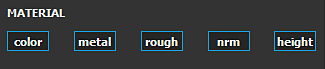

# 지우개

[지우개]는 이전에 다른 도구로 페인트한 내용을 지우거나 숨기는 페인트 도구입니다. 이 도구는 한 번에 하나의 레이어에만 영향을 줍니다.

지우개는 페인트 도구와 함께 일반적인 매개 변수 및 비헤이비어를 공유합니다. 브러시에 대한 자세한 내용은 알파 및 스텐실 컨트롤을 [페인트 도구 페이지](paint-brush.md)를 참조하십시오.

>[!NOTE]
>
> 엄밀히 말하면 **지우개가 실제로 정보를 제거하지 않습니다**. 이 옵션은 레이어 알파를 다시 0으로 설정하여 이전 페인팅 정보를 지우거나 숨깁니다. 이는 다음을 의미합니다.
> 
> * 페인트한 이전 브러쉬 획은 지우개가 있는 브러쉬 획이 적용되기 전에 프로젝트를 다시 열 때 계속 계산됩니다.
> * 알파 정보를 무시하는 경우 Substance 필터는 페인트 정보를 검색할 수 있습니다
> 
> 성능을 향상시킬 수 있으므로 지우개를 사용하지 않고 **레이어를 삭제하고 다시 만드는 것이**&#x200B;더 좋은 이유입니다.

## 재질

정보를 지울 때 특정 채널에만 영향을 미칠 수 있다.

>[!NOTE]
>
> 페인트 도구와 달리 지우개는 영향을 받을 채널만 정의할 수 있습니다. 셸프에서 리소스를 로드하여 각 채널에 영향을 줄 수는 없습니다.

* 모든 채널이 활성화된 경우 지우개는 모든 채널 내의 정보를 제거합니다.

  

  {width="325px"}
* 특정 채널을 선택한 경우 지우개는 해당 채널에서만 정보를 제거합니다.

  

  {width="325px"}
