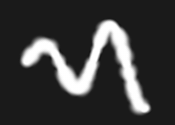

# 페인트 브러시

페인트 도구는 3D 메시에 색상과 재질 속성을 적용하는 Substance 3D Painter의 기본 도구입니다. [속성](../../interface/properties.md) 을 통해 편집할 수 있는 특정 매개 변수가 있습니다.

페인트 도구는 다양한 비헤이비어와 설정을 통해 브러시 획을 시뮬레이션하여 3D 메시에 페인팅하는 느낌을 줍니다.

## 도구 모음

[도구 모음](../../interface/toolbars.md)에 다음 바로 가기가 표시됩니다(다음 섹션의 설명 참조).

* 크기
* 흐름
* 획 불투명도
* 간격

일부 다른 도구에서 일반적으로 사용되는 추가 단축키를 사용할 수 있습니다.

* [게으름쥐](../lazy-mouse.md)
* [대칭](../symmetry/symmetry.md)

## 미리보기

[속성](../../interface/properties.md)의 맨 위에는 브러시 및 재질 미리 보기가 있습니다. 이 도구를 사용하면 현재 도구가 어떻게 설정되어 있는지 빠르게 확인할 수 있습니다.

| *이름* | *설명* |
| --- | --- |
| **브러시 미리 보기** | 브러시 미리 보기에는 브러시 매개 변수에 따라 브러시가 어떻게 작동하는지 표시됩니다. 미리 보기에서 클릭하여 사용자 정의 선을 그릴 수 있습니다.   <table> <tr style="border: 0;"> <td style="border: 0;" valign="top">  

  </td> <td style="border: 0;" valign="top">  

  </td> </tr> </table>   **참고:** 브러시 미리 보기는 펜 압력을 지원하지 않습니다. |
| **재질 미리 보기** | 재질 미리 보기에는 현재 페인팅에 사용된 재질의 속성이 표시됩니다. 미리 보기를 클릭하여 조명을 회전하고 페인팅하기 전에 재질의 작동 방식을 확인할 수 있습니다.   <table> <tr style="border: 0;"> <td style="border: 0;" valign="top">  

  </td> <td style="border: 0;" valign="top">  

  </td> </tr> </table> |

## 브러시

브러시 매개 변수는 3D 메시에서 수행할 때 브러시 획의 모양과 느낌을 정의하는 매개 변수입니다.

>[!NOTE]
>
> 일부 매개 변수는 그래픽 타블렛을 사용할 때 [펜 압력]으로 제어할 수 있습니다. 이 정보는 [사전 설정](../presets/presets.md)에도 저장할 수 있습니다.\
> 전용 버튼을 클릭하여 압력을 활성화하거나 비활성화합니다.
> 
> 

| 이름 | 설명 |
| --- | --- |
| **크기** | 브러쉬 획 안의 스탬프 크기를 제어합니다. 브러시 크기 상대는 정의된 상대 공간에 따라 변경될 수 있습니다(아래의 정렬 크기 공간 매개 변수 참조). *이 매개 변수는 펜 압력으로 제어할 수 있습니다.* |
| **플로우** | 브러쉬 선 내부에 있는 개별 스탬프의 강도 또는 불투명도입니다. *이 매개 변수는 펜 압력으로 제어할 수 있습니다.* |
| **선 불투명도** | 브러시 획의 최대 전체 불투명도입니다. [플로우] 매개 변수와 달리 [펜 압력]을 사용하면 선 그리기 프로세스가 끝날 때 선 불투명도를 제어할 수 없습니다.플로우 와 획 불투명도의 차이 :<ul data-preserve-html="true"><li data-preserve-html="true"><strong> 왼쪽 </strong> : 플로우 50%, 획 불투명도 100%</li><li data-preserve-html="true"><strong> 오른쪽 </strong> : 플로우 100%, 획 불투명도 50%</li></ul> 

 **참고:** 바로 가기 &quot;A&quot;를 눌러 위의 애니메이션에서와 같이 이전 획을 계속할 수 있습니다. |
| **간격** | 브러쉬 획의 개별 스탬프 간 거리입니다. 값이 작을수록 연속 선이 생성될 수 있지만 전체적으로 훨씬 더 많은 스탬프를 그리기 때문에 계산이 더 광범위해집니다. 높은 값을 지정하면 스탬프 사이에 간격이 생겨 특정 패턴(예: 나무의 손톱)에 더 적합할 수 있습니다. |
| **각도** | 브러쉬 획 안의 스탬프 방향입니다. 정렬되지 않은 경우 Alpha을 회전하는 데 유용합니다. 패스와 결합할 수 있습니다. |
| **경로 팔로우** | 브러쉬 획 안의 스탬프가 페인팅 방향을 따르도록 방향을 설정합니다. 

 **참고:** 선 방향을 계산하려면 Substance 3D Painter에서 이전 스탬프를 현재 스탬프와 비교합니다. 이 때문에 [패스 따르기]를 사용하도록 설정한 경우 한 번의 클릭으로 페인트해도 결과가 생성되지 않습니다. 이 기능이 활성화된 브러쉬 획을 페인트하려면 최소 2개의 스탬프가 필요합니다. |
| **크기 지터** | 브러시 획 내부에 스탬프당 임의의 크기 값을 적용합니다. 값을 0으로 지정하면 임의성이 없고, 값을 1로 지정하면 완전 임의성이 적용됩니다. 

 |
| **플로우 지터** | 브러시 획 내부에 스탬프당 무작위 흐름 값을 적용합니다. 값을 0으로 지정하면 임의성이 없고, 값을 1로 지정하면 완전 임의성이 적용됩니다. 

 |
| **각도 지터** | 브러시 획 내부에 스탬프당 임의의 추가 회전 각도를 적용합니다. 값을 0으로 지정하면 임의성이 없고, 값을 1로 지정하면 완전 임의성이 적용됩니다. 

 |
| **위치 지터** | 브러시 획 내부에 스탬프당 임의의 위치 오프셋을 적용합니다. 값을 0으로 지정하면 임의성이 없고, 값을 1로 지정하면 완전 임의성이 적용됩니다. 

 |
| **맞춤** | 브러시 획 내부의 스탬프가 3D 메시 표면에 투영/배향되는 방법을 결정합니다. 다음과 같은 값을 사용할 수 있습니다.<ul data-preserve-html="true"><li data-preserve-html="true"><strong> 카메라 </strong>: 스탬프의 방향을 뷰포트 시점으로 향하게 합니다.</li><li data-preserve-html="true"><strong> 접선 `\|` 줄 바꿈(기본값) </strong> : 3D 메시 표면에 정렬되도록 스탬프의 방향을 조정합니다. 스탬프도 표면에 맞게 변형됩니다.</li><li data-preserve-html="true"><strong> 접선 `\|` 평면 </strong> : 3D 메시 표면에 정렬되도록 스탬프의 방향을 조정합니다. 스탬프의 테두리가 3D 메시 표면에서 너무 멀어 페이드됩니다. </li><li data-preserve-html="true"><strong> UV </strong>: 3D 메시 UV를 기준으로 스탬프의 방향을 조정합니다.</li></ul> |
| **뒷면 도태** | 3D 메시에서 스탬프와 정렬되지 않은 서피스를 무시할 수 있습니다. 3D 메쉬의 어느 부분을 무시해야 하는지 계산하기 위해 페인팅 엔진은 3D 메쉬의 표면에서 법선을 보고 그 각도를 정의된 값과 비교합니다. |
| **크기 공간** | 브러시 크기를 계산할 상대 공간을 제어합니다. 가능한 값은 다음과 같습니다.<ul data-preserve-html="true"><li data-preserve-html="true"><strong> 개체(기본값) </strong> : 브러시 크기가 3D 메시 크기와 동기화됩니다. 카메라를 뷰포트에서 이동하면 3D 메시를 기준으로 카메라를 유지할 수 있는 크기에 영향을 줍니다.</li><li data-preserve-html="true"><strong> 뷰포트 </strong> : 브러시 크기가 뷰포트에 연결됩니다. 인터페이스 크기를 조정하면 브러시 크기에 영향을 줍니다. 카메라를 이동해도 아무런 효과가 없습니다.</li><li data-preserve-html="true"><strong> 텍스처 </strong> : 브러시 크기가 2D 뷰 포트 수준의 확대/축소에 연결됩니다.</li></ul> |

## 알파

Alpha은 브러시 획 내의 각 스탬프 위에 적용되는 회색 음영 마스크입니다. Substance 파일 또는 비트맵일 수 있습니다.

>[!NOTE]
>
> Substance 그래프에 &quot;hardness&quot;(identifier) 매개 변수가 노출된 경우 Hardness [Shortcuts](../../interface/settings/shortcuts.md)로 제어할 수 있습니다.

## 물리학

물리학의 성질은 페인팅할 때 투영되는 입자들을 제어할 수 있게 해준다.

기본적으로 물리학 속성은 사용할 수 없지만 두 가지 방법으로 활성화할 수 있습니다.

* [도구 모음](../../interface/toolbars.md)에서 도구를 &quot;실제&quot;로 전환하거나 키보드 단축키를 통해.
* [에셋](../../interface/assets/assets.md) 창에서 입자 브러시 사전 설정을 클릭합니다.

## 스텐실

스텐실은 브러시 획을 위한 추가 회색 음영 마스크입니다. 각 개별 스탬프에 적용되는 알파와는 반대로, 스텐실은 [뷰포트](../../interface/viewport/viewport.md) 시점에서 적용되는 전역 마스크입니다.

>[!NOTE]
>
> **S** 키를 누른 다음 뷰포트 오른쪽 상단의 &quot; **재설정**&quot; 버튼을 클릭하여 스텐실 변형을 재설정할 수 있습니다.
> 
> 

| *모드* | *뷰포트* |
| --- | --- |
| **로드된 리소스가 없습니다** | 로드된 리소스가 없는 경우 스텐실은 영향을 주지 않습니다. 

 **참고:** 리소스를 제거하지 않고 [바로 가기](../../interface/settings/shortcuts.md) &quot;N&quot;을 눌러 일시적으로 스텐실 마스크를 사용하지 않도록 설정할 수 있습니다. |
| **스텐실 이동** | 스텐실 이동은 **S** 키를 누르고 **중간 마우스** 단추로 클릭하고 드래그하면 수행할 수 있습니다. 

 |
| **스텐실 회전** | **S** 키를 누르고 **왼쪽 마우스** 단추로 클릭하고 드래그하면 스텐실 회전을 수행할 수 있습니다. 또한 **Shift** 키를 누르면 **90도**&#x200B;마다 회전을 스냅할 수 있습니다. 

 |
| **스텐실 크기 조정** | **S** 키를 누르고 **오른쪽 마우스** 단추로 클릭하고 드래그하면 스텐실 크기를 조정할 수 있습니다. 

 |

타일링 모드 설정은 뷰포트를 통해 스텐실 마스크가 반복되는 방식을 제어합니다(이 설정은 텍스처링에도 영향을 줌) .

| *타일링 모드* | *설명* |
| --- | --- |
| **타일링 없음(기본값)** | 스텐실 마스크가 반복되지 않습니다. 

 |
| **수평 타일링** | 가로 축에서만 스텐실 마스크를 반복합니다. 

 |
| **세로 타일링** | 세로 축에서만 스텐실 마스크를 반복합니다. 

 |
| **H 및 V 타일링** | 가로 및 세로 축 모두에서 스텐실 마스크를 반복합니다. 

 |

## 재질

재질은 각각 특정 특성을 유지하는 여러 채널로 구성됩니다. 채널 목록은 [텍스처 집합 설정](../../interface/texture-set/texture-set-settings.md)에 정의된 내용에 종속됩니다.

**재질 모드** 버튼은 Substance 파일 또는 사전 설정을 쉽게 로드하여 한 번에 여러 채널을 빠르게 할당하고 편집할 수 있는 방법입니다.

채널 버튼을 클릭하면 선택되거나 선택 해제됩니다. 이 옵션을 선택 해제하면 채널 속성을 수정할 수 없으며 페인팅 프로세스 중에 사용할 수 없습니다.

