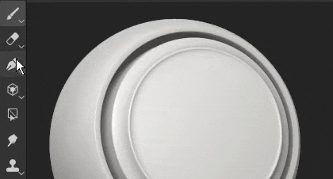
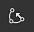
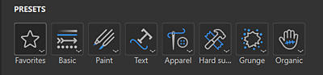

# 패스 도구 개요

<table>
<tr style="border: 0;">
<td style="border: 0;" valign="top">

<b>오디오</b>

오디오를 조정하거나 프로젝트에 추가합니다.

* 오디오가 있는 소스 비디오 볼륨을 조정합니다.
* 외부 오디오 파일을 추가, 제거 또는 교체합니다.
* 외부 오디오 파일 볼륨을 조정합니다.

</td>
<td style="border: 0;" valign="top">

</td>
</tr>
</table>

<b>패스 도구</b>를 사용하면 메시 표면의 점으로 곡선을 정의할 수 있습니다. 곡선을 만든 후에는 다른 패스 도구를 사용하여 곡선을 따라 다른 효과를 만들 수 있습니다.

## 패스 만들기

페인트 레이어와 페인트 효과에서 패스를 만들 수 있습니다. 패스 도구에 액세스하는 방법에는 두 가지가 있습니다.

* <b>인터페이스를 통해</b>: 왼쪽에 있는 도구의 도구 모음으로 이동하고 상단에서 세 번째 아이콘을 클릭합니다.
* <b>키보드 바로 가기를 통해</b>: 기본적으로 도구에 할당된 항목이 없습니다. [설정] 메뉴에서 &quot;패스를 따라 페인트 선택 도구&quot; 단축키를 편집하여 변경할 수 있습니다.

이 도구를 선택하면 3D 뷰포트 내에서 3D 모델의 서피스를 클릭하여 점을 배치할 수 있습니다. 패스를 만들려면 두 개 이상의 점(또는 정점)이 필요합니다.

[패스 도구]에는 다음과 같은 다양한 모드가 있습니다. 이는 애플리케이션에서 사용할 수 있는 다른 페인트 도구와 비슷할 수 있습니다.

* 패스를 따라 페인트: 정의된 패스를 따라 일반 브러시 획을 그립니다.
* [리본 경로](ribbon-tool.md): 패스를 따라 반복되거나 늘어난 이미지를 그립니다.
* [칠한 패스](filled-path.md): 균일한 색상으로 패스 내부를 칠합니다.
* 패스를 따라 지우기: 정의된 패스를 따라 정보를 지우거나 제거하는 획을 그립니다.
* 패스를 따라 문지르기: 정의된 패스를 따라 정보를 문지르거나 흐리게 만드는 획을 그립니다.

예를 들어, 다른 페인팅 정보에 영향을 주는 <b>손가락</b> 모드의 패스 도구는 다음과 같습니다.

>[!NOTE]
>
> <b>패스 도구</b>는 모양 표면의 3D 공간에서만 작동합니다. UV 공간 또는 화면 공간 투영으로 패스를 만드는 것은 현재 지원되지 않습니다.

### 패스 편집

패스 지점(또는 정점)은 메시 표면에 자동으로 연결됩니다. 언제든지 이동하고 조정할 수 있습니다. 선을 따라 아무 곳이나 클릭하여 기존 패스에 새 정점을 추가할 수 있습니다. 

* <b>Esc </b>을 누르거나 <b> Enter </b>을(를) 누르면 경로 편집이 종료됩니다.
* 끝나면 메쉬의 빈 표면을 클릭하면 새 패스가 시작됩니다.
* 기존 패스를 마우스로 가리키고 클릭하면 해당 패스가 선택되고 해당 패스를 계속 사용할 수 있습니다. <b>패스</b> 패널을 통해 패스를 다시 선택할 수도 있습니다(아래 참조).

일부 속성은 패스와 전체적으로 관련이 있습니다. <b>속성 </b> 창에 있는 옵션의 경우입니다. 일반 선([페인트 도구 설명서](paint-brush.md) 참조)과 마찬가지로 패스에 대해 다음 속성을 정의할 수 있습니다.

* <b>브러시</b>
* <b>Alpha</b>
* <b>재질</b>

<b>브러시 </b> 섹션에 패스 도구에서만 사용할 수 있는 추가 옵션이 있습니다.

| <b>설정</b> | <b>설명</b> |
| --- | --- |
| <b>투영 깊이</b> | 브러쉬 스탬프가 나타나기 위해 메시 표면에 패스가 얼마나 가까이 있어야 하는지 결정합니다. 뷰포트에서 직접 이 시각적 피드백을 보려면 <b>경로 표시 설정 </b>에서 <b>표준</b>을 사용하도록 설정할 수 있습니다(아래 참조). |
| <b>위쪽 축</b> | <b>패스 따르기</b>가 꺼져 있을 때 브러시 스탬프의 방향을 지정하는 데 사용되는 축입니다.   일부 컨텍스트에서는 모든 스탬프가 패스를 따라 정렬되지 않고 글로벌 축/방향을 따라 정렬되도록 하는 것이 더 좋습니다. 예를 들어 금속 표면에 리벳이 있는 경우. |

기타 속성은 압력과 같이 패스의 점(정점)별로 정의됩니다. 특정 점을 편집하려면 원하는 점을 클릭하거나 사각형 선택 영역을 사용합니다. 그런 다음 상황별 도구 모음을 사용하여 선택한 포인트 값을 편집합니다.

### 접선 제어

3D 모델 표면을 가장 잘 따르지 않거나 특정 모양에 맞지 않아 매끄러운 패스가 이상적이지 않은 경우가 있을 수 있습니다. 이러한 문제를 해결하기 위해, 주어진 정점의 접선을 수정하는 것이 가능하다. 접선은 패스의 벤드 방식을 제어하는 점의 방향입니다.

부드러운 접선 또는 선형/끊어진 접선 간에 전환하려면 정점을 두 번 클릭하거나 컨텍스트 도구 모음에서 전용 버튼을 사용하면 됩니다.

접선의 방향을 더 정확하게 제어하려면 컨텍스트 도구 모음의 사용자 정의 접선 버튼을 사용하여 접선을 수동으로 재정의합니다.

포인트가 아직 없는 경우 이동하는 동안 <b>ALT</b> 키보드 단축키를 사용하여 접선을 끊습니다.

<b>CTRL</b> 키보드 단축키를 사용하여 두 접선의 크기를 동시에 조정합니다.

>[!NOTE]
>
> 탄젠트 컨트롤은 패스에 지정된 점의 수직과 정렬되는 평면을 따라 정의됩니다. 이는 접선이 어떤 방향으로는 휘지 못한다는 것을 의미한다.

### 상황별 도구 모음

<b>경로</b> 도구를 선택한 경우 <b>컨텍스트 도구 모음</b>에서는 현재 선택한 경로를 제어할 수 있는 여러 설정을 제공합니다.

| <b>매개 변수</b> | <b>설명</b> |
| --- | --- |
| <b>뷰포트 인터페이스 표시/숨기기</b>  

 | 이 옵션을 활성화하면 경로 및 정점 오버레이가 뷰포트에 표시됩니다. |
| <b>표시 설정</b>  

 | 뷰포트에서 경로 시각적 피드백의 모양 제어:<ul data-preserve-html="true"> <li data-preserve-html="true"><b>핸들 크기</b>: 패스 지점의 크기를 제어합니다.</li> <li data-preserve-html="true"><b>경로 너비</b>: 경로 선의 Thickness을 제어합니다.  </li> <li data-preserve-html="true"><b>경로 색상</b>: 경로 선의 색상을 제어합니다.  </li> <li data-preserve-html="true"><b>선택하지 않은 경로 색상</b>: 비활성 경로의 색상을 제어합니다.  </li> <li data-preserve-html="true"><b>정상</b>: 활성화되면 경로의 각 지점에 투영 방향을 표시합니다.  </li> <li data-preserve-html="true"><b>접선</b>: 활성화되면 경로의 조절점의 곡선 방향을 표시합니다.  </li> <li data-preserve-html="true"><b>패스 방향</b>: 활성화된 경우 패스의 끝에 작은 화살표를 표시하여 페인팅 방향을 나타냅니다. 이는 획 내의 스탬프가 어떻게 방향 설정되는지 아는 데 유용합니다.</li> </ul>  

 |
| <b>패스 방향 반전</b>  

 | 현재 패스의 방향을 대칭 이동합니다. 방향은 선 내에 스탬프를 페인트하는 데 사용되는 일반 방향을 정의합니다. 패스를 반전하면 그려진 패턴의 방향을 다시 설정하는 데 도움이 될 수 있습니다. |
| <b>모퉁이/매끄럽게 전환</b>  

 | 현재 선택한 정점의 탄젠트를 끊거나 정렬하여 부드러운 곡선 또는 선형 곡선 간에 전환할 수 있습니다.  

  **참고:** 패스에서 직접 점을 두 번 클릭하여 모퉁이/매끄러운 동작 간 전환할 수도 있습니다. |
| <b>사용자 지정 접선</b>  

 | 활성화되면 패스에 지정된 점의 접선을 수동으로 제어할 수 있습니다.  

 |
| <b>패스 열기/닫기</b>  

 | 현재 패스를 열거나 닫습니다. 패스를 닫으려면 현재 패스의 두 끝점 중 하나를 먼저 선택해야 합니다.  

 |
| <b>정점 삭제</b>  

 | 패스에서 현재 선택된 정점을 제거합니다. |
| <b>대칭</b>  

 | 현재 패스에 대해 대칭을 활성화하거나 비활성화합니다. 자세한 내용은 [대칭 설명서](../symmetry/symmetry.md)를 참조하십시오.  

 |
| <b>제외된 도형 숨기기/무시</b>  

 | 활성화되면 현재 패스가 숨겨진 형상을 통해 페인팅됩니다. 자세한 내용은 [모양 마스크 설명서](../../interface/layer-stack/geometry-mask.md)를 참조하십시오. |

### 패스 패널

>[!NOTE]
>
> 이 패널은 현재 도구가 [패스] 도구가 아니거나 칠 레이어/폴더를 선택한 경우 숨겨집니다.

뷰포트 안에는 현재 선택한 페인트 레이어/효과의 모든 경로가 나열된 <b>패스</b> 패널이 있습니다. 간편한 경로 선택 및 관리 방법을 제공합니다.

이 패널을 사용하여 다음을 수행할 수 있습니다.

* 경로를 두 번 클릭하여 경로를 <b>이름 바꾸기</b>합니다.
* 경로를 선택한 다음 Delete 키를 눌러 <b>삭제</b>합니다.
* 전용 키보드 단축키를 사용하여 경로를 <b>복사</b>/<b>붙여넣기</b>/<b>복제</b>합니다.
* 눈 모양 아이콘(텍스처링에 패스를 적용할지 여부를 제어)으로 패스를 <b>표시</b> 또는 <b>숨기기</b>합니다.

편의를 위해 경로를 마우스 오른쪽 버튼으로 클릭하여 동일한 작업을 제공하는 컨텍스트 메뉴를 열 수도 있습니다.

마우스 오른쪽 버튼을 클릭하면 나타나는 메뉴에서도 액션을 열어 패스의 속성이나 위치를 다른 패스에 복사할 수 있습니다. 이렇게 하면 서로 다른 경로 간에 기능을 쉽게 공유하거나 동기화할 수 있습니다.

>[!NOTE]
>
> 속성 복사 및 붙여넣기는 패스가 동일한 페인팅 도구를 기반으로 하는 경우에만 작동합니다. 예를 들어 손가락 설정을 사용하면 패스와 브러시 설정을 사용하면 패스 간에 속성을 공유할 수 없습니다.

## 도구 사전 설정

{width="400px"}

패스 도구를 선택하면 속성 패널 위쪽에 있는 사전 설정 섹션을 사용할 수 있습니다. 여기에서 다양한 패스 도구의 사전 설정에 빠르게 액세스할 수 있습니다.

### 즐겨찾기 패스 사전 설정

사전 설정 섹션의 즐겨찾기 옵션에는 보다 빠르게 액세스할 수 있도록 즐겨찾기에 추가한 사전 설정만 들어 있습니다. 즐겨찾기 추가를 시작하려면 즐겨찾기, &quot;에셋에 호환되는 사전 설정 표시&quot;를 차례로 선택하여 사용 가능한 경로 사전 설정의 전체 목록을 확인합니다.

사전 설정을 즐겨찾기에 추가하려면 에셋 패널 또는 속성 패널의 사전 설정 섹션에서 사전 설정을 마우스 오른쪽 버튼으로 클릭한 다음 &quot;즐겨찾기에 추가&quot;를 선택합니다. 

즐겨찾기 목록에서 사전 설정을 제거할 수도 있습니다. 즐겨찾기에 추가된 사전 설정을 마우스 오른쪽 버튼으로 클릭한 다음 즐겨찾기에서 제거 선택

{width="400px"}

### 패스 사전 설정 만들기

다른 도구와 마찬가지로 사전 설정을 만들어 브러시 설정/구성을 빠르게 복원할 수 있습니다. 이렇게 하려면 <b>속성</b> 창에서 마우스 오른쪽 단추를 클릭하고 <b>도구 사전 설정 만들기</b>를 선택하면 됩니다. 새로 만든 이 사전 설정은 <b>에셋</b> 창에서 선택하면 자동으로 경로 도구로 전환됩니다.
