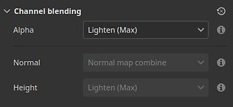

# 리본 경로

<b>리본 </b>패스 도구를 사용하면 3D 모델 표면의 점으로 정의된 곡선을 따라 변형되는 패턴을 만들 수 있습니다. 리본 메뉴를 사용하여 곡선을 따라 텍스트를 쓸 수도 있습니다.

리본 도구는 도구 모음의 패스 도구 메뉴에서 선택할 수 있습니다.

또는 <b>경로 유형</b> 단추를 통해:

## 개요

[리본 경로] 도구는 이미지 및 재질을 그리는 방법에서 [패스를 따라 페인트] 도구와 다릅니다.

페인트/브러시 기반 도구를 사용하면 이미지가 패스 상에서 여러 번 반복되고 리본 도구를 사용하면 이미지가 패스를 따라 반복되어 곡선을 따라 변형됩니다. 페인트 브러시의 개별 구성 요소를 <b>스탬프</b>라고 하며 리본의 구성 요소를 <b>패치</b>라고 합니다.

## 설정

### 크기

| 매개변수 | 설명 |
| --- | --- |
| <b>획 너비</b> | 현재 선의 전체 폭을 제어합니다. |

### 불투명도

| 매개변수 | 설명 |
| --- | --- |
| <b>선 불투명도</b> | 현재 획의 최종 불투명도를 제어합니다. |

### 획

| 매개변수 | 설명 |
| --- | --- |
| <b>이미지 방향</b> | 입력 이미지의 방향을 정의합니다. 이 방향은 패스에 이미지가 배치되는 방식을 제어합니다. |
| <b>이미지 뒤집기</b> | 경로의 축/너비를 따라 이미지를 뒤집습니다. |
| <b>모퉁이</b> | 패스에 표시되는 날카로운 모퉁이(접선 분할)를 정의합니다. 가능한 동작은 다음과 같습니다.<ul data-preserve-html="true"> <li data-preserve-html="true"><b>마이터 연결</b>: 날카로운/뾰족한 모퉁이</li> <li data-preserve-html="true"><b>원형 연결</b>: 부드러운/원형 모퉁이</li> <li data-preserve-html="true"><b>경사 연결</b>: 정사각형/평면 모퉁이</li> <li data-preserve-html="true"><b>조인 잘라내기</b>: 경로를 다시 시작합니다. 이 모드에서는 전용 시작/종료 섹션이 있는 새 경로가 만들어집니다.</li> </ul>아래에는 순서대로 모퉁이의 모습이 나와 있습니다.  

 |
| <b>닫을 때 종료 생략</b> | 이 옵션을 활성화하면 연속된 루프를 만들기 위해 패스가 닫힐 때 시작/끝 섹션이 제거됩니다. 이는 늘리다 및 오프셋에 모두 적용됩니다. |

### 타일&amp;타일

리본 경로는 두 가지 모드를 사용하여 이미지가 반복되는 방식을 제어하고 경로를 따라 늘리다가 제어하는 방식을 사용할 수 있습니다.

* <b>경로를 따라(기본값)</b> 이미지가 경로 길이에 맞게 반복됩니다.
* <b>종횡비 유지</b>: 경로를 따라 반복되는 이미지의 종횡비는 유지됩니다. 이미지가 경로에 비해 너무 길면 잘립니다.

#### 패스를 따라 늘리기

| 매개변수 | 설명 |
| --- | --- |
| <b>오프셋 사이</b> | 활성화된 경우 이미지의 시작 및 끝 부분은 그대로 유지하면서 가운데를 유지합니다. <b>시작 오프셋</b> 및 <b>종료 오프셋</b> 매개 변수를 사용하여 이러한 섹션의 크기를 정의하십시오. 중간 섹션은 시작/끝을 기준으로 자동으로 계산됩니다.  

 |
| <b>타일링 모드</b> | 패스를 따라 이미지가 반복되는 방식을 정의합니다. 가능한 값은 다음과 같습니다.<ul data-preserve-html="true"> <li data-preserve-html="true"><b>없음</b>: 이미지가 반복되지 않습니다. 전체 경로를 따라 늘리다가 될 거야</li> <li data-preserve-html="true"><b>자동</b>: (기본값) 이미지의 크기와 획 너비에 따라 특정 횟수만큼 이미지가 자동으로 반복됩니다.</li> <li data-preserve-html="true"><b>사용자 지정</b>: 이미지화된 이미지가 <b>타일링 양</b> 매개 변수에 의해 정의된 횟수만큼 반복됩니다.</li> </ul> |
| <b>타일링 양</b> | <b>사용자 지정</b> 타일링 모드에서 이미지가 반복되는 횟수를 지정합니다. |
| <b>두 번째 타일마다 미러링</b> | 경로의 길이를 따라 사용된 이미지를 1초마다 뒤집습니다. |
| <b>종횡비 계수</b> | 현재 이미지 종횡비를 늘리거나 줄입니다. |

#### 종횡비 유지

| 매개변수 | 설명 |
| --- | --- |
| <b>비율</b> | 비율을 유지하면서 이미지 크기를 조정하는 방법을 정의합니다.<ul data-preserve-html="true"> <li data-preserve-html="true"><b>패스 너비에 맞추기</b>: (기본값) 패스 너비에 맞게 이미지 크기를 조정합니다. 이 경우 너무 길면 이미지가 잘릴 수 있습니다.</li> <li data-preserve-html="true"><b>패스 길이에 맞추기</b>: 종횡비를 대략적으로 유지하면서 정확한 숫자가 패스를 따라 들어가도록 이미지의 치수를 조정하십시오.</li> </ul> |
| <b>클리핑된 타일 제거</b> | 활성화된 경우 는 완전히 표시할 수 없는 경로를 따라 반복을 제거합니다(잘린 경우). <b>비율</b> 설정이 <b>경로 길이에 맞춤</b>(으)로 설정되어 있으면 이 설정을 사용할 수 없습니다. |
| <b>타일링 모드</b> | 패스를 따라 이미지가 반복되는 방식을 정의합니다. 가능한 값은 다음과 같습니다.<ul data-preserve-html="true"> <li data-preserve-html="true"><b>없음</b>: 이미지가 반복되지 않습니다. 전체 경로를 따라 늘리다가 될 거야</li> <li data-preserve-html="true"><b>자동</b>: (기본값) 이미지의 크기와 획 너비에 따라 특정 횟수만큼 이미지가 자동으로 반복됩니다.</li> <li data-preserve-html="true"><b>사용자 지정</b>: 이미지화된 이미지가 <b>타일링 양</b> 매개 변수에 의해 정의된 횟수만큼 반복됩니다.</li> </ul> |
| <b>두 번째 타일마다 미러링</b> | 경로의 길이를 따라 사용된 이미지를 1초마다 뒤집습니다. |
| <b>맞춤</b> | 패스를 따라 이미지가 시작되는 위치를 정의합니다. 가능한 값은 다음과 같습니다.<ul data-preserve-html="true"> <li data-preserve-html="true"><b>시작점에 맞춤</b>: 이미지는 패스의 첫 번째 지점부터 그려집니다.</li> <li data-preserve-html="true"><b>중심에 맞춤</b>: 이미지가 패스의 중앙에 그려집니다.</li> <li data-preserve-html="true"><b>끝에 맞춤</b>: 이미지가 패스의 마지막 지점에서부터 그려집니다.</li> </ul> |
| <b>종횡비 계수</b> | 현재 이미지 종횡비 |

### 채널 혼합

이 섹션에서는 패스가 자신과 겹치는 경우에 대한 혼합 결과를 제어합니다.

| 매개변수 | 설명 |
| --- | --- |
| <b>Alpha</b> | 리본 경로의 <b>Alpha</b> 섹션이 자신과 겹치는 영역에서 혼합되는 방식을 제어합니다. 이는 다른 모든 채널의 혼합 강도에 영향을 줍니다. 가능한 값은 다음과 같습니다.<ul data-preserve-html="true"> <li data-preserve-html="true"><b>표준</b>: 맨 위 세그먼트의 알파를 사용합니다.</li> <li data-preserve-html="true"><b>밝게(최대)</b>: (기본값)은 최대 알파 값을 사용하여 가장 불투명한 세그먼트를 유지합니다.</li> <li data-preserve-html="true"><b>선형 닷지(추가)</b>: 선분의 알파를 추가하여 선분을 함께 누적하여 채도가 더 높은 값을 만듭니다.</li> </ul> |
| <b>표준</b> | 경로가 겹치는 영역에서 <b>표준</b> 채널을 혼합하는 방법을 정의합니다. 가능한 값은 다음과 같습니다.<ul data-preserve-html="true"> <li data-preserve-html="true"><b>표준</b>: 맨 위 세그먼트의 결과를 사용합니다.</li> <li data-preserve-html="true"><b>노멀 맵 결합</b>: (기본값) 동일한 강도로 세그먼트를 결합합니다.</li> <li data-preserve-html="true"><b>노멀 맵 세부 사항</b>: 맨 위 세그먼트를 추가 세부 사항으로 간주하고 맨 아래 영역은 해당 강도를 유지합니다.</li> </ul>이 설정은 전체 레이어에 대해 정의된 <b>표준</b> 혼합 모드와 별개이며, 패스 자체의 자체 오버랩 혼합 후에 적용됩니다. <b>참고</b>: 채널이 채널인 경우 이 설정을 사용할 수 없습니다. 비트맵 및 Substance 리소스와만 호환됩니다. |
| <b>Height</b> | 경로가 겹치는 영역에서 <b>Height</b> 채널을 혼합하는 방법을 정의합니다. 가능한 값은 다음과 같습니다.<ul data-preserve-html="true"> <li data-preserve-html="true"><b>표준</b>: 맨 위 세그먼트의 결과를 사용합니다.</li> <li data-preserve-html="true"><b>선형 닷지(추가)</b>: 원래 강도를 유지하면서 세그먼트를 함께 추가합니다.</li> <li data-preserve-html="true"><b>어둡게(최소)</b>: 겹치는 선분의 가장 어두운/가장 낮은 값만 유지합니다.</li> <li data-preserve-html="true"><b>조명(최대)</b>: (기본값) 겹치는 선분의 가장 밝은/가장 높은 값을 유지합니다.</li> <li data-preserve-html="true"><b>화면</b>: <b>선형 닷지</b>와 비슷하지만 채도가 더 낮은 결과를 제공합니다.</li> </ul>이 설정은 전체 레이어에 대해 정의된 <b>Height</b> 혼합 모드와 별개이며, 이는 패스 자체의 자체 오버랩 혼합 후에 적용됩니다. <b>참고</b>: 채널이 균일한 색상인 경우 이 설정을 사용할 수 없습니다. 비트맵 및 Substance 리소스와만 호환됩니다. |

Height 채널을 사용한 혼합 모드의 예:

## 텍스트 및 정사각형이 아닌 이미지

[텍스트 리소스](../text-resource.md)를 사용하거나 종횡비가 정사각형이 아닌 이미지를 사용할 경우 리본 경로에 맞게 자동으로 크기가 조정됩니다.

이 비헤이비어를 사용하면 텍스트를 작성하거나 패스를 따라 패턴 트리밍과 같은 이미지를 반복할 수 있습니다.

