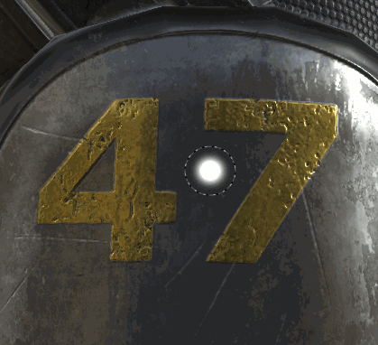

# 손가락 도구

Substance 3D Painter 2에 도입된 손가락 도구는 [페인트 도구](https://support.allegorithmic.com/documentation/display/SPDOC/Paint+brush)와 동일한 유형의 매개 변수를 공유합니다.

## 사용

[손가락] 도구를 사용하는 가장 간단한 방법은 일반 페인트 도구처럼 페인팅 레이어의 내용물에 직접 사용하는 것입니다.

손가락 도구를 사용하는 더 스마트한 방법은 페인팅 레이어를 만들고 레이어의 모든 채널을 &quot;통과&quot; 혼합 모드로 설정하는 것입니다. 이렇게 하면 &quot;손가락 레이어&quot; 아래에 있는 모든 레이어에 비파괴적인 방식으로 문지를 수 있습니다. 아래 레이어는 그대로 유지되며 나중에 적용한 모든 수정 사항은 손가락 레이어에서 고려됩니다.
