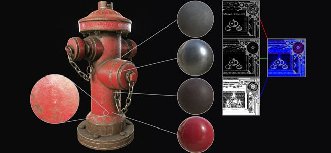

# 버전 2.2

**Substance Painter 2.2**&#x200B;에서 동적 재질 레이어에 해당하는 새 워크플로를 추가합니다.

출시일: *21 7월 2016*

## 주요 기능

### 새로운 동적 재질 레이어 워크플로우

이 새로운 버전에서는 **재질 레이어**&#x200B;라는 새 **워크플로**&#x200B;를 추가합니다. 기존 텍스처링 워크플로는 **고해상도**&#x200B;에서 텍스처를 만들어 **세부 정보를 유지**&#x200B;하는 데 의존하지만 사용 사례에 대해서는 **편리하지 않다**. 대신 더 흥미로운 방법은 **작은 틸링 재료를 만들고** **셰이더 내에서 이를 반복합니다**. 이 셰이더를 사용하면 특정 품질과 이 셰이더를 사용하여 **세부 정보를 잃지 않고** 개체에 대한 **확대/축소 정말** 기능을 유지할 수 있습니다. 유일한 문제는 최종 결과를 미리 보기 위해 이전에는 최종 셰이더를 표시하는 게임 엔진/렌더러로 이동해야 했습니다. 이 새로운 버전에서는 이제 Substance Painter 내에서 비슷한 셰이더를 사용할 수 있으므로 **최종 결과를 시각화하고 동시에 페인팅할 수 있습니다**.

새 워크플로를 보여 주기 위해 이름이 &quot;**소화전**&quot;인 **새 샘플 프로젝트**&#x200B;가 추가되었습니다.

이 새로운 워크플로우는 두 가지 작업 방식을 엽니다.

* 재질은 셰이더에서 정의되며 마스크만 페인트하여 혼합할 수 있습니다
* 재질과 마스크를 함께 페인팅할 수 있습니다

어떤 경우에도 매번 새로운 레이어 스택을 정의하여 마스크와 재질을 만들 때 더 많은 자유를 부여할 수 있습니다. 이러한 방식으로 레이어를 관리하는 것이 훨씬 더 쉬우며 각 스택에는 최종 셰이더에서 블렌드될 수 있는 고유한 특정 채널 세트가 있을 수 있습니다.\
Share에서 사용할 수 있는 Unity 5 및 Unreal Engine 4에 대한 특수 셰이더도 있습니다.

* [유니티](https://share.allegorithmic.com/libraries/2126)
* [언리얼 엔진](https://share.allegorithmic.com/libraries/2125)

자세한 내용은 설명서의 전용 페이지([동적 재질 레이어](../../features/dynamic-material-layering.md))를 참조하십시오.

### 새로운 미니 쉘프 검색 필드

전용 검색 필드를 사용하여 응용 프로그램의 여러 위치에 나타나는 **미니 선반**&#x200B;을 개선했습니다. 이러한 개선은 리소스 검색을 훨씬 더 편리하고 즐겁게 사용하도록 만듭니다. 사용자 정의 검색은 응용 프로그램의 현재 세션 중에 유지됩니다. 예를 들어, 그런지 노이즈를 많이 사용하는 경우 이 키워드를 사용하면

## 튜토리얼

최신 비디오 튜토리얼에서는 다음과 같은 새로운 기능을 제공합니다.

## 릴리스 정보

### 2.2.0

(2016년 7월 21일 릴리스)

**추가됨 :**

* [Shelf] 검색 시스템 및 쿼리 개선
* [Shelf] 미니 선반용 검색 필드 추가
* [셰이더] 슬라이더의 단계 정밀도 정의 허용
* [Shader] 셰이더 매개변수에 대한 실행 취소/다시 실행 버튼 추가
* [Shader] 셰이더를 다시 로드하면 해당 매개 변수를 재설정할 수 없습니다.
* [MatLayering] 동적 재질 레이어 및 하위 스택에 대한 지원 추가
* [MatLayering] json 파일을 가져와 셰이더 설정을 설정할 수 있습니다.
* [MatLayering] 텍스처 샘플러 제한 잠금 해제(비고정 텍스처로 전환)
* [스크립팅] 베이커 설정을 설정하고 계산을 실행할 수 있습니다.
* [Substance] 식별자 외에 입력/출력 연결에 &quot;usage&quot;를 사용합니다.
* [도구] 투영 도구에 대한 뷰포트에서 미리보기 채널을 선택할 수 있습니다.

**고정:**

* 물질이 잘못된 폴더에 있는 경우 시작하는 동안 충돌 발생
* 잘못된 로그 파일로 인해 충돌 보고서가 작동하지 않는 경우가 있습니다
* [Iray] Iray가 일시 중지되면 Post 효과가 새로 고쳐지지 않습니다.
* [Iray] 자동 초점 단축키가 더 이상 작동하지 않습니다.
* [Iray] 조리개 슬라이더 동작이 에셋 크기에 따라 달라집니다.
* [레이어] [첫 번째 재질 채널]이 모두 비활성화되어 있으면 기본적으로 활성화되지 않습니다.
* [Shader] &quot;param auto&quot;가 잘못된 경우 오류가 인쇄되지 않습니다.

**알려진 문제 :**

* [Mac] 텍스처 샘플 제한이 16에서 잠겨 있습니다(GPU 드라이버 문제).
